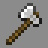

# Brute

---

#### 

# Overview

---

- **Introduced:** v1.7.0
- **Description:** An aggressive kit with an axe.
- **Role:** Damage
- **How to Unlock:** Purchase for 500 Credits.

 

# Gear

---

- Chainmail Chestplate
- Chainmail Leggings
- Chainmail Boots
- Iron Axe
- {{ kits.brute.data.MAX_HEALING_POTIONS }} Healing Potions

 

# Abilities

---

### Actives

<!-- tabs:start -->

#### **Axe Swirl**

## Axe Swirl

Right click the iron axe to unleash an attack in a `{{ kits.brute.data.BRUTE_AXE_SWIRL_RADIUS }}` meter radius. This ability will deal `{{ kits.brute.data.BRUTE_AXE_SWIRL_DAMAGE }}` damage all enemies in range. If `BRUTE_AXE_SWIRL_IGNORE_I_FRAMES` is set to `true`, then the attack will ignore invulnerability frames.

Axe swirl will disable shields and damage enemy engineer blocks.

<!-- tabs:end -->

### Passives

<!-- tabs:start -->

#### **Berserk**

## Berserk

When the player's health drops to or below `{{ kits.brute.data.BRUTE_BERSERK_ACTIVATION_THRESHOLD }}` HP, they will receive a berserk stack and activate berserk. While berserk is active, the player will gain speed that scales with the number of berserk stacks. The player can have up to `{{ kits.brute.data.BRUTE_BERSERK_MAX_STACKS }}` berserk stacks.

Additionally, dealing melee damage with the axe will instantly break shields.

<!-- tabs:end -->
 

# Achievements

---

<!-- prettier-ignore -->
| Achievement | Description | Reward |
| ----------- | ----------- | ------ |
| A clean cut | Get a double axe swirl kill. | 50 Credits |
| Skull splitter | Get 2 final blows with in one berserk. | 50 Credits |
| Passive Aggressive Negotiator | Activate the berserk passive 100 times. | 100 Credits |
| Head Collector | Get 50 axe swirl kills. | 1,000 Credits |

 

# Kit Data

---

<!-- prettier-ignore -->
| Property | Value | Description |
|----------|-------|-------------|
| MAX_HEALING_POTIONS | `{{ kits.brute.data.MAX_HEALING_POTIONS }}` | {{ kitDataSharedDescriptions.MAX_HEALING_POTIONS }} |
| HEALING_POTION_CLICK_POTENCY | `{{ kits._shared.data.HEALING_POTION_CLICK_POTENCY }}` | {{ kitDataSharedDescriptions.HEALING_POTION_CLICK_POTENCY }} |
| HEALING_POTION_AUTOPOT_POTENCY | `{{ kits._shared.data.HEALING_POTION_AUTOPOT_POTENCY }}` | {{ kitDataSharedDescriptions.HEALING_POTION_AUTOPOT_POTENCY }} |
| HEALING_POTION_AUTOPOT_THRESHOLD | `{{ kits._shared.data.HEALING_POTION_AUTOPOT_THRESHOLD }}` | {{ kitDataSharedDescriptions.HEALING_POTION_AUTOPOT_THRESHOLD }} |
| HEALING_POTION_AUTOPOT_HOTBAR_ONLY | `{{ kits._shared.data.HEALING_POTION_AUTOPOT_HOTBAR_ONLY }}` | {{ kitDataSharedDescriptions.HEALING_POTION_AUTOPOT_HOTBAR_ONLY }} |
| POTION_IN_COMBAT_REGENERATION_RATE | `{{ kits._shared.data.POTION_IN_COMBAT_REGENERATION_RATE }}` | {{ kitDataSharedDescriptions.POTION_IN_COMBAT_REGENERATION_RATE }} |
| POTION_OUT_OF_COMBAT_REGENERATION_RATE | `{{ kits._shared.data.POTION_OUT_OF_COMBAT_REGENERATION_RATE }}` | {{ kitDataSharedDescriptions.POTION_OUT_OF_COMBAT_REGENERATION_RATE }} |
| BRUTE_AXE_MELEE_DAMAGE | `{{ kits.brute.data.BRUTE_AXE_MELEE_DAMAGE }}` | The base melee damage of the axe. |
| BRUTE_AXE_MELEE_SPEED | `{{ kits.brute.data.BRUTE_AXE_MELEE_SPEED }}` | The base melee speed of the axe. |
| BRUTE_BERSERK_ACTIVATION_THRESHOLD | `{{ kits.brute.data.BRUTE_BERSERK_ACTIVATION_THRESHOLD }}` | The threshold at which the Berserk ability will trigger. (1hp = 0.5 hearts) |
| BRUTE_BERSERK_COOLDOWN | `{{ kits.brute.data.BRUTE_BERSERK_COOLDOWN }}` | The cooldown, in ticks, of the Berserk ability. |
| BRUTE_BERSERK_DURATION | `{{ kits.brute.data.BRUTE_BERSERK_DURATION }}` | The duration, in ticks, of the Berserk ability. |
| BRUTE_BERSERK_MAX_STACKS | `{{ kits.brute.data.BRUTE_BERSERK_MAX_STACKS }}` | The maximum number of Berserk ability stacks. |
| BRUTE_AXE_SWIRL_COOLDOWN | `{{ kits.brute.data.BRUTE_AXE_SWIRL_COOLDOWN }}` | The cooldown, in ticks, of the Axe Swirl ability. |
| BRUTE_AXE_SWIRL_DAMAGE | `{{ kits.brute.data.BRUTE_AXE_SWIRL_DAMAGE }}` | The damage of the Axe Swirl ability. |
| BRUTE_AXE_SWIRL_RADIUS | `{{ kits.brute.data.BRUTE_AXE_SWIRL_RADIUS }}` | The radius of the Axe Swirl ability. |
| BRUTE_AXE_SWIRL_DELAY | `{{ kits.brute.data.BRUTE_AXE_SWIRL_DELAY }}` | The delay, in ticks, between activating the Axe Swirl ability and the ability dealing damage. |
| BRUTE_AXE_SWIRL_IGNORE_I_FRAMES | `{{ kits.brute.data.BRUTE_AXE_SWIRL_IGNORE_I_FRAMES }}` | Determines if the Axe Swirl ability should ignore invulnerability frames. |
