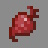

# Demon

---

#### 

# Overview

---

- **Introduced:** v2.1.0
- **Description:** A mage kit that uses blood to damage enemies and heal allies.
- **Role:** Support
- **How to Unlock:** Purchase for 500 Credits.

 

# Gear

---

- Chainmail Chestplate
- Leather Leggings
- Chainmail Boots
- Stone Sword
- Blood Staff
- Transfusion
- {{ kits.demon.data.MAX_BLOOD_POTIONS }} Blood Potions

 

# Abilities

---

### Actives

<!-- tabs:start -->

#### **Blood Staff**

## Blood Staff

A weapon that is used to cast spells. Casting spells costs blood and each spell has a cooldown.

### Casting

- Homing Hemoglobin _(Left-Click)_
- Break Blood Bonds _(Right-Click)_

<!-- tabs:start -->

#### **Homing Hemoglobin**

## Homing Hemoglobin

The spell costs `{{ kits.demon.data.DEMON_HOMING_HEMOGLOBIN_COST }}ml` of blood. Casting summons a projectile of blood that travels forward. The projectile locks onto a nearby entity after traveling `{{ kits.demon.data.DEMON_HOMING_HEMOGLOBIN_START_HOMING_AFTER_DISTANCE }}` meters. When a projectile hits an entity, a [`Blood Bond`](#blood-bond) forms.

Blood projectiles target allies that don't have a blood bond.

Blood projectiles always target enemies. The projectile deals `{{ kits.demon.data.DEMON_HOMING_HEMOGLOBIN_DAMAGE }}` damage.

#### **Break Blood Bonds**

## Break Blood Bonds

A spell that costs `{{ kits.demon.data.DEMON_BREAK_BLOOD_BONDS_COST }}ml` of blood. Casting breaks all of the [`Blood Bonds`](#blood-bond) that the player formed. The player does not take damage when a bond breaks this way.

<!-- tabs:end -->

#### **Transfusion**

## Transfusion

An item used to convert blood into health and health into blood. When holding right-click, it transfuses `{{ kits.demon.data.DEMON_TRANSFUSION_BLOOD_AMOUNT }}ml` blood every `{{ kits.demon.data.DEMON_TRANSFUSION_CONVERSION_RATE }}` ticks. The player can left-click to switch modes.

<!-- tabs:end -->

### Passives

<!-- tabs:start -->

#### **Demon's Curse**

## Demon's Curse

The player's magic damage is increased by `5%` for every active blood bond.

The player's physical damage is decreased by `10%` for every active blood bond.

#### **Hellfire**

## Hellfire

The [`Light Beam`](./Priest#light-beam) spell from kit priest ignites the player.

<!-- tabs:end -->

### Effects

<!-- tabs:start -->

#### **Blood Bond**

## Blood Bond

A special bond between the player and an entity. The bond forms when the player hits an entity with the [`Homing Hemoglobin`](#homing-hemoglobin) spell. The bond lasts `forever`. The number of active bonds is indicated by the number of orbiting blood spheres.

After enemies that have a bond with the player take damage, `{{ kits.demon.data.DEMON_BLOOD_BOND_BLOOD_TRANSMISSION_EFFICIENCY }}%` of the blood lost is transmitted through the bond. If there are multiple bonds, then the amount of blood is split and transmitted evenly.

Allies that have a bond with the player restore `{{ kits.demon.data.DEMON_BLOOD_BOND_HEALING_POTENCY }}` health every `{{ kits.demon.data.DEMON_BLOOD_BOND_HEALING_RATE }}` ticks. This consumes the blood.

A blood bond breaks if the distance between the entity and the player is greater than `{{ kits.demon.data.DEMON_BLOOD_BOND_BREAK_DISTANCE }}` meters. It also breaks if the entity is ignited or the entity is cleansed. The player takes `{{ kits.demon.data.DEMON_BLOOD_BOND_BREAK_DAMAGE }}` damage when a bond breaks.

<!-- tabs:end -->

### Resources

<!-- tabs:start -->

#### **Blood**

## Blood

The primary resource for blood related spells and items. The conversion for blood to health is `{{ kits.demon.data.DEMON_BLOOD_TO_HEALTH_CONVERSION }}ml` to `1` respectively. The player can hold a maximum of `{{ kits.demon.data.DEMON_BLOOD_MAX }}ml` of blood.

#### **Blood Potions**

## Blood Potions

A potion used to restore blood. It restores `{{ kits.demon.data.BLOOD_POTION_CLICK_POTENCY }}ml` of blood when using the potion manually and `{{ kits.demon.data.BLOOD_POTION_AUTOPOT_POTENCY }}ml` of blood when using auto-pot. The player can hold a maximum of `{{ kits.demon.data.MAX_BLOOD_POTIONS }}` potions.

Potions regenerate over time.

#### **Essence of the Afterlife**

## Essence of the Afterlife

A resource used to restore blood.

Picking up an Essence of the Afterlife restores `{{ kits.demon.data.DEMON_BLOOD_PER_ESSENCE }}ml` blood.

Essence of the Afterlife drops upon the death of players and necromancer skeletons.

<!-- tabs:end -->
 

# Achievements

---

<!-- prettier-ignore -->
| Achievement | Description | Reward |
| ----------- | ----------- | ------ |
| Hemokinesis | Maintain 4 blood bonds at once. | 20 Credits |
| Perish | Eliminate a priest as demon. | 20 Credits |
| Satan's little helper | Form a blood bond with a wither skeleton. | 20 Credits |
| Archdemon | Consume 5,000,000ml of blood as demon. | 250 Credits |
| The Devil's Advocate | Restore a total of 5,000 health as demon. | 250 Credits |
| Satan's Wrath | Get 50 homing hemoglobin kills. | 1,000 Credits |

 

# Kit Data

---

<!-- prettier-ignore -->
| Property | Value | Description |
|----------|-------|-------------|
| MAX_BLOOD_POTIONS | `{{ kits.demon.data.MAX_BLOOD_POTIONS }}` | Maximum number of blood potions the player can carry. |
| BLOOD_POTION_CLICK_POTENCY | `{{ kits.demon.data.BLOOD_POTION_CLICK_POTENCY }}` | The amount of blood restored when using a blood potion by clicking. |
| BLOOD_POTION_AUTOPOT_POTENCY | `{{ kits.demon.data.BLOOD_POTION_AUTOPOT_POTENCY }}` | The amount of blood restored when using a blood potion through autopot. |
| BLOOD_POTION_AUTOPOT_THRESHOLD | `{{ kits.demon.data.BLOOD_POTION_AUTOPOT_THRESHOLD }}` | The threshold of blood at which autopot should trigger. |
| BLOOD_POTION_AUTOPOT_HOTBAR_ONLY | `{{ kits.demon.data.BLOOD_POTION_AUTOPOT_HOTBAR_ONLY }}` | If autopot should only use blood potions in the hotbar. |
| POTION_IN_COMBAT_REGENERATION_RATE | `{{ kits._shared.data.POTION_IN_COMBAT_REGENERATION_RATE }}` | {{ kitDataSharedDescriptions.POTION_IN_COMBAT_REGENERATION_RATE }} |
| POTION_OUT_OF_COMBAT_REGENERATION_RATE | `{{ kits._shared.data.POTION_OUT_OF_COMBAT_REGENERATION_RATE }}` | {{ kitDataSharedDescriptions.POTION_OUT_OF_COMBAT_REGENERATION_RATE }} |
| DEMON_BLOOD_MAX | `{{ kits.demon.data.DEMON_BLOOD_MAX }}` | The maximum amount of blood the player can hold. |
| DEMON_BLOOD_TO_HEALTH_CONVERSION | `{{ kits.demon.data.DEMON_BLOOD_TO_HEALTH_CONVERSION }}` | The amount of blood that equates to 1 health. |
| DEMON_SWORD_DAMAGE | `{{ kits.demon.data.DEMON_SWORD_DAMAGE }}` | The base damage of the sword. |
| DEMON_SWORD_SPEED | `{{ kits.demon.data.DEMON_SWORD_SPEED }}` | The base speed of the sword. |
| DEMON_ESSENCE_OF_THE_AFTER_LIFE_MAX | `{{ kits.demon.data.DEMON_ESSENCE_OF_THE_AFTER_LIFE_MAX }}` | The maximum number of essence the player can have at once. Essence is immediately converted to blood, so this value does not need to be greater than 1. |
| DEMON_BLOOD_PER_ESSENCE | `{{ kits.demon.data.DEMON_BLOOD_PER_ESSENCE }}` | The amount of blood restored after picking up an Essence of the Afterlife. |
| DEMON_TRANSFUSION_SWITCH_MODE_COOLDOWN | `{{ kits.demon.data.DEMON_TRANSFUSION_SWITCH_MODE_COOLDOWN }}` | The cooldown, in ticks, after switching transfusion modes. |
| DEMON_TRANSFUSION_BLOOD_AMOUNT | `{{ kits.demon.data.DEMON_TRANSFUSION_BLOOD_AMOUNT }}` | The amount of blood to transfuse. |
| DEMON_TRANSFUSION_CONVERSION_RATE | `{{ kits.demon.data.DEMON_TRANSFUSION_CONVERSION_RATE }}` | The rate, in ticks, at which blood transfuses. |
| DEMON_HOMING_HEMOGLOBIN_COOLDOWN | `{{ kits.demon.data.DEMON_HOMING_HEMOGLOBIN_COOLDOWN }}` | The homing hemoglobin spell cooldown in ticks. |
| DEMON_HOMING_HEMOGLOBIN_COST | `{{ kits.demon.data.DEMON_HOMING_HEMOGLOBIN_COST }}` | The cost of blood to cast the homing hemoglobin spell. |
| DEMON_HOMING_HEMOGLOBIN_SPEED | `{{ kits.demon.data.DEMON_HOMING_HEMOGLOBIN_SPEED }}` | The speed of the homing hemoglobin. |
| DEMON_HOMING_HEMOGLOBIN_SIZE | `{{ kits.demon.data.DEMON_HOMING_HEMOGLOBIN_SIZE }}` | The size of the homing hemoglobin. |
| DEMON_HOMING_HEMOGLOBIN_HOMING_FACTOR | `{{ kits.demon.data.DEMON_HOMING_HEMOGLOBIN_HOMING_FACTOR }}` | The strength of homing hemoglobin's homing effect. |
| DEMON_HOMING_HEMOGLOBIN_MAX_TRAVEL_DISTANCE | `{{ kits.demon.data.DEMON_HOMING_HEMOGLOBIN_MAX_TRAVEL_DISTANCE }}` | The maximum travel distance, in meters, of homing hemoglobin. |
| DEMON_HOMING_HEMOGLOBIN_START_HOMING_AFTER_DISTANCE | `{{ kits.demon.data.DEMON_HOMING_HEMOGLOBIN_START_HOMING_AFTER_DISTANCE }}` | The distance, in meters, at which homing hemoglobin starts homing in on targets. |
| DEMON_HOMING_HEMOGLOBIN_START_HOMING_RADIUS | `{{ kits.demon.data.DEMON_HOMING_HEMOGLOBIN_START_HOMING_RADIUS }}` | The tracking radius, in meters, of homing hemoglobin. |
| DEMON_HOMING_HEMOGLOBIN_DAMAGE | `{{ kits.demon.data.DEMON_HOMING_HEMOGLOBIN_DAMAGE }}` | The damage dealt by homing hemoglobin. |
| DEMON_BREAK_BLOOD_BONDS_COOLDOWN | `{{ kits.demon.data.DEMON_BREAK_BLOOD_BONDS_COOLDOWN }}` | The break blood bonds spell cooldown in ticks. |
| DEMON_BREAK_BLOOD_BONDS_COST | `{{ kits.demon.data.DEMON_BREAK_BLOOD_BONDS_COST }}` | The cost of blood to cast the break blood bonds spell. |
| DEMON_BLOOD_BOND_HEALING_RATE | `{{ kits.demon.data.DEMON_BLOOD_BOND_HEALING_RATE }}` | The rate, in ticks, at which allies are healed from blood bonds. |
| DEMON_BLOOD_BOND_HEALING_POTENCY | `{{ kits.demon.data.DEMON_BLOOD_BOND_HEALING_POTENCY }}` | The amount of healing done by blood bonds. |
| DEMON_BLOOD_BOND_BREAK_DISTANCE | `{{ kits.demon.data.DEMON_BLOOD_BOND_BREAK_DISTANCE }}` | The distance, in meters, at which blood bonds break. |
| DEMON_BLOOD_BOND_BLOOD_TRANSMISSION_EFFICIENCY | `{{ kits.demon.data.DEMON_BLOOD_BOND_BLOOD_TRANSMISSION_EFFICIENCY }}` | The percentage of blood that successfully transmits through blood bonds. |
| DEMON_BLOOD_BOND_BREAK_DAMAGE | `{{ kits.demon.data.DEMON_BLOOD_BOND_BREAK_DAMAGE }}` | The damage taken when a blood bond breaks. |
| DEMON_HELLFIRE_BURN_DURATION | `{{ kits.demon.data.DEMON_HELLFIRE_BURN_DURATION }}` | The burn duration, in ticks, after taking hits from light beam. |
| DEMONS_CURSE_MAX_EFFECTIVE_BONDS | `{{ kits.demon.data.DEMONS_CURSE_MAX_EFFECTIVE_BONDS }}` | The maximum number of blood bonds that contribute to the demon's curse passive. |
| DEMONS_CURSE_MAGIC_DAMAGE_INCREASE_PER_BLOOD_BOND | `{{ kits.demon.data.DEMONS_CURSE_MAGIC_DAMAGE_INCREASE_PER_BLOOD_BOND }}` | The magic damage increase per active blood bond. |
| DEMONS_CURSE_PHYSICAL_DAMAGE_DECREASE_PER_BLOOD_BOND | `{{ kits.demon.data.DEMONS_CURSE_PHYSICAL_DAMAGE_DECREASE_PER_BLOOD_BOND }}` | The physical damage decrease per active blood bond. |
