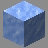

# Glacier

---

#### 

# Overview

---

- **Introduced:** v2.1.0
- **Description:** A damage kit that uses ice balls to slow down enemies and move faster on snow.
- **Role:** Damage
- **How to Unlock:** Purchase for 500 Credits.

 

# Gear

---

- Leather Chestplate (Blue)
- Chainmail Leggings
- Chainmail Boots
- Iron Sword
- Ice Ball
- {{ kits.glacier.data.MAX_HEALING_POTIONS }} Healing Potions

 

# Abilities

---

### Actives

<!-- tabs:start -->

#### **Ice Ball**

## Ice Ball

A throwable projectile, when it lands or collides with a enemy it produces a temporary snow layer block. When the snowball hits an enemy it applies slowness `{{ kits.glacier.data.GLACIER_ICE_BALL_SLOWNESS_LEVEL }}` for `{{ kits.glacier.data.GLACIER_ICE_BALL_SLOWNESS_DURATION }}` ticks. If there is an existing snow layer block at the location the ice ball lands, an additional layer is added and extends its duration. The maxiumum layers in one block is `{{ kits.glacier.data.GLACIER_ICE_BALL_MAX_SNOW_LAYER }}`.

<!-- tabs:end -->

### Passives

<!-- tabs:start -->

#### **Snowdrift**

## Snowdrift

When a player moves on a layer of snow, they gain speed `{{ kits.glacier.data.GLACIER_SNOWDRIFT_SPEED_LEVEL }}` for `{{ kits.glacier.data.GLACIER_SNOWDRIFT_DURATION }}` ticks.

<!-- tabs:end -->

 

# Achievements

---

<!-- prettier-ignore -->
| Achievement | Description | Reward |
| ----------- | ----------- | ------ |
| Cold and Tangled | Freeze an enemy that is in a cobweb with an ice ball. | 20 Credits |
| Deep Freeze | Freeze an enemy that is already frozen from a snowman with an ice ball. | 20 Credits |
| Ice Fishing | Kill a fish as glacier. | 20 credits |
| Skiing accident | Freeze a enemy glacier with an ice ball  | 20 credits |
| Frozen Blob | Freeze 250 enemies with your ice ball. | 250 Credits |
| Ski-Mogul | Walk on a Snow Layer 1000 times. | 250 Credits |

 

# Kit Data

---

<!-- prettier-ignore -->
| Property | Value | Description |
|----------|-------|-------------|
| MAX_HEALING_POTIONS | `{{ kits.glacier.data.MAX_HEALING_POTIONS }}` | {{ kitDataSharedDescriptions.MAX_HEALING_POTIONS }} |
| HEALING_POTION_CLICK_POTENCY | `{{ kits._shared.data.HEALING_POTION_CLICK_POTENCY }}` | {{ kitDataSharedDescriptions.HEALING_POTION_CLICK_POTENCY }} |
| HEALING_POTION_AUTOPOT_POTENCY | `{{ kits._shared.data.HEALING_POTION_AUTOPOT_POTENCY }}` | {{ kitDataSharedDescriptions.HEALING_POTION_AUTOPOT_POTENCY }} |
| HEALING_POTION_AUTOPOT_THRESHOLD | `{{ kits._shared.data.HEALING_POTION_AUTOPOT_THRESHOLD }}` | {{ kitDataSharedDescriptions.HEALING_POTION_AUTOPOT_THRESHOLD }} |
| HEALING_POTION_AUTOPOT_HOTBAR_ONLY | `{{ kits._shared.data.HEALING_POTION_AUTOPOT_HOTBAR_ONLY }}` | {{ kitDataSharedDescriptions.HEALING_POTION_AUTOPOT_HOTBAR_ONLY }} |
| POTION_IN_COMBAT_REGENERATION_RATE | `{{ kits._shared.data.POTION_IN_COMBAT_REGENERATION_RATE }}` | {{ kitDataSharedDescriptions.POTION_IN_COMBAT_REGENERATION_RATE }} |
| POTION_OUT_OF_COMBAT_REGENERATION_RATE | `{{ kits._shared.data.POTION_OUT_OF_COMBAT_REGENERATION_RATE }}` | {{ kitDataSharedDescriptions.POTION_OUT_OF_COMBAT_REGENERATION_RATE }} |
| CHESTPLATE_ARMOR | `{{ kits.glacier.data.CHESTPLATE_ARMOR }}` | {{ kitDataSharedDescriptions.CHESTPLATE_ARMOR }} |
| CHESTPLATE_ARMOR_TOUGHNESS | `{{ kits.glacier.data.CHESTPLATE_ARMOR_TOUGHNESS }}` | {{ kitDataSharedDescriptions.CHESTPLATE_ARMOR_TOUGHNESS }} |
| CHESTPLATE_PROTECTION_LEVEL | `{{ kits.glacier.data.CHESTPLATE_PROTECTION_LEVEL }}` | {{ kitDataSharedDescriptions.CHESTPLATE_PROTECTION_LEVEL }} |
| CHESTPLATE_KNOCKBACK_RESISTANCE | `{{ kits.glacier.data.CHESTPLATE_KNOCKBACK_RESISTANCE }}` | {{ kitDataSharedDescriptions.CHESTPLATE_KNOCKBACK_RESISTANCE }} |
| LEGGINGS_ARMOR | `{{ kits.glacier.data.LEGGINGS_ARMOR }}` | {{ kitDataSharedDescriptions.LEGGINGS_ARMOR }} |
| LEGGINGS_ARMOR_TOUGHNESS | `{{ kits.glacier.data.LEGGINGS_ARMOR_TOUGHNESS }}` | {{ kitDataSharedDescriptions.LEGGINGS_ARMOR_TOUGHNESS }} |
| LEGGINGS_PROTECTION_LEVEL | `{{ kits.glacier.data.LEGGINGS_PROTECTION_LEVEL }}` | {{ kitDataSharedDescriptions.LEGGINGS_PROTECTION_LEVEL }} |
| LEGGINGS_KNOCKBACK_RESISTANCE | `{{ kits.glacier.data.LEGGINGS_KNOCKBACK_RESISTANCE }}` | {{ kitDataSharedDescriptions.LEGGINGS_KNOCKBACK_RESISTANCE }} |
| BOOTS_ARMOR | `{{ kits.glacier.data.BOOTS_ARMOR }}` | {{ kitDataSharedDescriptions.BOOTS_ARMOR }} |
| BOOTS_ARMOR_TOUGHNESS | `{{ kits.glacier.data.BOOTS_ARMOR_TOUGHNESS }}` | {{ kitDataSharedDescriptions.BOOTS_ARMOR_TOUGHNESS }} |
| BOOTS_PROTECTION_LEVEL | `{{ kits.glacier.data.BOOTS_PROTECTION_LEVEL }}` | {{ kitDataSharedDescriptions.BOOTS_PROTECTION_LEVEL }} |
| BOOTS_KNOCKBACK_RESISTANCE | `{{ kits.glacier.data.BOOTS_KNOCKBACK_RESISTANCE }}` | {{ kitDataSharedDescriptions.BOOTS_KNOCKBACK_RESISTANCE }} |
| GLACIER_ICE_BALL_COOLDOWN | `{{ kits.glacier.data.GLACIER_ICE_BALL_COOLDOWN }}` | The ice ball's cooldown in ticks. |
| GLACIER_ICE_BALL_VELOCITY_MULTIPLIER | `{{ kits.glacier.data.GLACIER_ICE_BALL_VELOCITY_MULTIPLIER }}` | The velocity mutliplier when throwing an ice ball. |
| GLACIER_ICE_BALL_SLOWNESS_DURATION| `{{ kits.glacier.data.GLACIER_ICE_BALL_SLOWNESS_DURATION }}` | The duration, in ticks, of the ice ball's slowness effect.|
| GLACIER_ICE_BALL_SLOWNESS_LEVEL| `{{ kits.glacier.data.GLACIER_ICE_BALL_SLOWNESS_LEVEL }}` | The level of the ice ball's slowness effect.|
| GLACIER_ICE_BALL_SNOW_LAYER_DURATION| `{{ kits.glacier.data.GLACIER_ICE_BALL_SNOW_LAYER_DURATION }}` | The duration, in ticks, of the snow layer created by the ice ball. |
| GLACIER_ICE_BALL_MAX_SNOW_LAYER| `{{ kits.glacier.data.GLACIER_ICE_BALL_MAX_SNOW_LAYER }}` | The amount of snow layers that can be stacked ontop of each other. |
| GLACIER_SNOWDRIFT_DURATION| `{{ kits.glacier.data.GLACIER_SNOWDRIFT_DURATION }}` | The duration, in ticks, of the snowdrift passive. |
| GLACIER_SNOWDRIFT_SPEED_LEVEL| `{{ kits.glacier.data.GLACIER_SNOWDRIFT_SPEED_LEVEL }}` | The level of the snowdrift passive's speed effect. |
