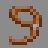

<!-- replace grappler with the actual kit name -->

# Grappler

---

#### 

# Overview

---

- **Introduced:** v2.1.0
- **Description:** A mobility-focused kit that uses a grappling hook to quickly reposition and pull enemies into range.
- **Role:** Damage
- **How to Unlock:** Purchase for 500 Credits.

 

# Gear

---

- Leather Chestplate (Brown)
- Leather Leggings (Brown)
- Leather Boots (Brown)
- Iron Sword
- Grappling Hook
- {{ kits.grappler.data.MAX_HEALING_POTIONS }} Healing Potions

 

# Abilities

---

### Actives

<!-- tabs:start -->

#### **Grappling Hook**

## Grappling Hook

Launch a grappling hook that attaches to blocks or enemies. If attached to a block, the player is pulled swiftly towards it. If attached to an entity, the smaller one is pulled towards the larger one. If both are similar size, the pull direction is based on height and groundedness. The pull strength scales with distance from the hook. In addition, reeling in an enemy, deals `4` damage.

<!-- tabs:end -->

### Passives

<!-- tabs:start -->

#### **Feather Falling**

## Feather Falling

Fall damage is reduced by `{{ kits.grappler.data.GRAPPLER_FEATHER_FALLING_DAMAGE_REDUCTION }}%`.

<!-- tabs:end -->

 

# Achievements

---

<!-- prettier-ignore -->
| Achievement | Description | Reward |
| ----------- | ----------- | ------ |
| Beach Battle | Kill an aquaman as grappler | 20 Credits |
| Chum Bucket | Kill a fish as grappler | 20 Credits |
| Get over here! | Pull an enemy toward you using a grappling hook | 20 Credits|
| Hook and Slash | Grapple an enemy and hit them with a melee attack within 1 second | 20 Credits |
| Gravity Wins | Grapple an enemy player into the void | 50 Credits |
| Reel Deal | Grapple 10 different enemies with your grappling hook in one life | 50 Credits |
| Vertical Victory | As grappler, kill a player while at least 10 blocks above them | 50 Credits |
| Reel Warrior | Grapple in 250 entities | 250 Credits |
| Master of Strings | Get 50 grappling hook kills | 1,000 Credits |

 

# Kit Data

---

<!-- prettier-ignore -->
| Property | Value | Description |
|----------|-------|-------------|
| MAX_HEALING_POTIONS | `{{ kits.grappler.data.MAX_HEALING_POTIONS }}` | {{ kitDataSharedDescriptions.MAX_HEALING_POTIONS }} |
| HEALING_POTION_CLICK_POTENCY | `{{ kits._shared.data.HEALING_POTION_CLICK_POTENCY }}` | {{ kitDataSharedDescriptions.HEALING_POTION_CLICK_POTENCY }} |
| HEALING_POTION_AUTOPOT_POTENCY | `{{ kits._shared.data.HEALING_POTION_AUTOPOT_POTENCY }}` | {{ kitDataSharedDescriptions.HEALING_POTION_AUTOPOT_POTENCY }} |
| HEALING_POTION_AUTOPOT_THRESHOLD | `{{ kits._shared.data.HEALING_POTION_AUTOPOT_THRESHOLD }}` | {{ kitDataSharedDescriptions.HEALING_POTION_AUTOPOT_THRESHOLD }} |
| HEALING_POTION_AUTOPOT_HOTBAR_ONLY | `{{ kits._shared.data.HEALING_POTION_AUTOPOT_HOTBAR_ONLY }}` | {{ kitDataSharedDescriptions.HEALING_POTION_AUTOPOT_HOTBAR_ONLY }} |
| POTION_IN_COMBAT_REGENERATION_RATE | `{{ kits._shared.data.POTION_IN_COMBAT_REGENERATION_RATE }}` | {{ kitDataSharedDescriptions.POTION_IN_COMBAT_REGENERATION_RATE }} |
| POTION_OUT_OF_COMBAT_REGENERATION_RATE | `{{ kits._shared.data.POTION_OUT_OF_COMBAT_REGENERATION_RATE }}` | {{ kitDataSharedDescriptions.POTION_OUT_OF_COMBAT_REGENERATION_RATE }} |
| CHESTPLATE_ARMOR | `{{ kits.grappler.data.CHESTPLATE_ARMOR }}` | {{ kitDataSharedDescriptions.CHESTPLATE_ARMOR }} |
| CHESTPLATE_ARMOR_TOUGHNESS | `{{ kits.grappler.data.CHESTPLATE_ARMOR_TOUGHNESS }}` | {{ kitDataSharedDescriptions.CHESTPLATE_ARMOR_TOUGHNESS }} |
| CHESTPLATE_PROTECTION_LEVEL | `{{ kits.grappler.data.CHESTPLATE_PROTECTION_LEVEL }}` | {{ kitDataSharedDescriptions.CHESTPLATE_PROTECTION_LEVEL }} |
| CHESTPLATE_KNOCKBACK_RESISTANCE | `{{ kits.grappler.data.CHESTPLATE_KNOCKBACK_RESISTANCE }}` | {{ kitDataSharedDescriptions.CHESTPLATE_KNOCKBACK_RESISTANCE }} |
| LEGGINGS_ARMOR | `{{ kits.grappler.data.LEGGINGS_ARMOR }}` | {{ kitDataSharedDescriptions.LEGGINGS_ARMOR }} |
| LEGGINGS_ARMOR_TOUGHNESS | `{{ kits.grappler.data.LEGGINGS_ARMOR_TOUGHNESS }}` | {{ kitDataSharedDescriptions.LEGGINGS_ARMOR_TOUGHNESS }} |
| LEGGINGS_PROTECTION_LEVEL | `{{ kits.grappler.data.LEGGINGS_PROTECTION_LEVEL }}` | {{ kitDataSharedDescriptions.LEGGINGS_PROTECTION_LEVEL }} |
| LEGGINGS_KNOCKBACK_RESISTANCE | `{{ kits.grappler.data.LEGGINGS_KNOCKBACK_RESISTANCE }}` | {{ kitDataSharedDescriptions.LEGGINGS_KNOCKBACK_RESISTANCE }} |
| BOOTS_ARMOR | `{{ kits.grappler.data.BOOTS_ARMOR }}` | {{ kitDataSharedDescriptions.BOOTS_ARMOR }} |
| BOOTS_ARMOR_TOUGHNESS | `{{ kits.grappler.data.BOOTS_ARMOR_TOUGHNESS }}` | {{ kitDataSharedDescriptions.BOOTS_ARMOR_TOUGHNESS }} |
| BOOTS_PROTECTION_LEVEL | `{{ kits.grappler.data.BOOTS_PROTECTION_LEVEL }}` | {{ kitDataSharedDescriptions.BOOTS_PROTECTION_LEVEL }} |
| BOOTS_KNOCKBACK_RESISTANCE | `{{ kits.grappler.data.BOOTS_KNOCKBACK_RESISTANCE }}` | {{ kitDataSharedDescriptions.BOOTS_KNOCKBACK_RESISTANCE }} |
| GRAPPLER_SWORD_DAMAGE | `{{ kits.grappler.data.GRAPPLER_SWORD_DAMAGE }}` | The base damage of the sword. |
| GRAPPLER_SWORD_SPEED | `{{ kits.grappler.data.GRAPPLER_SWORD_SPEED }}` | The base speed of the sword. |
| GRAPPLER_GRAPPLE_COOLDOWN | `{{ kits.grappler.data.GRAPPLER_GRAPPLE_COOLDOWN }}` | The cooldown, in ticks, of the grappling hook ability. |
| GRAPPLER_GRAPPLE_CAST_STRENGTH | `{{ kits.grappler.data.GRAPPLER_GRAPPLE_CAST_STRENGTH }}` | The strength when casting out the grappling hook. |
| GRAPPLER_GRAPPLE_HOOK_HITBOX_EXPANSION | `{{ kits.grappler.data.GRAPPLER_GRAPPLE_HOOK_HITBOX_EXPANSION }}` | The grappling hook size increase when checking for hit blocks. |
| GRAPPLER_GRAPPLE_REEL_STRENGTH_MAX | `{{ kits.grappler.data.GRAPPLER_GRAPPLE_REEL_STRENGTH_MAX }}` | The maximum strength when reeling in the grappling hook. |
| GRAPPLER_GRAPPLE_REEL_STRENGTH_SCALAR | `{{ kits.grappler.data.GRAPPLER_GRAPPLE_REEL_STRENGTH_SCALAR }}` | The strengh increase per meter from the grappling hook when reeling in the grappling hook. |
| GRAPPLER_GRAPPLE_REEL_VOLUME_THRESHOLD | `{{ kits.grappler.data.GRAPPLER_GRAPPLE_REEL_VOLUME_THRESHOLD }}` | The value for checking the size difference between the caster and the hooked entity for determining if the caster should be pulled. |
| GRAPPLER_GRAPPLE_REEL_BELOW_DISTANCE | `{{ kits.grappler.data.GRAPPLER_GRAPPLE_REEL_BELOW_DISTANCE }}` | The value for checking the height difference between the caster and the hooked entity for determining if the caster should be pulled. |
| GRAPPLER_GRAPPLE_REEL_DAMAGE | `{{ kits.grappler.data.GRAPPLER_GRAPPLE_REEL_DAMAGE }}` | The damage of the grappling hook when reeling it in. |
| GRAPPLER_GRAPPLE_REEL_DAMAGE_IGNORE_NO_DAMAGE_TICKS | `{{ kits.grappler.data.GRAPPLER_GRAPPLE_REEL_DAMAGE_IGNORE_NO_DAMAGE_TICKS }}` | If the grappling hook damage should ignore no damage ticks. |
| GRAPPLER_GRAPPLE_REEL_DAMAGE_RESET_NO_DAMAGE_TICKS | `{{ kits.grappler.data.GRAPPLER_GRAPPLE_REEL_DAMAGE_RESET_NO_DAMAGE_TICKS }}` | IF the grappling hook damage should reset no damage ticks. |
| GRAPPLER_FEATHER_FALLING_DAMAGE_REDUCTION | `{{ kits.grappler.data.GRAPPLER_FEATHER_FALLING_DAMAGE_REDUCTION }}` | The fall damage reduction from the feather falling ability. |
