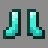

# Kangaroo

***

#### 

# Overview
***
- **Introduced:** v1.7.0
- **Description:** A melee damage kit that likes to jump.
- **Role:** Damage
- **How to Unlock:** Purchase for 500 Credits.

   

# Gear
***
- Chainmail Chestplate
- Chainmail Leggings
- Chainmail Boots
- Iron Sword
- Stomp
- {{ kits.kangaroo.data.MAX_HEALING_POTIONS }} Healing Potions

   

# Abilities
***
### Actives
<!-- tabs:start -->
#### **Stomp**
## Stomp
Right click to gain jump boost for `{{ kits.kangaroo.data.KANGAROO_STOMP_DURATION }}` ticks. When the player lands, they will deal damage in a `{{ kits.kangaroo.data.KANGAROO_STOMP_RADIUS }}` meter radius. The damage is based the player's fall distance. The damage does a minimum damage of `{{ kits.kangaroo.data.KANGAROO_STOMP_MIN_DAMAGE }}`. The damage begins to ramp at a fall distance of `{{ kits.kangaroo.data.KANGAROO_STOMP_RAMP_UP_START }}m`. The damage stops ramping up at `{{ kits.kangaroo.data.KANGAROO_STOMP_RAMP_UP_END }}m` and will deal `{{ kits.kangaroo.data.KANGAROO_STOMP_MAX_DAMAGE }}` damage.

The kangaroo will damage [Engineer Blocks](Engineer#sentries).

<!-- tabs:end -->

### Passives
<!-- tabs:start -->
#### **Strong Legs**
## Strong Legs
The player is immune to fall damage.

<!-- tabs:end -->
 

# Achievements
***

<!-- prettier-ignore -->
| Achievement | Description | Reward |
| ----------- | ----------- | ------ |
| Crippled Turret | Destroy a sentry with your stomp ability. | 20 Credits |
| Mega Stomp | Stomp on an enemy after falling for 50 blocks. | 50 Credits |
| Stomptopia | Get 1,000 stomp kills. | 250 Credits |

   

# Kit Data
***

<!-- prettier-ignore -->
| Property | Value | Description |
|----------|-------|-------------|
| MAX_HEALING_POTIONS | `{{ kits.kangaroo.data.MAX_HEALING_POTIONS }}` | {{ kitDataSharedDescriptions.MAX_HEALING_POTIONS }} |
| HEALING_POTION_CLICK_POTENCY | `{{ kits._shared.data.HEALING_POTION_CLICK_POTENCY }}` | {{ kitDataSharedDescriptions.HEALING_POTION_CLICK_POTENCY }} |
| HEALING_POTION_AUTOPOT_POTENCY | `{{ kits._shared.data.HEALING_POTION_AUTOPOT_POTENCY }}` | {{ kitDataSharedDescriptions.HEALING_POTION_AUTOPOT_POTENCY }} |
| HEALING_POTION_AUTOPOT_THRESHOLD | `{{ kits._shared.data.HEALING_POTION_AUTOPOT_THRESHOLD }}` | {{ kitDataSharedDescriptions.HEALING_POTION_AUTOPOT_THRESHOLD }} |
| HEALING_POTION_AUTOPOT_HOTBAR_ONLY | `{{ kits._shared.data.HEALING_POTION_AUTOPOT_HOTBAR_ONLY }}` | {{ kitDataSharedDescriptions.HEALING_POTION_AUTOPOT_HOTBAR_ONLY }} |
| POTION_IN_COMBAT_REGENERATION_RATE | `{{ kits._shared.data.POTION_IN_COMBAT_REGENERATION_RATE }}` | {{ kitDataSharedDescriptions.POTION_IN_COMBAT_REGENERATION_RATE }} |
| POTION_OUT_OF_COMBAT_REGENERATION_RATE | `{{ kits._shared.data.POTION_OUT_OF_COMBAT_REGENERATION_RATE }}` | {{ kitDataSharedDescriptions.POTION_OUT_OF_COMBAT_REGENERATION_RATE }} |
| KANGAROO_SWORD_DAMAGE | `{{ kits.kangaroo.data.KANGAROO_SWORD_DAMAGE }}` | The base damage of the sword. |
| KANGAROO_SWORD_SPEED | `{{ kits.kangaroo.data.KANGAROO_SWORD_SPEED }}` | The base speed of the sword. |
| KANGAROO_STOMP_COOLDOWN | `{{ kits.kangaroo.data.KANGAROO_STOMP_COOLDOWN }}` | The cooldown, in ticks, of the Stomp ability. |
| KANGAROO_STOMP_DURATION | `{{ kits.kangaroo.data.KANGAROO_STOMP_DURATION }}` | The duration, in ticks, of the Stomp ability. |
| KANGAROO_STOMP_JUMPBOOST_LEVEL | `{{ kits.kangaroo.data.KANGAROO_STOMP_JUMPBOOST_LEVEL }}` | The level of the jump boost effect. |
| KANGAROO_STOMP_HEIGHT_THRESHOLD | `{{ kits.kangaroo.data.KANGAROO_STOMP_HEIGHT_THRESHOLD }}` | The minimum fall distance required to deal Stomp damage. |
| KANGAROO_STOMP_MIN_DAMAGE | `{{ kits.kangaroo.data.KANGAROO_STOMP_MIN_DAMAGE }}` | The minimum damage the Stomp ability will deal. |
| KANGAROO_STOMP_MAX_DAMAGE | `{{ kits.kangaroo.data.KANGAROO_STOMP_MAX_DAMAGE }}` | The maximum damage the Stomp ability will deal. |
| KANGAROO_STOMP_MIN_DAMAGE | `{{ kits.kangaroo.data.KANGAROO_STOMP_RAMP_UP_START }}` | The fall distance, in meters, at which the stomp damage starts to ramp up. |
| KANGAROO_STOMP_MAX_DAMAGE | `{{ kits.kangaroo.data.KANGAROO_STOMP_RAMP_UP_END }}` | The fall distance, in meters, at which the stomp damage stops ramping up. |
| KANGAROO_STOMP_RADIUS | `{{ kits.kangaroo.data.KANGAROO_STOMP_RADIUS }}` | The radius of the Stomp ability. |