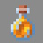

# Medic

---

#### 

# Overview

---

- **Introduced:** v1.7.0
- **Description:** A support kit that uses a healing stone and special healing potions to heal nearby allies.
- **Role:** Support
- **How to Unlock:** Unlocked by Default.

 

# Gear

---

- Leather Chestplate (Green)
- Chainmail Leggings
- Chainmail Boots
- Stone Sword
- Healing Stone
- {{ kits.medic.data.MAX_HEALING_POTIONS }} Medic Healing Potions

 

# Abilities

---

### Actives

<!-- tabs:start -->

#### **Medic Healing Potions**

## Medic Healing Potions

Left-click or right-click to use. Just like regular potions, medic healing potions will restore a certain amount of health to the player. In addition, when the player consumes a medic healing potion, they will also restore `{{ kits.medic.data.MEDIC_POTION_SHARE_POTENCY }}` health to all nearby allies in a `{{ kits.medic.data.MEDIC_POTION_SHARE_RADIUS }}` meter radius.

#### **Healing Stone**

## Healing Stone

Right click and hold to use. The healing stone is used to heal nearby allies in a `{{ kits.medic.data.MEDIC_HEALING_STONE_RADIUS }}` meter radius. Using the healing stone converts [Electrolytes](#electrolytes) to health at a 1:1 ratio. The maximum number of electrolytes that can be converted in a single instance of healing is `{{ kits.medic.data.MEDIC_HEALING_STONE_POTENCY }}`. The player can use the healing stone ability every `{{ kits.medic.data.MEDIC_HEALING_STONE_HEAL_RATE }}` ticks. However, the player can only heal themselves once every `{{ kits.medic.data.MEDIC_HEALING_STONE_SELF_HEAL_RATE }}` ticks.

<!-- tabs:end -->

### Resources

<!-- tabs:start -->

#### **Electrolytes**

## Electrolytes

Electrolytes are used by the [Healing Stone](#healing-stone) ability to heal allies. The maximum number of electrolytes that a player can have is `{{ kits.medic.data.MEDIC_MAX_ELECTROLYTES }}` and the player regenerates `{{ kits.medic.data.MEDIC_ELECTROLYTES_REGENERATION_AMOUNT }}` electrolytes every `{{ kits.medic.data.MEDIC_ELECTROLYTES_REGENERATION_RATE }}` ticks.

<!-- tabs:end -->
 

# Achievements

---

<!-- prettier-ignore -->
| Achievement | Description | Reward |
| ----------- | ----------- | ------ |
| Get zem. Raus, Raus! | Heal 4 allies at once as medic. | 20 Credits |
| Ze healing is not as revarding as ze hurting! | Do a total of 5,000 healing as medic. | 500 Credits |

 

# Kit Data

---

<!-- prettier-ignore -->
| Property | Value | Description |
|----------|-------|-------------|
| MAX_HEALING_POTIONS | `{{ kits.medic.data.MAX_HEALING_POTIONS }}` | Maximum number of medic healing potions the player can carry. |
| HEALING_POTION_CLICK_POTENCY | `{{ kits._shared.data.HEALING_POTION_CLICK_POTENCY }}` | {{ kitDataSharedDescriptions.HEALING_POTION_CLICK_POTENCY }} |
| HEALING_POTION_AUTOPOT_POTENCY | `{{ kits._shared.data.HEALING_POTION_AUTOPOT_POTENCY }}` | {{ kitDataSharedDescriptions.HEALING_POTION_AUTOPOT_POTENCY }} |
| HEALING_POTION_AUTOPOT_THRESHOLD | `{{ kits._shared.data.HEALING_POTION_AUTOPOT_THRESHOLD }}` | {{ kitDataSharedDescriptions.HEALING_POTION_AUTOPOT_THRESHOLD }} |
| HEALING_POTION_AUTOPOT_HOTBAR_ONLY | `{{ kits._shared.data.HEALING_POTION_AUTOPOT_HOTBAR_ONLY }}` | {{ kitDataSharedDescriptions.HEALING_POTION_AUTOPOT_HOTBAR_ONLY }} |
| POTION_IN_COMBAT_REGENERATION_RATE | `{{ kits._shared.data.POTION_IN_COMBAT_REGENERATION_RATE }}` | {{ kitDataSharedDescriptions.POTION_IN_COMBAT_REGENERATION_RATE }} |
| POTION_OUT_OF_COMBAT_REGENERATION_RATE | `{{ kits._shared.data.POTION_OUT_OF_COMBAT_REGENERATION_RATE }}` | {{ kitDataSharedDescriptions.POTION_OUT_OF_COMBAT_REGENERATION_RATE }} |
| CHESTPLATE_ARMOR | `{{ kits.medic.data.CHESTPLATE_ARMOR }}` | {{ kitDataSharedDescriptions.CHESTPLATE_ARMOR }} |
| CHESTPLATE_ARMOR_TOUGHNESS | `{{ kits.medic.data.CHESTPLATE_ARMOR_TOUGHNESS }}` | {{ kitDataSharedDescriptions.CHESTPLATE_ARMOR_TOUGHNESS }} |
| CHESTPLATE_PROTECTION_LEVEL | `{{ kits.medic.data.CHESTPLATE_PROTECTION_LEVEL }}` | {{ kitDataSharedDescriptions.CHESTPLATE_PROTECTION_LEVEL }} |
| CHESTPLATE_KNOCKBACK_RESISTANCE | `{{ kits.medic.data.CHESTPLATE_KNOCKBACK_RESISTANCE }}` | {{ kitDataSharedDescriptions.CHESTPLATE_KNOCKBACK_RESISTANCE }} |
| LEGGINGS_ARMOR | `{{ kits.medic.data.LEGGINGS_ARMOR }}` | {{ kitDataSharedDescriptions.LEGGINGS_ARMOR }} |
| LEGGINGS_ARMOR_TOUGHNESS | `{{ kits.medic.data.LEGGINGS_ARMOR_TOUGHNESS }}` | {{ kitDataSharedDescriptions.LEGGINGS_ARMOR_TOUGHNESS }} |
| LEGGINGS_PROTECTION_LEVEL | `{{ kits.medic.data.LEGGINGS_PROTECTION_LEVEL }}` | {{ kitDataSharedDescriptions.LEGGINGS_PROTECTION_LEVEL }} |
| LEGGINGS_KNOCKBACK_RESISTANCE | `{{ kits.medic.data.LEGGINGS_KNOCKBACK_RESISTANCE }}` | {{ kitDataSharedDescriptions.LEGGINGS_KNOCKBACK_RESISTANCE }} |
| BOOTS_ARMOR | `{{ kits.medic.data.BOOTS_ARMOR }}` | {{ kitDataSharedDescriptions.BOOTS_ARMOR }} |
| BOOTS_ARMOR_TOUGHNESS | `{{ kits.medic.data.BOOTS_ARMOR_TOUGHNESS }}` | {{ kitDataSharedDescriptions.BOOTS_ARMOR_TOUGHNESS }} |
| BOOTS_PROTECTION_LEVEL | `{{ kits.medic.data.BOOTS_PROTECTION_LEVEL }}` | {{ kitDataSharedDescriptions.BOOTS_PROTECTION_LEVEL }} |
| BOOTS_KNOCKBACK_RESISTANCE | `{{ kits.medic.data.BOOTS_KNOCKBACK_RESISTANCE }}` | {{ kitDataSharedDescriptions.BOOTS_KNOCKBACK_RESISTANCE }} |
| MEDIC_SWORD_DAMAGE | `{{ kits.medic.data.MEDIC_SWORD_DAMAGE }}` | The base damage of the sword. |
| MEDIC_SWORD_SPEED | `{{ kits.medic.data.MEDIC_SWORD_SPEED }}` | The base speed of the sword. |
| MEDIC_POTION_SHARE_POTENCY | `{{ kits.medic.data.MEDIC_POTION_SHARE_POTENCY }}` | The amount of health to restore to allies when using a medic healing potion. |
| MEDIC_POTION_SHARE_RADIUS | `{{ kits.medic.data.MEDIC_POTION_SHARE_RADIUS }}` | The radius, in meters, in which medic healing potions will heal allies. |
| MEDIC_HEALING_STONE_RADIUS | `{{ kits.medic.data.MEDIC_HEALING_STONE_RADIUS }}` | The radius, in meters, in which the healing stone ability will heal allies. |
| MEDIC_HEALING_STONE_POTENCY | `{{ kits.medic.data.MEDIC_HEALING_STONE_POTENCY }}` | The maximum amount health that an instance of healing from the healing stone can restore.|
| MEDIC_HEALING_STONE_HEAL_RATE | `{{ kits.medic.data.MEDIC_HEALING_STONE_HEAL_RATE }}` | The rate, in ticks, at which the player can use the healing stone. |
| MEDIC_HEALING_STONE_SELF_HEAL_RATE | `{{ kits.medic.data.MEDIC_HEALING_STONE_SELF_HEAL_RATE }}` | The rate, in ticks, at which the player can heal themselves using the healing stone. |
| MEDIC_MAX_ELECTROLYTES | `{{ kits.medic.data.MEDIC_MAX_ELECTROLYTES }}` | The maximum number of electrolytes the player can hold. |
| MEDIC_ELECTROLYTES_REGENERATION_AMOUNT | `{{ kits.medic.data.MEDIC_ELECTROLYTES_REGENERATION_AMOUNT }}` | The amount of the electrolytes to regenerate. |
| MEDIC_ELECTROLYTES_REGENERATION_RATE | `{{ kits.medic.data.MEDIC_ELECTROLYTES_REGENERATION_RATE }}` | The rate, in ticks, at which electrolytes regenerate. |
