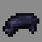

# Ninja

---

#### 

# Overview

---

- **Introduced:** v2.1.0
- **Description:** A stealthy kit that deflects and dodges attacks.
- **Role:** Damage
- **How to Unlock:** Purchase for 500 Credits.

 

# Gear

---

- Leather Chestplate (Black)
- Netherite Leggings
- Leather Boots (Black)
- Katana
- Dodge
- {{ kits.ninja.data.MAX_HEALING_POTIONS }} Healing Potions

 

# Abilities

---

### Actives

<!-- tabs:start -->

#### **Katana**

## Katana

Forged in ancient flames and tempered by shadows, the katana is a powerful weapon that slices through enemies.

Hold right-click to block an incoming physcial attack. The damage is deflected to a nearby enemy. Only physical damage can be parried.

#### **Dodge**

## Dodge

Use the dodge ability to evade enemy attacks. When right-clicked, the player teleports close to the nearest enemy within `{{ kits.ninja.data.NINJA_DODGE_AROUND_ENEMY_TARGET_RADIUS }}` meters.

When shift + right-clicked, the ninja performs an escape, teleporting to a random location within `{{ kits.ninja.data.NINJA_DODGE_MAX_RADIUS }}` meters.

<!-- tabs:end -->

### Passives

<!-- tabs:start -->

#### **Agility**

## Agility

After performing a successful parry, the player gains speed `{{ kits.ninja.data.NINJA_AGILITY_SPEED_LEVEL }}` for `{{ kits.ninja.data.NINJA_AGILITY_SPEED_DURATION }}` ticks.

<!-- tabs:end -->

### Resources

<!-- tabs:start -->

#### **Ki**

## Ki

The player harnesses inner energy to empower their katana with devastating precision. Ki is a mystical resource that increases parry damage by `{{ kits.ninja.data.NINJA_PARRY_DAMAGE_INCREASE_PER_KI }}%` for each point the player possesses. The player can store up to `{{ kits.ninja.data.NINJA_KI_MAX }}` ki.

When a parry attack is performed, `{{ kits.ninja.data.NINJA_KI_PARRY_CONSUME_AMOUNT }}` ki is consumed to amplify its power, turning defense into a deadly counterstrike.

Ki is accumulated in several ways:

<!-- tabs:start -->

#### **Melee Attacks**

## Melee Attacks

The player accumulates `{{ kits.ninja.data.NINJA_KI_PER_MELEE_ATTACK }}` ki per katana strike.

#### **Parrying**

## Parrying

The player accumulates `{{ kits.ninja.data.NINJA_KI_TO_DAMAGE_RATIO }}` ki per point of damage blocked when the damage isn't deflected.

#### **Dodging in Combat**

## Dodging in Combat

The player accumulates `{{ kits.ninja.data.NINJA_DODGE_USE_IN_COMBAT_KI_BONUS }}` ki when using the dodge ability while in combat.

#### **Eliminations**

## Eliminations

The player accumulates `{{ kits.ninja.data.NINJA_KI_ELIMINATION_REWARD }}` ki after eliminating an enemy.

<!-- tabs:end -->

<!-- tabs:end -->
 

# Achievements

---

<!-- prettier-ignore -->
| Achievement | Description | Reward |
| ----------- | ----------- | ------ |
| Collateral Cut | Earn a katana parry kill on an enemy that isn't the parry source. | 20 Credits |
| From the Shadow | Earn a kill within 2 seconds after using the ninja dodge ability. | 20 Credits |
| Knightmare | Kill a knight as ninja. | 20 Credits |
| Outstealthed | Kill a spy as ninja. | 20 Credits |
| Phantom Reflexes | Parry a katana parry as ninja. | 30 Credits |
| Smoke Without Bombs | Kill a bomber as ninja | 20 Credits |
| Art of Redirection | Parry 10 attacks in one life" | 50 Credits |
| Dance of Shadows | Perform 250 ninja dodges. | 250 Credits |
| Reservoir of Will | Accumulate 10,000 Ki. | 250 Credits |
| Fruit of the Blade | Get 50 katana parry kills. | 1,000 Credits |

 

# Kit Data

---

<!-- prettier-ignore -->
| Property | Value | Description |
|----------|-------|-------------|
| MAX_HEALING_POTIONS | `{{ kits.ninja.data.MAX_HEALING_POTIONS }}` | {{ kitDataSharedDescriptions.MAX_HEALING_POTIONS }} |
| HEALING_POTION_CLICK_POTENCY | `{{ kits._shared.data.HEALING_POTION_CLICK_POTENCY }}` | {{ kitDataSharedDescriptions.HEALING_POTION_CLICK_POTENCY }} |
| HEALING_POTION_AUTOPOT_POTENCY | `{{ kits._shared.data.HEALING_POTION_AUTOPOT_POTENCY }}` | {{ kitDataSharedDescriptions.HEALING_POTION_AUTOPOT_POTENCY }} |
| HEALING_POTION_AUTOPOT_THRESHOLD | `{{ kits._shared.data.HEALING_POTION_AUTOPOT_THRESHOLD }}` | {{ kitDataSharedDescriptions.HEALING_POTION_AUTOPOT_THRESHOLD }} |
| HEALING_POTION_AUTOPOT_HOTBAR_ONLY | `{{ kits._shared.data.HEALING_POTION_AUTOPOT_HOTBAR_ONLY }}` | {{ kitDataSharedDescriptions.HEALING_POTION_AUTOPOT_HOTBAR_ONLY }} |
| POTION_IN_COMBAT_REGENERATION_RATE | `{{ kits._shared.data.POTION_IN_COMBAT_REGENERATION_RATE }}` | {{ kitDataSharedDescriptions.POTION_IN_COMBAT_REGENERATION_RATE }} |
| POTION_OUT_OF_COMBAT_REGENERATION_RATE | `{{ kits._shared.data.POTION_OUT_OF_COMBAT_REGENERATION_RATE }}` | {{ kitDataSharedDescriptions.POTION_OUT_OF_COMBAT_REGENERATION_RATE }} |
| CHESTPLATE_ARMOR | `{{ kits.ninja.data.CHESTPLATE_ARMOR }}` | {{ kitDataSharedDescriptions.CHESTPLATE_ARMOR }} |
| CHESTPLATE_ARMOR_TOUGHNESS | `{{ kits.ninja.data.CHESTPLATE_ARMOR_TOUGHNESS }}` | {{ kitDataSharedDescriptions.CHESTPLATE_ARMOR_TOUGHNESS }} |
| CHESTPLATE_PROTECTION_LEVEL | `{{ kits.ninja.data.CHESTPLATE_PROTECTION_LEVEL }}` | {{ kitDataSharedDescriptions.CHESTPLATE_PROTECTION_LEVEL }} |
| CHESTPLATE_KNOCKBACK_RESISTANCE | `{{ kits.ninja.data.CHESTPLATE_KNOCKBACK_RESISTANCE }}` | {{ kitDataSharedDescriptions.CHESTPLATE_KNOCKBACK_RESISTANCE }} |
| LEGGINGS_ARMOR | `{{ kits.ninja.data.LEGGINGS_ARMOR }}` | {{ kitDataSharedDescriptions.LEGGINGS_ARMOR }} |
| LEGGINGS_ARMOR_TOUGHNESS | `{{ kits.ninja.data.LEGGINGS_ARMOR_TOUGHNESS }}` | {{ kitDataSharedDescriptions.LEGGINGS_ARMOR_TOUGHNESS }} |
| LEGGINGS_PROTECTION_LEVEL | `{{ kits.ninja.data.LEGGINGS_PROTECTION_LEVEL }}` | {{ kitDataSharedDescriptions.LEGGINGS_PROTECTION_LEVEL }} |
| LEGGINGS_KNOCKBACK_RESISTANCE | `{{ kits.ninja.data.LEGGINGS_KNOCKBACK_RESISTANCE }}` | {{ kitDataSharedDescriptions.LEGGINGS_KNOCKBACK_RESISTANCE }} |
| BOOTS_ARMOR | `{{ kits.ninja.data.BOOTS_ARMOR }}` | {{ kitDataSharedDescriptions.BOOTS_ARMOR }} |
| BOOTS_ARMOR_TOUGHNESS | `{{ kits.ninja.data.BOOTS_ARMOR_TOUGHNESS }}` | {{ kitDataSharedDescriptions.BOOTS_ARMOR_TOUGHNESS }} |
| BOOTS_PROTECTION_LEVEL | `{{ kits.ninja.data.BOOTS_PROTECTION_LEVEL }}` | {{ kitDataSharedDescriptions.BOOTS_PROTECTION_LEVEL }} |
| BOOTS_KNOCKBACK_RESISTANCE | `{{ kits.ninja.data.BOOTS_KNOCKBACK_RESISTANCE }}` | {{ kitDataSharedDescriptions.BOOTS_KNOCKBACK_RESISTANCE }} |
| NINJA_KATANA_DAMAGE | `{{ kits.ninja.data.NINJA_KATANA_DAMAGE }}` | The base damage of the katana. |
| NINJA_KATANA_SPEED | `{{ kits.ninja.data.NINJA_KATANA_SPEED }}` | The base speed of the katana. |
| NINJA_KI_MAX | `{{ kits.ninja.data.NINJA_KI_MAX }}` | The maximum amount of ki that the player can store. |
| NINJA_KI_PER_MELEE_ATTACK | `{{ kits.ninja.data.NINJA_KI_PER_MELEE_ATTACK }}` | The amount of ki accumulated per katana melee attack. |
| NINJA_KI_TO_DAMAGE_RATIO | `{{ kits.ninja.data.NINJA_KI_TO_DAMAGE_RATIO }}` | The amount of ki accumulated per damage blocked from parry attacks that are not deflected. |
| NINJA_KI_PARRY_CONSUME_AMOUNT | `{{ kits.ninja.data.NINJA_KI_PARRY_CONSUME_AMOUNT }}` | The amount of ki consumed after successfully deflecting an attack. |
| NINJA_KI_SWORDS_TO_DISPLAY | `{{ kits.ninja.data.NINJA_KI_SWORDS_TO_DISPLAY }}` | The amount of sword icons displayed on the player's action bar. |
| NINJA_KI_ELIMINATION_REWARD | `{{ kits.ninja.data.NINJA_KI_ELIMINATION_REWARD }}` | The amount of ki accumulated after eliminating an enemy. |
| NINJA_PARRY_DURATION | `{{ kits.ninja.data.NINJA_PARRY_DURATION }}` | The maximum duration, in ticks, that the player can hold up their katana to parry incoming attacks. |
| NINJA_PARRY_COOLDOWN | `{{ kits.ninja.data.NINJA_PARRY_COOLDOWN }}` | The cooldown, in ticks, of the katana parry ability. |
| NINJA_PARRY_BASE_DAMAGE_PERCENTAGE | `{{ kits.ninja.data.NINJA_PARRY_BASE_DAMAGE_PERCENTAGE }}` | The percentage of incoming damage that is deflected or converted when parried. |
| NINJA_PARRY_DAMAGE_INCREASE_PER_KI | `{{ kits.ninja.data.NINJA_PARRY_DAMAGE_INCREASE_PER_KI }}` | The parry damage increase (percentage) for each point of ki the player possesses. |
| NINJA_PARRY_DAMAGE_RADIUS | `{{ kits.ninja.data.NINJA_PARRY_DAMAGE_RADIUS }}` | The radius of parry attacks, in meters. |
| NINJA_PARRY_IGNORE_I_FRAMES | `{{ kits.ninja.data.NINJA_PARRY_IGNORE_I_FRAMES }}` | Specifies if parry attacks should ignore invulnerability frames. |
| NINJA_DODGE_COOLDOWN | `{{ kits.ninja.data.NINJA_DODGE_COOLDOWN }}` | The cooldown, in ticks, of the dodge ability (escape). |
| NINJA_DODGE_MIN_RADIUS | `{{ kits.ninja.data.NINJA_DODGE_MIN_RADIUS }}` | The minimum distance that the player can teleport to when using the dodge ability (escape). |
| NINJA_DODGE_MAX_RADIUS | `{{ kits.ninja.data.NINJA_DODGE_MAX_RADIUS }}` | The maximum distance that the player can teleport to when using the dodge ability (escape). |
| NINJA_DODGE_AROUND_ENEMY_TARGET_RADIUS | `{{ kits.ninja.data.NINJA_DODGE_AROUND_ENEMY_TARGET_RADIUS }}` | The radius, in blocks, used to locate the nearest enemy target when performing a dodge (around enemy). |
| NINJA_DODGE_AROUND_ENEMY_COOLDOWN | `{{ kits.ninja.data.NINJA_DODGE_AROUND_ENEMY_COOLDOWN }}` | The cooldown, in ticks, of the dodge ability (around enemy). |
| NINJA_DODGE_MIN_RADIUS_AROUND_ENEMY | `{{ kits.ninja.data.NINJA_DODGE_MIN_RADIUS_AROUND_ENEMY }}` | The minimum distance that the player can teleport to when using the dodge ability (around enemy). |
| NINJA_DODGE_MAX_RADIUS_AROUND_ENEMY | `{{ kits.ninja.data.NINJA_DODGE_MAX_RADIUS_AROUND_ENEMY }}` | The maximum distance that the player can teleport to when using the dodge ability (around enemy). |
| NINJA_DODGE_USE_IN_COMBAT_KI_BONUS | `{{ kits.ninja.data.NINJA_DODGE_USE_IN_COMBAT_KI_BONUS }}` | The amount of ki accumulated when using the dodge ability while in combat. |
| NINJA_AGILITY_SPEED_DURATION | `{{ kits.ninja.data.NINJA_AGILITY_SPEED_DURATION }}` | The duration, in ticks, of the agility speed effect. |
| NINJA_AGILITY_SPEED_LEVEL | `{{ kits.ninja.data.NINJA_AGILITY_SPEED_LEVEL }}` | The level of the agility speed effect. |
