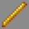

# Prometheus

***

#### 

# Overview
***
- **Introduced:** v1.8.0
- **Description:** A kit that uses the element of fire to deal damage.
- **Role:** Damage
- **How to Unlock:** Purchase for 500 Credits.

   

# Gear
***
- Chainmail Chestplate
- Leather Leggings (Orange)
- Chainmail Boots
- Stone Sword
- Spell Wand
- {{ kits.prometheus.data.MAX_MANA_POTIONS }} Mana Potions
- {{ kits._shared.data.MANA_MAX }} Mana

   

# Abilities
***
### Actives
<!-- tabs:start -->
#### **Spell Wand**
## Spell Wand
A weapon that is used to cast spells. Casting spells costs mana and each spell has a cooldown.

### Casting
- Fireball *(Left-Click)*
- Flame *(Right-Click)*
- Imbue *(Sneak + Rightt-Click)*

<!-- tabs:start -->
#### **Fireball**
## Fireball
The spell costs `{{ kits.prometheus.data.PROMETHEUS_FIREBALL_MANA_COST }}` mana. Casting summons a fireball in the direction the player is looking. The fireball deals `{{ kits.prometheus.data.PROMETHEUS_FIREBALL_HIT_DAMAGE }}` damage on impact and explodes to deal and an additional `{{ kits.prometheus.data.PROMETHEUS_FIREBALL_EXPLOSION_DAMAGE }}` damage. The fireball ignites enemies for `{{ kits.prometheus.data.PROMETHEUS_FIREBALL_EXPLOSION_FIRE_DURATION }}` ticks and deals knockback. The caster is also affected by the fireball if caught in the explosion.

Fireballs destroy builder bricks.

Fireballs damage engineer blocks.

#### **Flame**
## Flame
The spell costs `{{ kits.prometheus.data.PROMETHEUS_FLAME_MANA_COST }}` mana. Casting summons flames that travel forward in front of the player. Enemies that are caught in the are ignited for `{{ kits.prometheus.data.PROMETHEUS_FLAME_BURN_DURATION }}` ticks.

The flame spell burns cobwebs.

#### **Imbue**
## Imbue

The spell costs `{{ kits.prometheus.data.PROMETHEUS_IMBUE_MANA_COST }}` mana. Casting imbues the player's sword with flames. The player is also affected with fire resistance.

If the spell is casted again while the effects are active, then the player incinerate.

<!-- tabs:end -->

<!-- tabs:end -->

### Resources
<!-- tabs:start -->
#### **Mana**
## Mana
Mana is a resource used to cast spells.

The player's maximum mana is `{{ kits._shared.data.MANA_MAX }}` and it regenerates slowly over time.

After the player earns a final blow, they restore `{{ kits._shared.data.MANA_FINAL_BLOW_AMOUNT }}` mana. After earning an assist, they restore `{{ kits._shared.data.MANA_ASSIST_AMOUNT }}` mana.

Friendly engineer dispensers restore `{{ kits._shared.data.MANA_DISPENSER_DISPENSE_AMOUNT }}` mana.

<!-- tabs:end -->
 

# Achievements
***

| Achievement | Description | Reward |
| ----------- | ----------- | ------ |
| Deflected…but at what cost? | Deflect an enemy fireball and kill an ally. | 20 Credits |
| Frost fire | Ignite enemy that has the frozen effect. | 20 Credits |
| That was heated. | Use the imbue spell to save yourself from burning. | 20 Credits |
| That’s not fire. | Use the imbue spell again after already casting it. | 20 Credits |
| Grab the ember-ella! | Get a double fireball kill. | 50 Credits |
| Burn down the em-fire! | Get a triple fireball kill. | 50 Credits |
| I’ll have a blazed doughnut | Get 1,000 Fire Kills. | 250 Credits |
| In the Hall of Flame. | Get 1,000 fireball kills. | 250 Credits |
| It’s lit! | Ignite 10,000 enemies. | 250 Credits |

   

# Kit Data
***

| Property | Value | Description |
|----------|-------|-------------|
| MAX_HEALING_POTIONS | `{{ kits.prometheus.data.MAX_HEALING_POTIONS }}` | {{ kitDataSharedDescriptions.MAX_HEALING_POTIONS }} |
| HEALING_POTION_CLICK_POTENCY | `{{ kits._shared.data.HEALING_POTION_CLICK_POTENCY }}` | {{ kitDataSharedDescriptions.HEALING_POTION_CLICK_POTENCY }} |
| HEALING_POTION_AUTOPOT_POTENCY | `{{ kits._shared.data.HEALING_POTION_AUTOPOT_POTENCY }}` | {{ kitDataSharedDescriptions.HEALING_POTION_AUTOPOT_POTENCY }} |
| HEALING_POTION_AUTOPOT_THRESHOLD | `{{ kits._shared.data.HEALING_POTION_AUTOPOT_THRESHOLD }}` | {{ kitDataSharedDescriptions.HEALING_POTION_AUTOPOT_THRESHOLD }} |
| HEALING_POTION_AUTOPOT_HOTBAR_ONLY | `{{ kits._shared.data.HEALING_POTION_AUTOPOT_HOTBAR_ONLY }}` | {{ kitDataSharedDescriptions.HEALING_POTION_AUTOPOT_HOTBAR_ONLY }} |
| POTION_IN_COMBAT_REGENERATION_RATE | `{{ kits._shared.data.POTION_IN_COMBAT_REGENERATION_RATE }}` | {{ kitDataSharedDescriptions.POTION_IN_COMBAT_REGENERATION_RATE }} |
| POTION_OUT_OF_COMBAT_REGENERATION_RATE | `{{ kits._shared.data.POTION_OUT_OF_COMBAT_REGENERATION_RATE }}` | {{ kitDataSharedDescriptions.POTION_OUT_OF_COMBAT_REGENERATION_RATE }} |
| MAX_MANA_POTIONS | `{{ kits.prometheus.data.MAX_MANA_POTIONS }}` | {{ kitDataSharedDescriptions.MAX_MANA_POTIONS }} |
| MANA_POTION_CLICK_POTENCY | `{{ kits._shared.data.MANA_POTION_CLICK_POTENCY }}` | {{ kitDataSharedDescriptions.MANA_POTION_CLICK_POTENCY }} |
| MANA_POTION_AUTOPOT_POTENCY | `{{ kits._shared.data.MANA_POTION_AUTOPOT_POTENCY }}` | {{ kitDataSharedDescriptions.MANA_POTION_AUTOPOT_POTENCY }} |
| MANA_POTION_AUTOPOT_THRESHOLD | `{{ kits._shared.data.MANA_POTION_AUTOPOT_THRESHOLD }}` | {{ kitDataSharedDescriptions.MANA_POTION_AUTOPOT_THRESHOLD }} |
| MANA_POTION_AUTOPOT_HOTBAR_ONLY | `{{ kits._shared.data.MANA_POTION_AUTOPOT_HOTBAR_ONLY }}` | {{ kitDataSharedDescriptions.MANA_POTION_AUTOPOT_HOTBAR_ONLY }} |
| MANA_MAX | `{{ kits._shared.data.MANA_MAX }}` | {{ kitDataSharedDescriptions.MANA_MAX }} |
| MANA_REGENERATION_RATE | `{{ kits._shared.data.MANA_REGENERATION_RATE }}` | {{ kitDataSharedDescriptions.MANA_REGENERATION_RATE }} |
| MANA_REGENERATION_AMOUNT | `{{ kits._shared.data.MANA_REGENERATION_AMOUNT }}` | {{ kitDataSharedDescriptions.MANA_REGENERATION_AMOUNT }} |
| MANA_FINAL_BLOW_AMOUNT | `{{ kits._shared.data.MANA_FINAL_BLOW_AMOUNT }}` | {{ kitDataSharedDescriptions.MANA_FINAL_BLOW_AMOUNT }} |
| MANA_ASSIST_AMOUNT | `{{ kits._shared.data.MANA_ASSIST_AMOUNT }}` | {{ kitDataSharedDescriptions.MANA_ASSIST_AMOUNT }} |
| MANA_DISPENSER_DISPENSE_AMOUNT | `{{ kits._shared.data.MANA_DISPENSER_DISPENSE_AMOUNT }}` | {{ kitDataSharedDescriptions.MANA_DISPENSER_DISPENSE_AMOUNT }} |
| PROMETHEUS_SWORD_DAMAGE | `{{ kits.prometheus.data.PROMETHEUS_SWORD_DAMAGE }}` | |
| PROMETHEUS_SWORD_SPEED | `{{ kits.prometheus.data.PROMETHEUS_SWORD_SPEED }}` | |
| PROMETHEUS_WAND_KNOCKBACK | `{{ kits.prometheus.data.PROMETHEUS_WAND_KNOCKBACK }}` | |
| PROMETHEUS_FLAME_MANA_COST | `{{ kits.prometheus.data.PROMETHEUS_FLAME_MANA_COST }}` | |
| PROMETHEUS_FLAME_CAST_COOLDOWN | `{{ kits.prometheus.data.PROMETHEUS_FLAME_CAST_COOLDOWN }}` | |
| PROMETHEUS_FLAME_RANGE | `{{ kits.prometheus.data.PROMETHEUS_FLAME_RANGE }}` | |
| PROMETHEUS_FLAME_SPEED | `{{ kits.prometheus.data.PROMETHEUS_FLAME_SPEED }}` | |
| PROMETHEUS_FLAME_BLOCK_HITBOX_SIZE | `{{ kits.prometheus.data.PROMETHEUS_FLAME_BLOCK_HITBOX_SIZE }}` | |
| PROMETHEUS_FLAME_ENTITY_HITBOX_SIZE | `{{ kits.prometheus.data.PROMETHEUS_FLAME_ENTITY_HITBOX_SIZE }}` | |
| PROMETHEUS_FLAME_BURN_DURATION | `{{ kits.prometheus.data.PROMETHEUS_FLAME_BURN_DURATION }}` | |
| PROMETHEUS_FIREBALL_MANA_COST | `{{ kits.prometheus.data.PROMETHEUS_FIREBALL_MANA_COST }}` | |
| PROMETHEUS_FIREBALL_CAST_COOLDOWN | `{{ kits.prometheus.data.PROMETHEUS_FIREBALL_CAST_COOLDOWN }}` | |
| PROMETHEUS_FIREBALL_HIT_DAMAGE | `{{ kits.prometheus.data.PROMETHEUS_FIREBALL_HIT_DAMAGE }}` | |
| PROMETHEUS_FIREBALL_EXPLOSION_RADIUS | `{{ kits.prometheus.data.PROMETHEUS_FIREBALL_EXPLOSION_RADIUS }}` | |
| PROMETHEUS_FIREBALL_EXPLOSION_DAMAGE | `{{ kits.prometheus.data.PROMETHEUS_FIREBALL_EXPLOSION_DAMAGE }}` | |
| PROMETHEUS_FIREBALL_EXPLOSION_IGNORE_I_FRAMES | `{{ kits.prometheus.data.PROMETHEUS_FIREBALL_EXPLOSION_IGNORE_I_FRAMES }}` | |
| PROMETHEUS_FIREBALL_EXPLOSION_SELF_DAMAGE_MULTIPLIER | `{{ kits.prometheus.data.PROMETHEUS_FIREBALL_EXPLOSION_SELF_DAMAGE_MULTIPLIER }}` | |
| PROMETHEUS_FIREBALL_EXPLOSION_FIRE_DURATION | `{{ kits.prometheus.data.PROMETHEUS_FIREBALL_EXPLOSION_FIRE_DURATION }}` | |
| PROMETHEUS_FIREBALL_EXPLOSION_KNOCKBACK_MULTIPLIER | `{{ kits.prometheus.data.PROMETHEUS_FIREBALL_EXPLOSION_KNOCKBACK_MULTIPLIER }}` | |
| PROMETHEUS_IMBUE_MANA_COST | `{{ kits.prometheus.data.PROMETHEUS_IMBUE_MANA_COST }}` | |
| PROMETHEUS_IMBUE_CAST_COOLDOWN | `{{ kits.prometheus.data.PROMETHEUS_IMBUE_CAST_COOLDOWN }}` | |
| PROMETHEUS_IMBUE_FIRE_ASPECT_LEVEL | `{{ kits.prometheus.data.PROMETHEUS_IMBUE_FIRE_ASPECT_LEVEL }}` | |
| PROMETHEUS_IMBUE_FIRE_RESISTANCE_LEVEL | `{{ kits.prometheus.data.PROMETHEUS_IMBUE_FIRE_RESISTANCE_LEVEL }}` | |
| PROMETHEUS_IMBUE_DURATION | `{{ kits.prometheus.data.PROMETHEUS_IMBUE_DURATION }}` | |
| PROMETHEUS_IMBUE_SELF_DAMAGE | `{{ kits.prometheus.data.PROMETHEUS_IMBUE_SELF_DAMAGE }}` | |

### Changelog