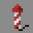

# Pyrotechnic

***

#### 

# Overview
***
- **Introduced:** v1.7.0
- **Description:** A ranged kit that shoots firework rockets with a crossbow.
- **Role:** Damage
- **How to Unlock:** Purchase for 500 Credits.

   

# Gear
***
- Chainmail Chestplate
- Chainmail Leggings
- Chainmail Boots
- Iron Sword
- Rocket Launcher
- {{ kits.pyrotechnic.data.PYROTECHNIC_MAX_AMMO }} Reserve Rockets
- {{ kits.pyrotechnic.data.MAX_HEALING_POTIONS }} Healing Potions

   

# Abilities
***
### Actives
<!-- tabs:start -->
#### **Rocket Launcher**
## Rocket Launcher
The rocket launcher is a weapon that is used to shoot fireworks rockets at enemies. It will shoot `1` rocket at a time. When a rocket explodes, it will deal `{{ kits.pyrotechnic.data.PYROTECHNIC_ROCKET_DAMAGE }}` damage to enemies in a `{{ kits.pyrotechnic.data.PYROTECHNIC_ROCKET_RADIUS }}` meter radius. After shooting, the rocket will automatically reload after `{{ kits.pyrotechnic.data.PYROTECHNIC_ROCKET_SHOOT_COOLDOWN }}` ticks.

#### **Barrage**
## Barrage
Left-click the rocket launcher to activate Barrage. While Barrage is active, the rocket launcher will shoot `{{ kits.pyrotechnic.data.PYROTECHNIC_BARRAGE_ROCKETS_PER_SHOT }}` rockets at a time. The reload time is also decreased to `{{ kits.pyrotechnic.data.PYROTECHNIC_BARRAGE_ROCKET_SHOOT_COOLDOWN }}` ticks.

<!-- tabs:end -->

### Resources
<!-- tabs:start -->
#### **Rockets**
## Rockets
Rockets are used as ammo for the rocket launcher. Rockets will be taken from the reserve ammo after the rocket launcher finishes reloading. The player can hold a maxiumum of `{{ kits.pyrotechnic.data.PYROTECHNIC_MAX_AMMO }}` rockets and rockets automatically regenerate every `{{ kits.pyrotechnic.data.PYROTECHNIC_AMMO_REGENERATION_RATE }}` ticks.

The player will be rewarded `{{ kits.pyrotechnic.data.PYROTECHNIC_AMMO_FINAL_BLOW_REWARD }}` rockets after earning a final blow and `1` rockets after earning an assist.

Ally engineer dispensers will dispense `{{ kits.pyrotechnic.data.PYROTECHNIC_AMMO_DISPENSER_DISPENSE_AMOUNT }}` rockets to the player if they are in range.

<!-- tabs:end -->
 

# Achievements
***

| Achievement | Description | Reward |
| ----------- | ----------- | ------ |
| Keep calm and sparkle on. | Get a double rocket kill. | 20 Credits |
| Glorified Gunpowder | Get a triple rocket kill. | 20 Credits |
| When birds fry | Knock an air mage our of flight using rockets. | 20 Credits |
| Snap, Crackle, Pop | Get 1,000 rocket kills. | 250 Credits |

   

# Kit Data
***

| Property | Value | Description |
|----------|-------|-------------|
| MAX_HEALING_POTIONS | `{{ kits.pyrotechnic.data.MAX_HEALING_POTIONS }}` | {{ kitDataSharedDescriptions.MAX_HEALING_POTIONS }} |
| HEALING_POTION_CLICK_POTENCY | `{{ kits._shared.data.HEALING_POTION_CLICK_POTENCY }}` | {{ kitDataSharedDescriptions.HEALING_POTION_CLICK_POTENCY }} |
| HEALING_POTION_AUTOPOT_POTENCY | `{{ kits._shared.data.HEALING_POTION_AUTOPOT_POTENCY }}` | {{ kitDataSharedDescriptions.HEALING_POTION_AUTOPOT_POTENCY }} |
| HEALING_POTION_AUTOPOT_THRESHOLD | `{{ kits._shared.data.HEALING_POTION_AUTOPOT_THRESHOLD }}` | {{ kitDataSharedDescriptions.HEALING_POTION_AUTOPOT_THRESHOLD }} |
| HEALING_POTION_AUTOPOT_HOTBAR_ONLY | `{{ kits._shared.data.HEALING_POTION_AUTOPOT_HOTBAR_ONLY }}` | {{ kitDataSharedDescriptions.HEALING_POTION_AUTOPOT_HOTBAR_ONLY }} |
| POTION_IN_COMBAT_REGENERATION_RATE | `{{ kits._shared.data.POTION_IN_COMBAT_REGENERATION_RATE }}` | {{ kitDataSharedDescriptions.POTION_IN_COMBAT_REGENERATION_RATE }} |
| POTION_OUT_OF_COMBAT_REGENERATION_RATE | `{{ kits._shared.data.POTION_OUT_OF_COMBAT_REGENERATION_RATE }}` | {{ kitDataSharedDescriptions.POTION_OUT_OF_COMBAT_REGENERATION_RATE }} |
| PYROTECHNIC_SWORD_DAMAGE | `{{ kits.pyrotechnic.data.PYROTECHNIC_SWORD_DAMAGE }}` | The base damage of the sword. |
| PYROTECHNIC_SWORD_SPEED | `{{ kits.pyrotechnic.data.PYROTECHNIC_SWORD_SPEED }}` | The base speed of the sword. |
| PYROTECHNIC_MAX_AMMO | `{{ kits.pyrotechnic.data.PYROTECHNIC_MAX_AMMO }}` | The maximum number of reserve rockets. |
| PYROTECHNIC_AMMO_REGENERATION_RATE | `{{ kits.pyrotechnic.data.PYROTECHNIC_AMMO_REGENERATION_RATE }}` | The rate, in ticks, at which reserve rockets passively regenerate. |
| PYROTECHNIC_AMMO_REGENERATION_COUNT | `{{ kits.pyrotechnic.data.PYROTECHNIC_AMMO_REGENERATION_COUNT }}` | The amount of rockets that is regenerated. |
| PYROTECHNIC_AMMO_DISPENSER_DISPENSE_AMOUNT | `{{ kits.pyrotechnic.data.PYROTECHNIC_AMMO_DISPENSER_DISPENSE_AMOUNT }}` | The amount of rockets that is dispensed from a dispenser to the player. |
| PYROTECHNIC_AMMO_ASSIST_REWARD | `{{ kits.pyrotechnic.data.PYROTECHNIC_AMMO_ASSIST_REWARD }}` | The amount of rockets that the player receives after earning a final blow. |
| PYROTECHNIC_AMMO_FINAL_BLOW_REWARD | `{{ kits.pyrotechnic.data.PYROTECHNIC_AMMO_FINAL_BLOW_REWARD }}` | The amount of rockets that the player receives after earning an assist. |
| PYROTECHNIC_ROCKET_AMMO_CONSUMPTION | `{{ kits.pyrotechnic.data.PYROTECHNIC_ROCKET_AMMO_CONSUMPTION }}` | The amount of rockets to use to reload the rocket launcher. |
| PYROTECHNIC_ROCKET_SHOOT_COOLDOWN | `{{ kits.pyrotechnic.data.PYROTECHNIC_ROCKET_SHOOT_COOLDOWN }}` | The cooldown, in ticks, after shooting a rocket. |
| PYROTECHNIC_ROCKET_DAMAGE | `{{ kits.pyrotechnic.data.PYROTECHNIC_ROCKET_DAMAGE }}` | The damage of rocket explosions. |
| PYROTECHNIC_ROCKET_RADIUS | `{{ kits.pyrotechnic.data.PYROTECHNIC_ROCKET_RADIUS }}` | The radius of rocket explosions. |
| PYROTECHNIC_ROCKET_KNOCKBACK_MULTIPLIER | `{{ kits.pyrotechnic.data.PYROTECHNIC_ROCKET_KNOCKBACK_MULTIPLIER }}` | The knockback multiplier of a rocket exploisions. |
| PYROTECHNIC_BARRAGE_LOAD_ROCKETS_WHEN_ACTIVATING | `{{ kits.pyrotechnic.data.PYROTECHNIC_BARRAGE_LOAD_ROCKETS_WHEN_ACTIVATING }}` | If the additional Barrage rockets should instantly be loaded into the rocket launcher when activating the Barrage ability.  |
| PYROTECHNIC_BARRAGE_COOLDOWN | `{{ kits.pyrotechnic.data.PYROTECHNIC_BARRAGE_COOLDOWN }}` | The cooldown, in ticks, of the Barrage ability. |
| PYROTECHNIC_BARRAGE_DURATION | `{{ kits.pyrotechnic.data.PYROTECHNIC_BARRAGE_DURATION }}` | The duration, in ticks, of the Barrage ability. |
| PYROTECHNIC_BARRAGE_ROCKET_AMMO_CONSUMPTION | `{{ kits.pyrotechnic.data.PYROTECHNIC_BARRAGE_ROCKET_AMMO_CONSUMPTION }}` | The amount of rockets to use to reload the rocket launcher while the Barrage ability is active. |
| PYROTECHNIC_BARRAGE_ROCKET_SHOOT_COOLDOWN | `{{ kits.pyrotechnic.data.PYROTECHNIC_BARRAGE_ROCKET_SHOOT_COOLDOWN }}` | The cooldown, in ticks, after shooting a rocket while the Barrage ability is active. |
| PYROTECHNIC_BARRAGE_ROCKETS_PER_SHOT | `{{ kits.pyrotechnic.data.PYROTECHNIC_BARRAGE_ROCKETS_PER_SHOT }}` | The amount of rockets to shoot while the Barrage ability is active. |
