# Kits

> Index for all playable kits in Fortress Wars

---

> ## [Aquaman](Aquaman)
>
> - **Role**: Damage
> - **Type**: Premium
> - **Introduced**: v1.7.0
>
> #### 

> ## [Aquarius](Aquarius)
>
> - **Role**: Support
> - **Type**: Premium
> - **Introduced**: v1.7.0
>
> #### 

> ## [Bomber](Bomber)
>
> - **Role**: Damage
> - **Type**: Premium
> - **Introduced**: v1.7.0
>
> #### 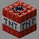

> ## [Brute](Brute)
>
> - **Role**: Damage
> - **Type**: Premium
> - **Introduced**: v1.7.0
>
> #### 

> ## [Buff Master](Buff_Master)
>
> - **Role**: Support
> - **Type**: Premium
> - **Introduced**: v1.7.0
>
> #### 

> ## [Builder](Builder)
>
> - **Role**: Utility
> - **Type**: Free
> - **Introduced**: v1.7.0
>
> #### 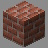

> ## [Crusader](Crusader)
>
> - **Role**: Tank
> - **Type**: Free
> - **Introduced**: v1.7.0
>
> #### 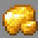

> ## [Crusher](Crusher)
>
> - **Role**: Damage
> - **Type**: Premium
> - **Introduced**: v1.8.0
>
> #### 

> ## [Default](Default)
>
> - **Role**: Damage
> - **Type**: Free
> - **Introduced**: v1.7.0
>
> #### 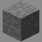

> ## [Demolitionist](Demolitionist)
>
> - **Role**: Tank
> - **Type**: Premium
> - **Introduced**: v1.7.0
>
> #### 

> ## [Demon](Demon)
>
> - **Role**: Support
> - **Type**: Premium
> - **Introduced**: v2.1.0
>
> #### 

> ## [Engineer](Engineer)
>
> - **Role**: Utility
> - **Type**: Premium
> - **Introduced**: v1.7.0
>
> #### 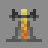

> ## [Fish](Fish)
>
> - **Role**: Damage
> - **Type**: Special
> - **Introduced**: v1.7.0
>
> #### 

> ## [Glacier](Glacier)
>
> - **Role**: Damage
> - **Type**: Premium
> - **Introduced**: v2.1.0
>
> #### 

> ## [Golem](Golem)
>
> - **Role**: Tank
> - **Type**: Premium
> - **Introduced**: v1.7.0
>
> #### 

> ## [Grappler](Grappler)
>
> - **Role**: Damage
> - **Type**: Premium
> - **Introduced**: v2.1.0
>
> #### 

> ## [Gunner](Gunner)
>
> - **Role**: Damage
> - **Type**: Premium
> - **Introduced**: v1.7.0
>
> #### 

> ## [Hitman](Hitman)
>
> - **Role**: Utility
> - **Type**: Premium
> - **Introduced**: v1.7.0
>
> #### 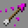

> ## [Hulk](Hulk)
>
> - **Role**: Damage
> - **Type**: Premium
> - **Introduced**: v1.7.0
>
> #### 

> ## [Illusionist](Illusionist)
>
> - **Role**: Damage
> - **Type**: Premium
> - **Introduced**: v1.7.0
>
> #### 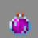

> ## [Jumper](Jumper)
>
> - **Role**: Damage
> - **Type**: Premium
> - **Introduced**: v1.7.0
>
> #### 

> ## [Kangaroo](Kangaroo)
>
> - **Role**: Damage
> - **Type**: Premium
> - **Introduced**: v1.7.0
>
> #### 

> ## [Knight](Knight)
>
> - **Role**: Tank
> - **Type**: Premium
> - **Introduced**: v1.7.0
>
> #### 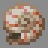

> ## [Master](Master)
>
> - **Role**: Damage
> - **Type**: Premium
> - **Introduced**: v1.7.0
>
> #### 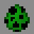

> ## [Mathematician](Mathematician)
>
> - **Role**: Support
> - **Type**: Special
> - **Introduced**: v1.7.0
>
> #### 

> ## [Medic](Medic)
>
> - **Role**: Support
> - **Type**: Free
> - **Introduced**: v1.7.0
>
> #### 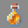

> ## [Mercy](Mercy)
>
> - **Role**: Support
> - **Type**: Premium
> - **Introduced**: v1.7.0
>
> #### 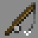

> ## [Miner](Miner)
>
> - **Role**: Utility
> - **Type**: Free
> - **Introduced**: v1.7.0
>
> #### 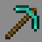

> ## [Musketeer](Musketeer)
>
> - **Role**: Damage
> - **Type**: Premium
> - **Introduced**: v1.7.0
>
> #### 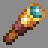

> ## [Necromancer](Necromancer)
>
> - **Role**: Tank
> - **Type**: Premium
> - **Introduced**: v1.7.0
>
> #### 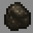

> ## [Ninja](Ninja)
>
> - **Role**: Damage
> - **Type**: Premium
> - **Introduced**: v2.1.0
>
> #### 

> ## [None](None)
>
> - **Role**: Damage
> - **Type**: Exclusive
> - **Introduced**: v1.7.0
>
> #### 

> ## [Porcupine](Porcupine)
>
> - **Role**: Damage
> - **Type**: Premium
> - **Introduced**: v1.7.0
>
> #### 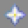

> ## [Potion Master](Potion_Master)
>
> - **Role**: Damage
> - **Type**: Premium
> - **Introduced**: v1.7.0
>
> #### 

> ## [Priest](Priest)
>
> - **Role**: Support
> - **Type**: Premium
> - **Introduced**: v1.7.0
>
> #### 

> ## [Prometheus](Prometheus)
>
> - **Role**: Damage
> - **Type**: Premium
> - **Introduced**: v1.8.0
>
> #### 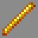

> ## [Pyrotechnic](Pyrotechnic)
>
> - **Role**: Damage
> - **Type**: Premium
> - **Introduced**: v1.7.0
>
> #### 

> ## [Raven](Raven)
>
> - **Role**: Damage
> - **Type**: Premium
> - **Introduced**: v1.7.0
>
> #### 

> ## [Slime](Slime)
>
> - **Role**: Tank
> - **Type**: Premium
> - **Introduced**: v1.8.0
>
> #### 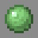

> ## [Sniper](Sniper)
>
> - **Role**: Damage
> - **Type**: Premium
> - **Introduced**: v1.7.0
>
> #### 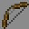

> ## [Snowman](Snowman)
>
> - **Role**: Tank
> - **Type**: Premium
> - **Introduced**: v1.7.0
>
> #### 

> ## [Soldier](Soldier)
>
> - **Role**: Damage
> - **Type**: Free
> - **Introduced**: v1.7.0
>
> #### 

> ## [Sonic](Sonic)
>
> - **Role**: Damage
> - **Type**: Premium
> - **Introduced**: v1.7.0
>
> #### 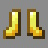

> ## [Spider](Spider)
>
> - **Role**: Tank
> - **Type**: Premium
> - **Introduced**: v1.7.0
>
> #### 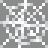

> ## [Spy](Spy)
>
> - **Role**: Damage
> - **Type**: Premium
> - **Introduced**: v1.7.0
>
> #### 

> ## [Vitalist](Vitalist)
>
> - **Role**: Support
> - **Type**: Premium
> - **Introduced**: v1.7.0
>
> #### 

> ## [Wizard](Wizard)
>
> - **Role**: Damage
> - **Type**: Premium
> - **Introduced**: v1.7.0
>
> #### 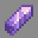
