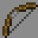

# Sniper

---

#### 

# Overview

---

- **Introduced:** v1.7.0
- **Description:** A kit with two bows that deal significant ranged damage.
- **Role:** Damage
- **How to Unlock:** Purchase for 500 Credits.

 

# Gear

---

- Chainmail Chestplate
- Leather Leggings (Black)
- Chainmail Boots
- Stone Sword
- Infinity Bow
- Power Bow
- {{ kits.sniper.data.SNIPER_ARROWS_MAX }} Arrows
- {{ kits.sniper.data.MAX_HEALING_POTIONS }} Healing Potions

 

# Abilities

---

### Actives

<!-- tabs:start -->

#### **Infinity Bow**

## Infinity Bow

The Infinity Bow that does not consume arrows and deals extra damage when hitting headshots. Headshots increase the damage dealt by `+{{ kits.sniper.data.SNIPER_INFINITY_BOW_HEADSHOT_PERCENTAGE_INCREASE }}%`.

#### **Power Bow**

## Power Bow

The Power Bow is a bow that does increased base damage and has knockback on arrows. Shooting consumes arrows. The bow will deal `+{{ kits.sniper.data.SNIPER_POWER_BOW_DAMAGE_PERCENTAGE_INCREASE }}%` more damage compared to a normal bow.

If the player shoots an enemy in the knees, the enemy will be slowed for `{{ kits.sniper.data.SNIPER_POWER_BOW_KNEE_SHOT_SLOWNESS_DURATION }}` ticks.

<!-- tabs:end -->

### Resources

<!-- tabs:start -->

#### **Arrows**

## Arrows

Arrows are used by the `Infinity Bow` and `Power Bow`. The player can carry a maximum of `{{ kits.sniper.data.SNIPER_ARROWS_MAX }}` arrows.

When the player doesn't have maximum arrows, they will slowly regenerate them over time.

Players will earn `{{ kits.sniper.data.SNIPER_ARROWS_FINAL_BLOW_REWARD }}` arrows from final blows and `{{ kits.sniper.data.SNIPER_ARROWS_ASSIST_REWARD }}` arrows from assists.

<!-- tabs:end -->
 

# Achievements

---

<!-- prettier-ignore -->
| Achievement | Description | Reward |
| ----------- | ----------- | ------ |
| I used to be an adventurer like you... | Shoot an enemy in the knees as sniper. | 20 Credits |
| The New Bow God! | Headshot your opponent 3 times in a row and bring them to the grave. | 20 Credits |
| Took more than the knee! | Shoot an enemy in the head as sniper | 20 Credits |
| Head Humiliator | Get 50 headshot kills. | 1,000 Credits |
| Knee Knocker | Get 50 kneeshot kills. | 1,000 Credits |

 

# Kit Data

---

<!-- prettier-ignore -->
| Property | Value | Description |
|----------|-------|-------------|
| MAX_HEALING_POTIONS | `{{ kits.sniper.data.MAX_HEALING_POTIONS }}` | {{ kitDataSharedDescriptions.MAX_HEALING_POTIONS }} |
| HEALING_POTION_CLICK_POTENCY | `{{ kits._shared.data.HEALING_POTION_CLICK_POTENCY }}` | {{ kitDataSharedDescriptions.HEALING_POTION_CLICK_POTENCY }} |
| HEALING_POTION_AUTOPOT_POTENCY | `{{ kits._shared.data.HEALING_POTION_AUTOPOT_POTENCY }}` | {{ kitDataSharedDescriptions.HEALING_POTION_AUTOPOT_POTENCY }} |
| HEALING_POTION_AUTOPOT_THRESHOLD | `{{ kits._shared.data.HEALING_POTION_AUTOPOT_THRESHOLD }}` | {{ kitDataSharedDescriptions.HEALING_POTION_AUTOPOT_THRESHOLD }} |
| HEALING_POTION_AUTOPOT_HOTBAR_ONLY | `{{ kits._shared.data.HEALING_POTION_AUTOPOT_HOTBAR_ONLY }}` | {{ kitDataSharedDescriptions.HEALING_POTION_AUTOPOT_HOTBAR_ONLY }} |
| POTION_IN_COMBAT_REGENERATION_RATE | `{{ kits._shared.data.POTION_IN_COMBAT_REGENERATION_RATE }}` | {{ kitDataSharedDescriptions.POTION_IN_COMBAT_REGENERATION_RATE }} |
| POTION_OUT_OF_COMBAT_REGENERATION_RATE | `{{ kits._shared.data.POTION_OUT_OF_COMBAT_REGENERATION_RATE }}` | {{ kitDataSharedDescriptions.POTION_OUT_OF_COMBAT_REGENERATION_RATE }} |
| SNIPER_SWORD_DAMAGE | `{{ kits.sniper.data.SNIPER_SWORD_DAMAGE }}` | The base damage of the sword. |
| SNIPER_SWORD_SPEED | `{{ kits.sniper.data.SNIPER_SWORD_SPEED }}` | The base speed of the sword. |
| SNIPER_ARROWS_MAX | `{{ kits.sniper.data.SNIPER_ARROWS_MAX }}` | The maximum number of arrows the player can carry. |
| SNIPER_ARROWS_REGENERATION_RATE | `{{ kits.sniper.data.SNIPER_ARROWS_REGENERATION_RATE }}` | The rate, in ticks, to regenerate 1 arrow. |
| SNIPER_ARROWS_DISPENSER_DISPENSE_COUNT | `{{ kits.sniper.data.SNIPER_ARROWS_DISPENSER_DISPENSE_COUNT }}` | The amount of arrows that engineer dispensers dispense. |
| SNIPER_ARROWS_FINAL_BLOW_REWARD | `{{ kits.sniper.data.SNIPER_ARROWS_FINAL_BLOW_REWARD }}` | The amount of arrows received after earning a final blow. |
| SNIPER_ARROWS_ASSIST_REWARD | `{{ kits.sniper.data.SNIPER_ARROWS_ASSIST_REWARD }}` | The amount of arrows received after earning an assist. |
| SNIPER_INFINITY_BOW_HEADSHOT_PERCENTAGE_INCREASE | `{{ kits.sniper.data.SNIPER_INFINITY_BOW_HEADSHOT_PERCENTAGE_INCREASE }}` | The damage percentage increase when hitting headshots with the Infinity Bow. |
| SNIPER_POWER_BOW_DAMAGE_PERCENTAGE_INCREASE | `{{ kits.sniper.data.SNIPER_POWER_BOW_DAMAGE_PERCENTAGE_INCREASE }}` | The damage percentage increase when hitting shots with the Power Bow. |
| SNIPER_POWER_BOW_PUNCH_LEVEL | `{{ kits.sniper.data.SNIPER_POWER_BOW_PUNCH_LEVEL }}` | The punch level of the Power Bow. |
| SNIPER_POWER_BOW_KNEE_SHOT_SLOWNESS_LEVEL | `{{ kits.sniper.data.SNIPER_POWER_BOW_KNEE_SHOT_SLOWNESS_LEVEL }}` | The level of the kneeshot slowness effect. |
| SNIPER_POWER_BOW_KNEE_SHOT_SLOWNESS_DURATION | `{{ kits.sniper.data.SNIPER_POWER_BOW_KNEE_SHOT_SLOWNESS_DURATION }}` | The duration, in ticks, of the kneeshot slowness effect. |
| SNIPER_POWER_BOW_USE_LAST_ARROW | `{{ kits.sniper.data.SNIPER_POWER_BOW_USE_LAST_ARROW }}` | If the Power Bow should let the user use the last arrow. |
