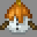

# Snow Golem

---

#### 

# Overview

---

- **Introduced:** v2.2.0
- **Description:** _description_
- **Role:** support
- **How to Unlock:** Purchase for 500 Credits.

 

# Gear

---

- Leather Chestplate
- Leather Leggings
- Leather Boots
- Icicle Staff
- Creeper Minion Egg
- {{ kits.snow_golem.data.MAX_HEALING_POTIONS }} Healing Potions

 

# Abilities

---

### Actives

<!-- tabs:start -->

#### **Icicle Staff**

## Icicle Staff

_description_1_

#### **Snow Golem Egg**

## Snow Golem Egg

_description_2_

#### **Snow Golem Minion**

## Snow Golem Minion

_description_2_

<!-- tabs:end -->

### Passives

<!-- tabs:start -->

#### **Snow Trail Support**

## Snow Trail Support

_description_2_

<!-- tabs:end -->

# Achievements

---

<!-- prettier-ignore -->
| Achievement | Description | Reward |
| ----------- | ----------- | ------ |
| Cryo-Goop | Attack an enemy slime minion with an icicle projectile. | 20 Credits |
| Frost Friends Forever | Have both your snow golem minions heal each other. | 20 Credits |
| Glacial Smash | Kill an enemy golem as kit snow golem. | 20 Credits |
| Instant Ice Pack | Heal an ally together with your snow golem minions. | 20 Credits |
| Putting the Flame Out | Kill an enemy prometheus as kit snow golem. | 20 Credits |
| Seasonal Flurry | Get a snow golem kill. | 20 Credits |
| Frost Aid Kit | Restore a total of 5,000 health as kit snow golem. | 250 Credits |
| Breaking the Ice | Get 50 icicle kills. | 1,000 Credits |

 

# Kit Data

---

<!-- prettier-ignore -->
| Property | Value | Description |
|----------|-------|-------------|
| MAX_HEALING_POTIONS | `{{ kits.snow_golem.data.MAX_HEALING_POTIONS }}` | {{ kitDataSharedDescriptions.MAX_HEALING_POTIONS }} |
| HEALING_POTION_CLICK_POTENCY | `{{ kits._shared.data.HEALING_POTION_CLICK_POTENCY }}` | {{ kitDataSharedDescriptions.HEALING_POTION_CLICK_POTENCY }} |
| HEALING_POTION_AUTOPOT_POTENCY | `{{ kits._shared.data.HEALING_POTION_AUTOPOT_POTENCY }}` | {{ kitDataSharedDescriptions.HEALING_POTION_AUTOPOT_POTENCY }} |
| HEALING_POTION_AUTOPOT_THRESHOLD | `{{ kits._shared.data.HEALING_POTION_AUTOPOT_THRESHOLD }}` | {{ kitDataSharedDescriptions.HEALING_POTION_AUTOPOT_THRESHOLD }} |
| HEALING_POTION_AUTOPOT_HOTBAR_ONLY | `{{ kits._shared.data.HEALING_POTION_AUTOPOT_HOTBAR_ONLY }}` | {{ kitDataSharedDescriptions.HEALING_POTION_AUTOPOT_HOTBAR_ONLY }} |
| POTION_IN_COMBAT_REGENERATION_RATE | `{{ kits._shared.data.POTION_IN_COMBAT_REGENERATION_RATE }}` | {{ kitDataSharedDescriptions.POTION_IN_COMBAT_REGENERATION_RATE }} |
| POTION_OUT_OF_COMBAT_REGENERATION_RATE | `{{ kits._shared.data.POTION_OUT_OF_COMBAT_REGENERATION_RATE }}` | {{ kitDataSharedDescriptions.POTION_OUT_OF_COMBAT_REGENERATION_RATE }} |
| CHESTPLATE_ARMOR | `{{ kits.snow_golem.data.CHESTPLATE_ARMOR }}` | {{ kitDataSharedDescriptions.CHESTPLATE_ARMOR }} |
| CHESTPLATE_ARMOR_TOUGHNESS | `{{ kits.snow_golem.data.CHESTPLATE_ARMOR_TOUGHNESS }}` | {{ kitDataSharedDescriptions.CHESTPLATE_ARMOR_TOUGHNESS }} |
| CHESTPLATE_PROTECTION_LEVEL | `{{ kits.snow_golem.data.CHESTPLATE_PROTECTION_LEVEL }}` | {{ kitDataSharedDescriptions.CHESTPLATE_PROTECTION_LEVEL }} |
| CHESTPLATE_KNOCKBACK_RESISTANCE | `{{ kits.snow_golem.data.CHESTPLATE_KNOCKBACK_RESISTANCE }}` | {{ kitDataSharedDescriptions.CHESTPLATE_KNOCKBACK_RESISTANCE }} |
| LEGGINGS_ARMOR | `{{ kits.snow_golem.data.LEGGINGS_ARMOR }}` | {{ kitDataSharedDescriptions.LEGGINGS_ARMOR }} |
| LEGGINGS_ARMOR_TOUGHNESS | `{{ kits.snow_golem.data.LEGGINGS_ARMOR_TOUGHNESS }}` | {{ kitDataSharedDescriptions.LEGGINGS_ARMOR_TOUGHNESS }} |
| LEGGINGS_PROTECTION_LEVEL | `{{ kits.snow_golem.data.LEGGINGS_PROTECTION_LEVEL }}` | {{ kitDataSharedDescriptions.LEGGINGS_PROTECTION_LEVEL }} |
| LEGGINGS_KNOCKBACK_RESISTANCE | `{{ kits.snow_golem.data.LEGGINGS_KNOCKBACK_RESISTANCE }}` | {{ kitDataSharedDescriptions.LEGGINGS_KNOCKBACK_RESISTANCE }} |
| BOOTS_ARMOR | `{{ kits.snow_golem.data.BOOTS_ARMOR }}` | {{ kitDataSharedDescriptions.BOOTS_ARMOR }} |
| BOOTS_ARMOR_TOUGHNESS | `{{ kits.snow_golem.data.BOOTS_ARMOR_TOUGHNESS }}` | {{ kitDataSharedDescriptions.BOOTS_ARMOR_TOUGHNESS }} |
| BOOTS_PROTECTION_LEVEL | `{{ kits.snow_golem.data.BOOTS_PROTECTION_LEVEL }}` | {{ kitDataSharedDescriptions.BOOTS_PROTECTION_LEVEL }} |
| BOOTS_KNOCKBACK_RESISTANCE | `{{ kits.snow_golem.data.BOOTS_KNOCKBACK_RESISTANCE }}` | {{ kitDataSharedDescriptions.BOOTS_KNOCKBACK_RESISTANCE }} |
| SNOW_GOLEM_ICICLE_STAFF_MELEE_DAMAGE | `{{ kits.snow_golem.data.SNOW_GOLEM_ICICLE_STAFF_MELEE_DAMAGE }}` | |
| SNOW_GOLEM_ICICLE_STAFF_MELEE_SPEED | `{{ kits.snow_golem.data.SNOW_GOLEM_ICICLE_STAFF_MELEE_SPEED }}` | |
| SNOW_GOLEM_ICICLE_STAFF_PROJECTILE_SPEED | `{{ kits.snow_golem.data.SNOW_GOLEM_ICICLE_STAFF_PROJECTILE_SPEED }}` | |
| SNOW_GOLEM_ICICLE_STAFF_PROJECTILE_SIZE | `{{ kits.snow_golem.data.SNOW_GOLEM_ICICLE_STAFF_PROJECTILE_SIZE }}` | |
| SNOW_GOLEM_ICICLE_STAFF_PROJECTILE_MAX_RANGE | `{{ kits.snow_golem.data.SNOW_GOLEM_ICICLE_STAFF_PROJECTILE_MAX_RANGE }}` | |
| SNOW_GOLEM_ICICLE_STAFF_PROJECTILE_PIERCING_LEVEL | `{{ kits.snow_golem.data.SNOW_GOLEM_ICICLE_STAFF_PROJECTILE_PIERCING_LEVEL }}` | |
| SNOW_GOLEM_ICICLE_STAFF_PROJECTILE_DAMAGE | `{{ kits.snow_golem.data.SNOW_GOLEM_ICICLE_STAFF_PROJECTILE_DAMAGE }}` | |
| SNOW_GOLEM_ICICLE_STAFF_PROJECTILE_HEALING | `{{ kits.snow_golem.data.SNOW_GOLEM_ICICLE_STAFF_PROJECTILE_HEALING }}` | |
| SNOW_GOLEM_ICICLE_STAFF_PROJECTILE_COOLDOWN | `{{ kits.snow_golem.data.SNOW_GOLEM_ICICLE_STAFF_PROJECTILE_COOLDOWN }}` | |
| SNOW_GOLEM_MINION_SPAWN_COOLDOWN | `{{ kits.snow_golem.data.SNOW_GOLEM_MINION_SPAWN_COOLDOWN }}` | |
| SNOW_GOLEM_MINION_MAX_GOLEMS | `{{ kits.snow_golem.data.SNOW_GOLEM_MINION_MAX_GOLEMS }}` | |
| SNOW_GOLEM_MINION_SPAWN_GOLEM_AMOUNT | `{{ kits.snow_golem.data.SNOW_GOLEM_MINION_SPAWN_GOLEM_AMOUNT }}` | |
| SNOW_GOLEM_MINION_GOLEMS_DURATION | `{{ kits.snow_golem.data.SNOW_GOLEM_MINION_GOLEMS_DURATION }}` | |
| SNOW_GOLEM_MINION_GOLEMS_MAX_HEALTH | `{{ kits.snow_golem.data.SNOW_GOLEM_MINION_GOLEMS_MAX_HEALTH }}` | |
| SNOW_GOLEM_MINION_ICICLE_DAMAGE | `{{ kits.snow_golem.data.SNOW_GOLEM_MINION_ICICLE_DAMAGE }}` | |
| SNOW_GOLEM_MINION_TARGET_RADIUS | `{{ kits.snow_golem.data.SNOW_GOLEM_MINION_TARGET_RADIUS }}` | |
| SNOW_GOLEM_MINION_MEMORY | `{{ kits.snow_golem.data.SNOW_GOLEM_MINION_MEMORY }}` | |
| SNOW_GOLEM_MINION_START_FOLLOW_OWNER_DISTANCE | `{{ kits.snow_golem.data.SNOW_GOLEM_MINION_START_FOLLOW_OWNER_DISTANCE }}` | |
| SNOW_GOLEM_MINION_END_FOLLOW_OWNER_DISTANCE | `{{ kits.snow_golem.data.SNOW_GOLEM_MINION_END_FOLLOW_OWNER_DISTANCE }}` | |
| SNOW_GOLEM_MINION_FOLLOW_OWNER_SPEED | `{{ kits.snow_golem.data.SNOW_GOLEM_MINION_FOLLOW_OWNER_SPEED }}` | |
| SNOW_GOLEM_MINION_ICICLE_ATTACK_COOLDOWN | `{{ kits.snow_golem.data.SNOW_GOLEM_MINION_ICICLE_ATTACK_COOLDOWN }}` | |
| SNOW_GOLEM_MINION_ICICLE_PREFERRED_ATTACK_DISTANCE | `{{ kits.snow_golem.data.SNOW_GOLEM_MINION_ICICLE_PREFERRED_ATTACK_DISTANCE }}` | |
| SNOW_GOLEM_MINION_MINIMUM_TARGET_DURATION | `{{ kits.snow_golem.data.SNOW_GOLEM_MINION_MINIMUM_TARGET_DURATION }}` | |
| SNOW_GOLEM_SNOW_LAYER_DURATION | `{{ kits.snow_golem.data.SNOW_GOLEM_SNOW_LAYER_DURATION }}` | |
| SNOW_GOLEM_MAX_SNOW_LAYERS | `{{ kits.snow_golem.data.SNOW_GOLEM_MAX_SNOW_LAYERS }}` | |
| SNOW_GOLEM_MINION_ICICLE_STAFF_PROJECTILE_SPEED | `{{ kits.snow_golem.data.SNOW_GOLEM_MINION_ICICLE_STAFF_PROJECTILE_SPEED }}` | |
| SNOW_GOLEM_MINION_ICICLE_STAFF_PROJECTILE_SIZE | `{{ kits.snow_golem.data.SNOW_GOLEM_MINION_ICICLE_STAFF_PROJECTILE_SIZE }}` | |
| SNOW_GOLEM_MINION_ICICLE_STAFF_PROJECTILE_MAX_RANGE | `{{ kits.snow_golem.data.SNOW_GOLEM_MINION_ICICLE_STAFF_PROJECTILE_MAX_RANGE }}` | |
| SNOW_GOLEM_MINION_ICICLE_STAFF_PROJECTILE_PIERCING_LEVEL | `{{ kits.snow_golem.data.SNOW_GOLEM_MINION_ICICLE_STAFF_PROJECTILE_PIERCING_LEVEL }}` | |
| SNOW_GOLEM_MINION_ICICLE_PROJECTILE_DAMAGE | `{{ kits.snow_golem.data.SNOW_GOLEM_MINION_ICICLE_PROJECTILE_DAMAGE }}` | |
| SNOW_GOLEM_MINION_ICICLE_PROJECTILE_HEALING | `{{ kits.snow_golem.data.SNOW_GOLEM_MINION_ICICLE_PROJECTILE_HEALING }}` | |
| SNOW_GOLEM_SNOW_MINION_FIRE_DAMAGE_WEAKNESS_PERCENTAGE | `{{ kits.snow_golem.data.SNOW_GOLEM_SNOW_MINION_FIRE_DAMAGE_WEAKNESS_PERCENTAGE }}` | |
| SNOW_GOLEM_SNOW_MINION_ICE_DAMAGE_RESISTANCE_PERCENTAGE | `{{ kits.snow_golem.data.SNOW_GOLEM_SNOW_MINION_ICE_DAMAGE_RESISTANCE_PERCENTAGE }}` | |
| SNOW_GOLEM_SNOW_TRAIL_SUPPORT_DURATION | `{{ kits.snow_golem.data.SNOW_GOLEM_SNOW_TRAIL_SUPPORT_DURATION }}` | |
| SNOW_GOLEM_SNOW_TRAIL_SUPPORT_AMPLIFIER | `{{ kits.snow_golem.data.SNOW_GOLEM_SNOW_TRAIL_SUPPORT_AMPLIFIER }}` | |
| SNOW_GOLEM_ICICLE_SHOULD_CREATE_SNOW_LAYER_ON_ENTITY_HIT | `{{ kits.snow_golem.data.SNOW_GOLEM_ICICLE_SHOULD_CREATE_SNOW_LAYER_ON_ENTITY_HIT }}` | |
| SNOW_GOLEM_ICICLE_SHOULD_IGNORE_NO_DAMAGE_TICKS | `{{ kits.snow_golem.data.SNOW_GOLEM_ICICLE_SHOULD_IGNORE_NO_DAMAGE_TICKS }}` | |
| SNOW_GOLEM_ICICLE_SHOULD_RESET_NO_DAMAGE_TICKS | `{{ kits.snow_golem.data.SNOW_GOLEM_ICICLE_SHOULD_RESET_NO_DAMAGE_TICKS }}` | |
