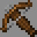

# Vitalist

***

#### 

# Overview
***
- **Introduced:** v1.7.0
- **Description:** A kit that uses a crossbow to heal allies and damage enemies.
- **Role:** Support
- **How to Unlock:** Purchase for 500 Crdits.

   

# Gear
***
- Leather Chestplate (Purple)
- Leather Leggings (Purple)
- Leather Boots (Purple)
- Stone Sword
- Crusader's Crossbow
- {{ kits.vitalist.data.VITALIST_MAX_AMMO }} Reserve Ammo
- {{ kits.vitalist.data.MAX_HEALING_POTIONS }} Healing Potions

   

# Abilities
***
### Actives
<!-- tabs:start -->
#### **Crusader's Crossbow**
## Crusader's Crossbow
A crossbow that shoots projectiles that heal allies and damage enemies.

<!-- tabs:start -->
#### **Shooting**
## Shooting
The player canshoot by right-clicking. The crossbow must be loaded in order to fire a projectile.

When a crossbow projectile hits an ally, it heals them overtime. The projectile has `3` healing ticks. One healing tick is equivalent to `10` ticks and restores `1.5` health. 

When a crossbow projectile hits an enemy, it deals `2` damage.

Crossbow projectile pierce up to `3` times.

#### **Reloading**
## Reloading
The player can reload by left-clicking. The reload duration depends on how empty the crossbow's magazine is. It takes `10` ticks to reload `1` ammo..

If the crossbow's magazine is empty and the player has reserve ammo, the crossbow reloads automatically. 

<!-- tabs:end -->
<!-- tabs:end -->

### Resources
<!-- tabs:start -->
#### **Ammo**
## Ammo
Ammo is a resource that is used by the [Crusader's Crossbow](#crusaders-crossbow). The maximum amount of reserve ammo the player can hold is `24`.

Ammo automatically regenerates at a rate of `1` ammo every `60` ticks.

The player receives `12` ammo after earning a file blow and `6` ammo after earning an assist.

Ally engineer dispensers dispense `3` ammo to the player if they are in range.

<!-- tabs:end -->
 

# Achievements
***

| Achievement | Description | Reward |
| ----------- | ----------- | ------ |
| Crusader² | Heal a Crusader | 20 Credits |
| Value from a Distance | Heal a teammate from over 100 blocks away | 20 Credits |
| Blessed Rebuttal | Get 1,000 kills with the crossbow | 250 Credits |
| Unbending Support | Heal 100,000 health with crossbow shots | 250 Credits |

   

# Kit Data
***

| Property | Value | Description |
|----------|-------|-------------|
| MAX_HEALING_POTIONS | `{{ kits.vitalist.data.MAX_HEALING_POTIONS }}` | {{ kitDataSharedDescriptions.MAX_HEALING_POTIONS }} |
| HEALING_POTION_CLICK_POTENCY | `{{ kits._shared.data.HEALING_POTION_CLICK_POTENCY }}` | {{ kitDataSharedDescriptions.HEALING_POTION_CLICK_POTENCY }} |
| HEALING_POTION_AUTOPOT_POTENCY | `{{ kits._shared.data.HEALING_POTION_AUTOPOT_POTENCY }}` | {{ kitDataSharedDescriptions.HEALING_POTION_AUTOPOT_POTENCY }} |
| HEALING_POTION_AUTOPOT_THRESHOLD | `{{ kits._shared.data.HEALING_POTION_AUTOPOT_THRESHOLD }}` | {{ kitDataSharedDescriptions.HEALING_POTION_AUTOPOT_THRESHOLD }} |
| HEALING_POTION_AUTOPOT_HOTBAR_ONLY | `{{ kits._shared.data.HEALING_POTION_AUTOPOT_HOTBAR_ONLY }}` | {{ kitDataSharedDescriptions.HEALING_POTION_AUTOPOT_HOTBAR_ONLY }} |
| POTION_IN_COMBAT_REGENERATION_RATE | `{{ kits._shared.data.POTION_IN_COMBAT_REGENERATION_RATE }}` | {{ kitDataSharedDescriptions.POTION_IN_COMBAT_REGENERATION_RATE }} |
| POTION_OUT_OF_COMBAT_REGENERATION_RATE | `{{ kits._shared.data.POTION_OUT_OF_COMBAT_REGENERATION_RATE }}` | {{ kitDataSharedDescriptions.POTION_OUT_OF_COMBAT_REGENERATION_RATE }} |
| VITALIST_SWORD_DAMAGE | `{{ kits.vitalist.data.VITALIST_SWORD_DAMAGE }}` | |
| VITALIST_SWORD_SPEED | `{{ kits.vitalist.data.VITALIST_SWORD_SPEED }}` | |
| VITALIST_MAX_AMMO | `{{ kits.vitalist.data.VITALIST_MAX_AMMO }}` | |
| VITALIST_CROSSBOW_AMMO_FINAL_BLOW_REWARD | `{{ kits.vitalist.data.VITALIST_CROSSBOW_AMMO_FINAL_BLOW_REWARD }}` | |
| VITALIST_CROSSBOW_AMMO_ASSIST_REWARD | `{{ kits.vitalist.data.VITALIST_CROSSBOW_AMMO_ASSIST_REWARD }}` | |
| VITALIST_CROSSBOW_AMMO_DISPENSE_COUNT | `{{ kits.vitalist.data.VITALIST_CROSSBOW_AMMO_DISPENSE_COUNT }}` | |
| VITALIST_CROSSBOW_AMMO_REGENERATION_RATE | `{{ kits.vitalist.data.VITALIST_CROSSBOW_AMMO_REGENERATION_RATE }}` | |
| VITALIST_CROSSBOW_AMMO_REGENERATION_AMOUNT | `{{ kits.vitalist.data.VITALIST_CROSSBOW_AMMO_REGENERATION_AMOUNT }}` | |
| VITALIST_CROSSBOW_MAGAZINE_SIZE | `{{ kits.vitalist.data.VITALIST_CROSSBOW_MAGAZINE_SIZE }}` | |
| VITALIST_CROSSBOW_SHOOT_COOLDOWN | `{{ kits.vitalist.data.VITALIST_CROSSBOW_SHOOT_COOLDOWN }}` | |
| VITALIST_CROSSBOW_RELOAD_DURATION_PER_1_AMMO | `{{ kits.vitalist.data.VITALIST_CROSSBOW_RELOAD_DURATION_PER_1_AMMO }}` | |
| VITALIST_CROSSBOW_PROJECTILE_SPEED | `{{ kits.vitalist.data.VITALIST_CROSSBOW_PROJECTILE_SPEED }}` | |
| VITALIST_CROSSBOW_PROJECTILE_SIZE | `{{ kits.vitalist.data.VITALIST_CROSSBOW_PROJECTILE_SIZE }}` | |
| VITALIST_CROSSBOW_PROJECTILE_MAX_DISTANCE | `{{ kits.vitalist.data.VITALIST_CROSSBOW_PROJECTILE_MAX_DISTANCE }}` | |
| VITALIST_CROSSBOW_PIERCING_LEVEL | `{{ kits.vitalist.data. VITALIST_CROSSBOW_PIERCING_LEVEL}}` | |
| VITALIST_CROSSBOW_PROJECTILE_SPREAD | `{{ kits.vitalist.data.VITALIST_CROSSBOW_PROJECTILE_SPREAD }}` | |
| VITALIST_CROSSBOW_PROJECTILE_DAMAGE | `{{ kits.vitalist.data.VITALIST_CROSSBOW_PROJECTILE_DAMAGE }}` | |
| VITALIST_CROSSBOW_HEALING_TICKS | `{{ kits.vitalist.data.VITALIST_CROSSBOW_HEALING_TICKS }}` | |
| VITALIST_CROSSBOW_HEALING_TICK_RATE | `{{ kits.vitalist.data.VITALIST_CROSSBOW_HEALING_TICK_RATE }}` | |
| VITALIST_CROSSBOW_HEALING_TICK_POTENCY | `{{ kits.vitalist.data.VITALIST_CROSSBOW_HEALING_TICK_POTENCY }}` | |
| VITALIST_CROSSBOW_LEFT_CLICK_ICD | `{{ kits.vitalist.data.VITALIST_CROSSBOW_LEFT_CLICK_ICD }}` | |