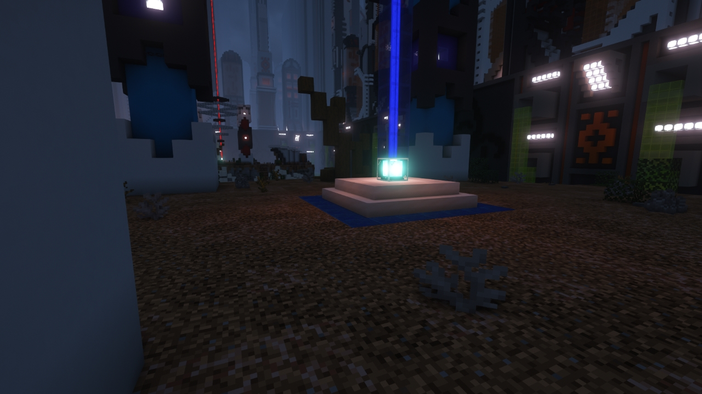
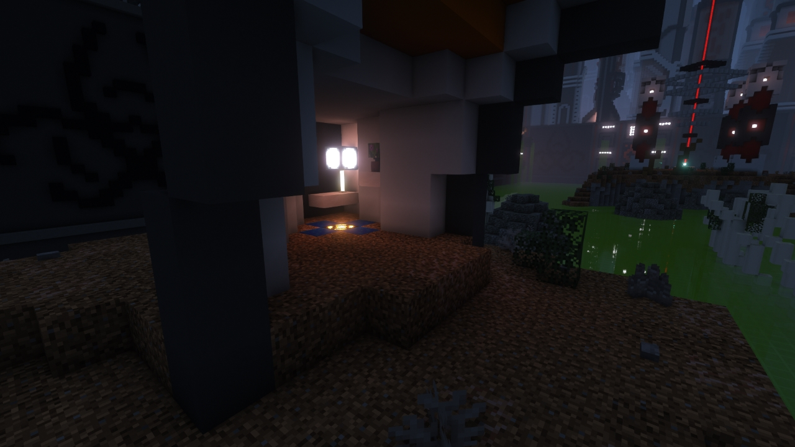
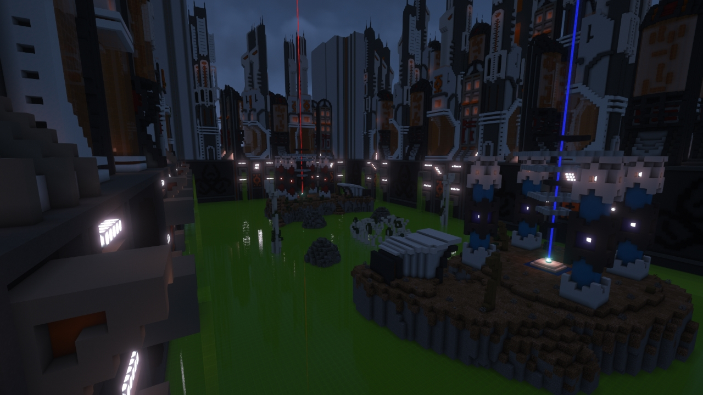

# Biohazard

---

#### 

# Overview

---

- **Introduced:** v1.7.0
- **Description:** A toxic and dangerous chemical plant.
- **Gamemode:** Classic
- **Map Type:** Non-Build (NB)
- **Size:** Medium
- **Contributors:** Naparizel

 

# Image Gallery

# Achievements

---

| Achievement            | Description                      | Reward     |
| ---------------------- | -------------------------------- | ---------- |
| Acid's not so toxic... | Win a game on the map Biohazard. | 20 Credits |

# Map Data

---

| Property    | Value                                       | Description                                       |
| ----------- | ------------------------------------------- | ------------------------------------------------- |
| buildRadius | `{{ maps.map_biohazard.data.buildRadius }}` | {{ mapPropertyDescriptions.buildRadius.classic }} |
| buildHeight | `{{ maps.map_biohazard.data.buildHeight }}` | {{ mapPropertyDescriptions.buildHeight.classic }} |
