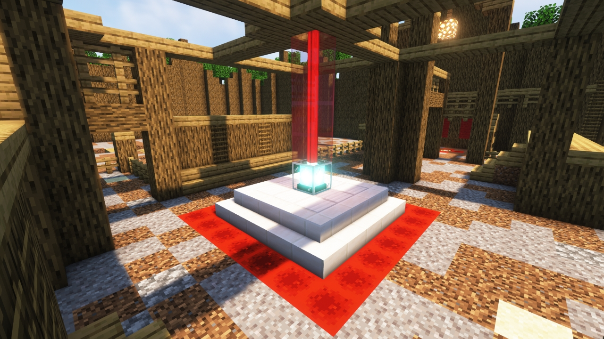
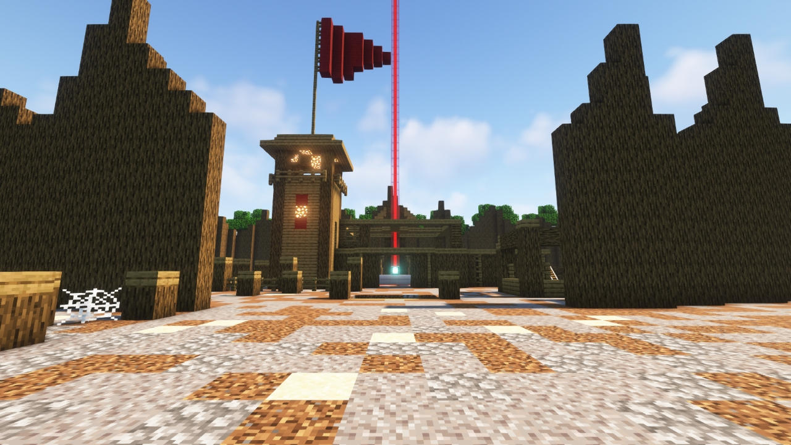
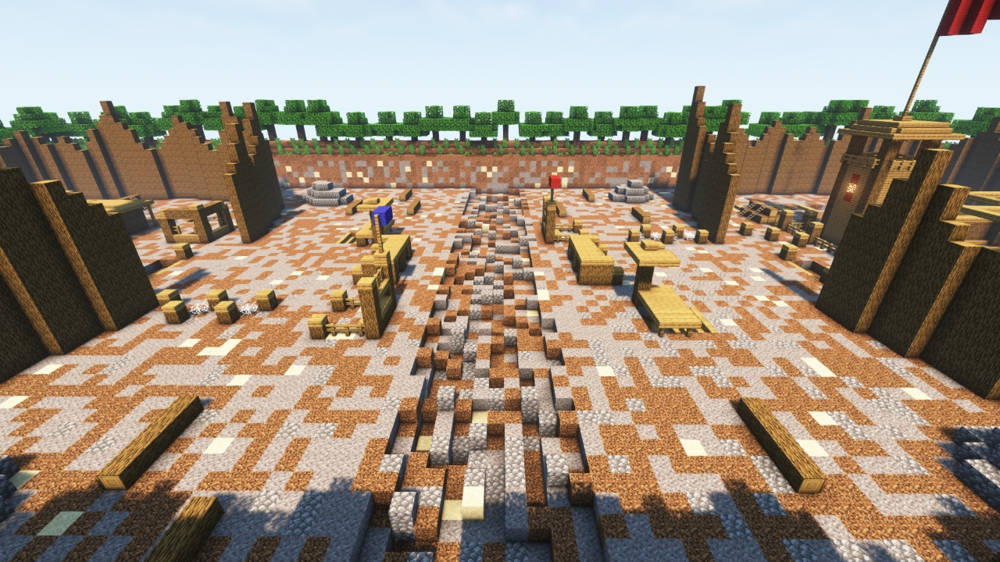

# Bootcamp

---

#### 

# Overview

---

- **Introduced:** v1.7.0
- **Description:** A basic camp for a branch of military.
- **Gamemode:** Classic
- **Map Type:** Non-Build (NB)
- **Size:** Medium
- **Contributors:** xzyle

 

# Image Gallery

# Achievements

---

| Achievement          | Description                     | Reward     |
| -------------------- | ------------------------------- | ---------- |
| I survived bootcamp! | Win a game on the map Bootcamp. | 20 Credits |

# Map Data

---

| Property    | Value                                      | Description                                       |
| ----------- | ------------------------------------------ | ------------------------------------------------- |
| buildRadius | `{{ maps.map_bootcamp.data.buildRadius }}` | {{ mapPropertyDescriptions.buildRadius.classic }} |
| buildHeight | `{{ maps.map_bootcamp.data.buildHeight }}` | {{ mapPropertyDescriptions.buildHeight.classic }} |
