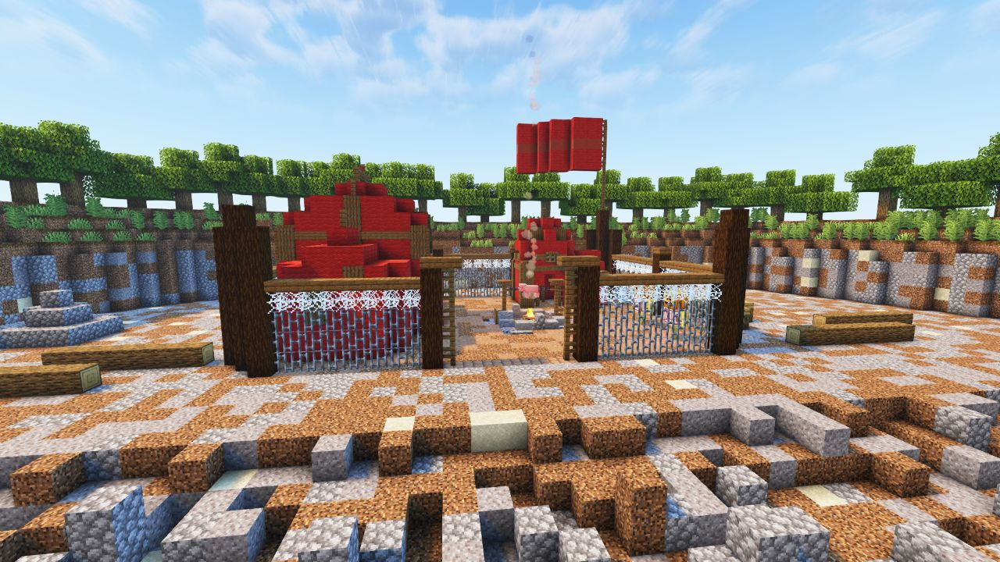
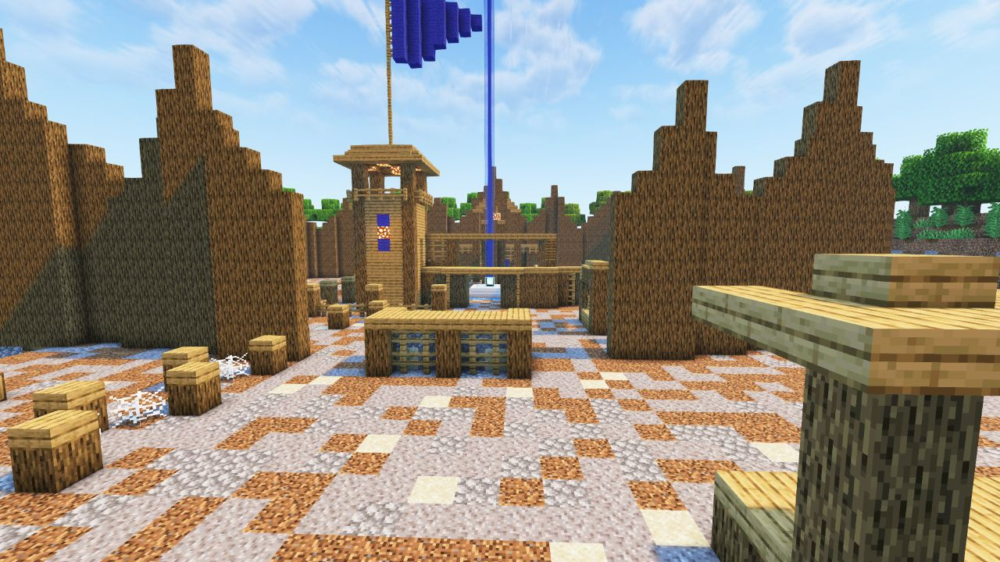
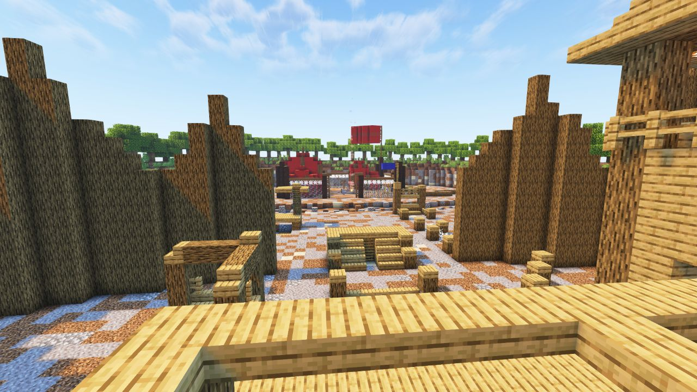
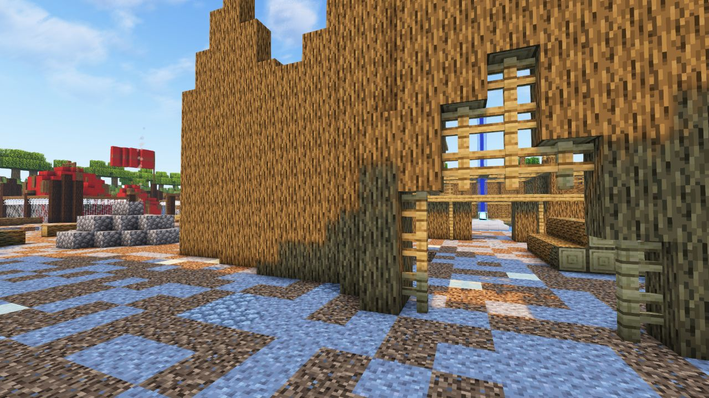

<!-- replace bootcamp_ad with the actual map name -->
<!-- change gamemode type for the Map data description  -->

# Bootcamp (AD)

---

#### 

# Overview

---

- **Introduced:** v2.2.0
- **Description:** A basic camp for a branch of military. It's a varied version of the original map, [Bootcamp](bootcamp).
- **Gamemode:** Attack and Defend
- **Map Type:** Non-Build (NB)
- **Size:** Medium
- **Contributors:** xzyle, alfredodan & FewerReaper1

 

# Map Galley

# Achievements

---

| Achievement | Description                          | Reward     |
| ----------- | ------------------------------------ | ---------- |
| ----------- | Win a game on the map Bootcamp (AD). | 20 Credits |

# Map Data

---

| Property    | Value                                         | Description                                       |
| ----------- | --------------------------------------------- | ------------------------------------------------- |
| buildRadius | `{{ maps.map_bootcamp_ad.data.buildRadius }}` | {{ mapPropertyDescriptions.buildRadius.classic }} |
| buildHeight | `{{ maps.map_bootcamp_ad.data.buildHeight }}` | {{ mapPropertyDescriptions.buildHeight.classic }} |
