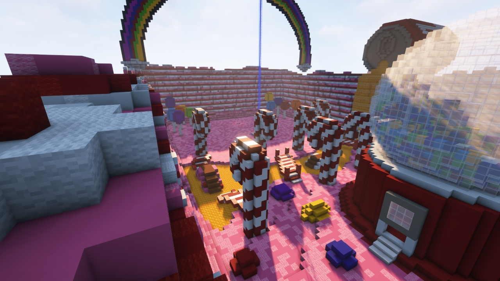
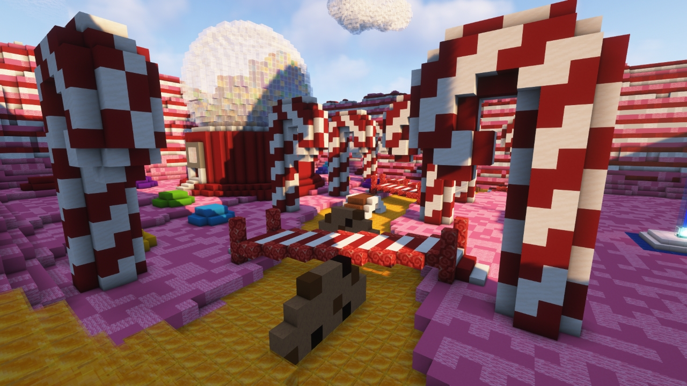
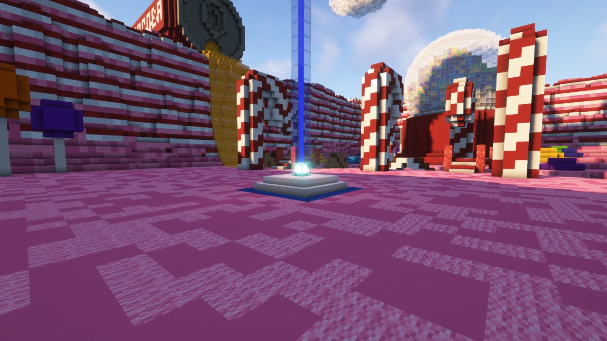
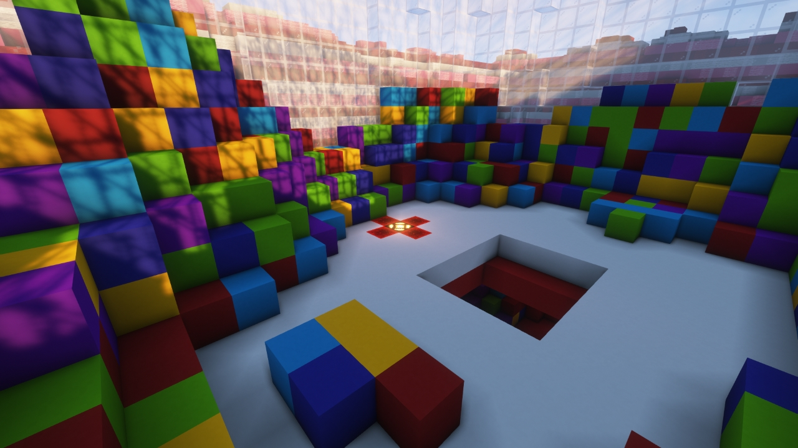

# Candyland

---

#### 

# Overview

---

- **Introduced:** v1.7.0
- **Description:** A land full of sugar and delicious foods.
- **Gamemode:** Attack and Defend
- **Map Type:** Build (B)
- **Size:** Small
- **Contributors:** LinkFD & TheLordStan

 

# Image Gallery

# Achievements

---

| Achievement | Description                      | Reward     |
| ----------- | -------------------------------- | ---------- |
| Sugar Rush! | Win a game on the map Candyland. | 20 Credits |

# Map Data

---

| Property    | Value                                       | Description                                       |
| ----------- | ------------------------------------------- | ------------------------------------------------- |
| buildRadius | `{{ maps.map_candyland.data.buildRadius }}` | {{ mapPropertyDescriptions.buildRadius.classic }} |
| buildHeight | `{{ maps.map_candyland.data.buildHeight }}` | {{ mapPropertyDescriptions.buildHeight.classic }} |
