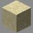
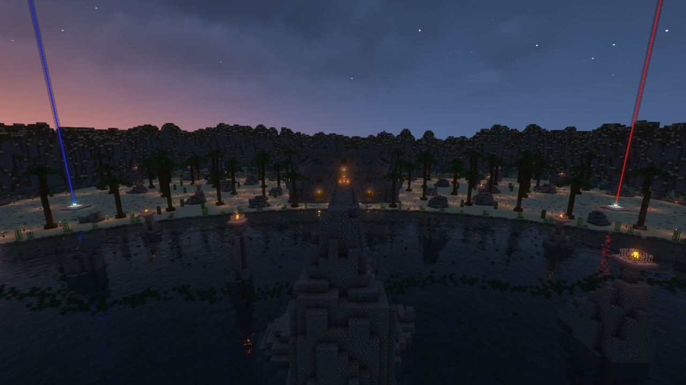
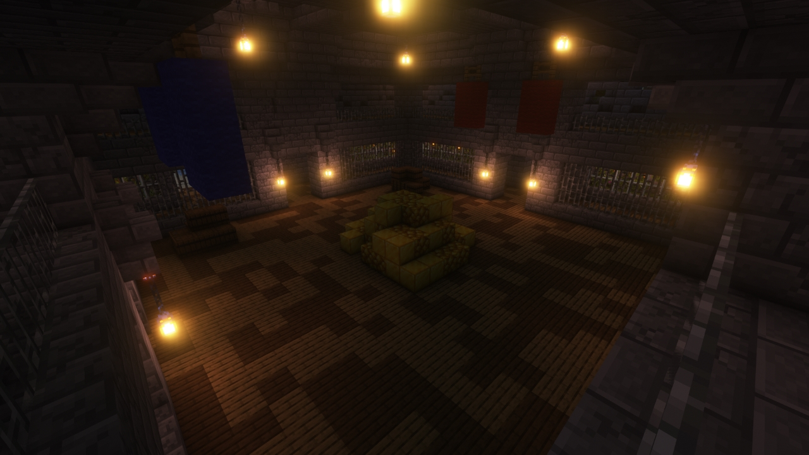
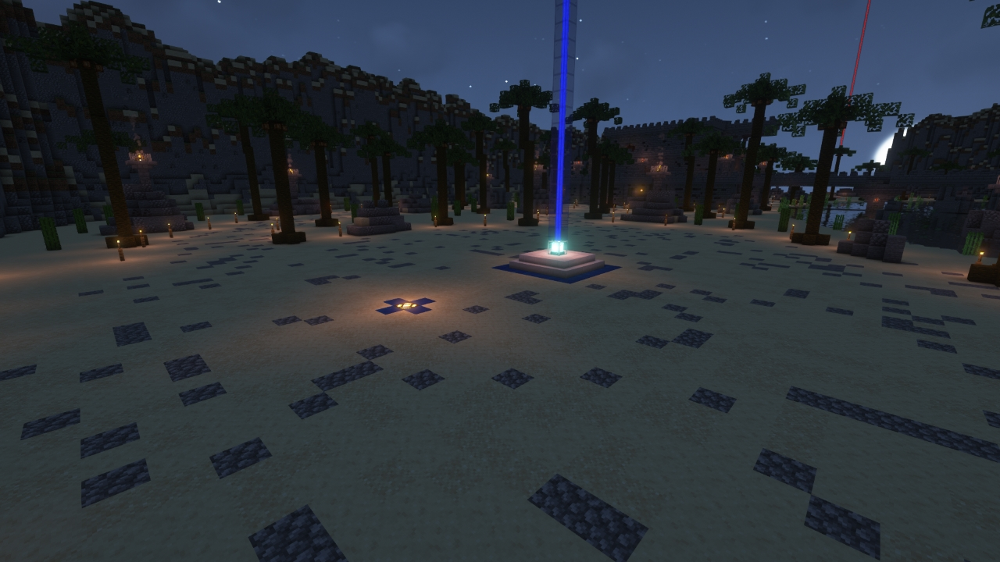
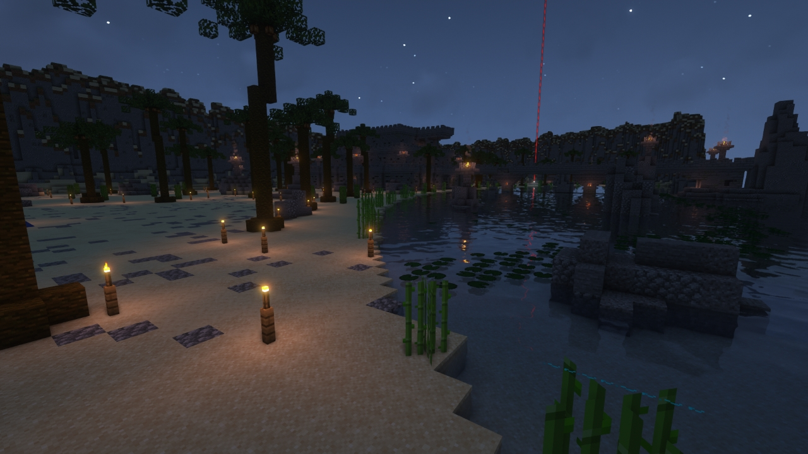
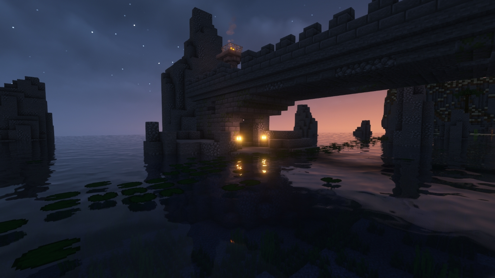

# Coast

---

#### 

# Overview

---

- **Introduced:** v1.7.0
- **Description:** A relic ruins that was built on a beach.
- **Gamemode:** Classic
- **Map Type:** Build (B)
- **Size:** Large
- **Contributors:** LinkFD & TheLordStan

 

# Image Gallery

# Achievements

---

| Achievement         | Description                  | Reward     |
| ------------------- | ---------------------------- | ---------- |
| Let’s shell-ebrate! | Win a game on the map Coast. | 20 Credits |

# Map Data

---

| Property    | Value                                   | Description                                       |
| ----------- | --------------------------------------- | ------------------------------------------------- |
| buildRadius | `{{ maps.map_coast.data.buildRadius }}` | {{ mapPropertyDescriptions.buildRadius.classic }} |
| buildHeight | `{{ maps.map_coast.data.buildHeight }}` | {{ mapPropertyDescriptions.buildHeight.classic }} |
