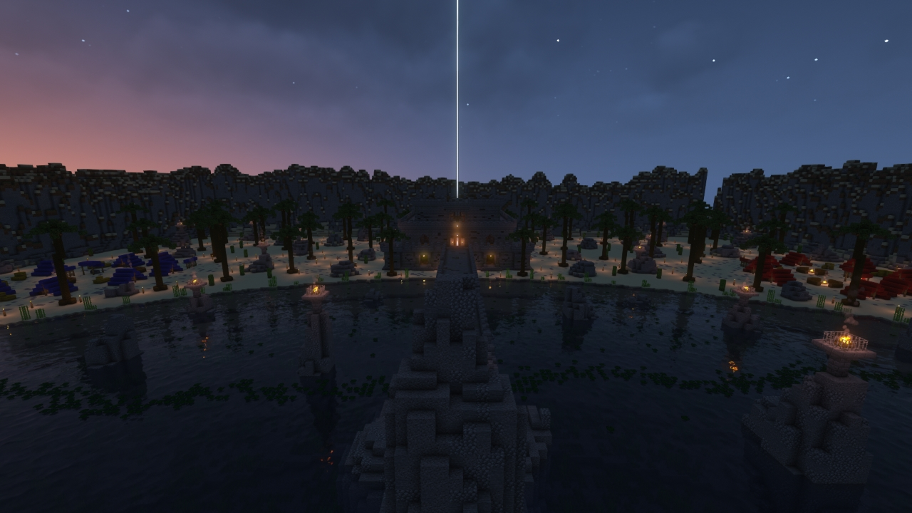
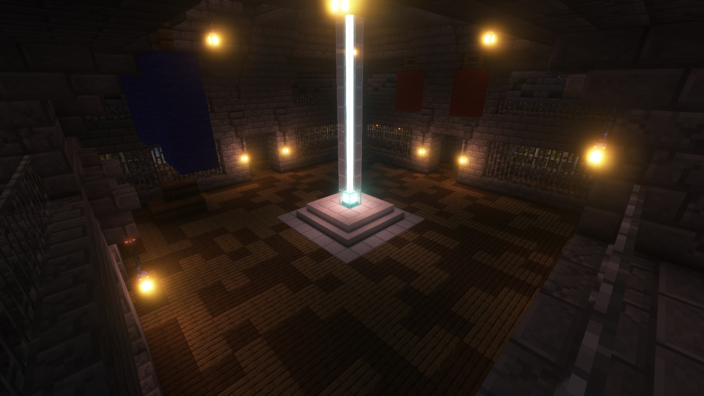
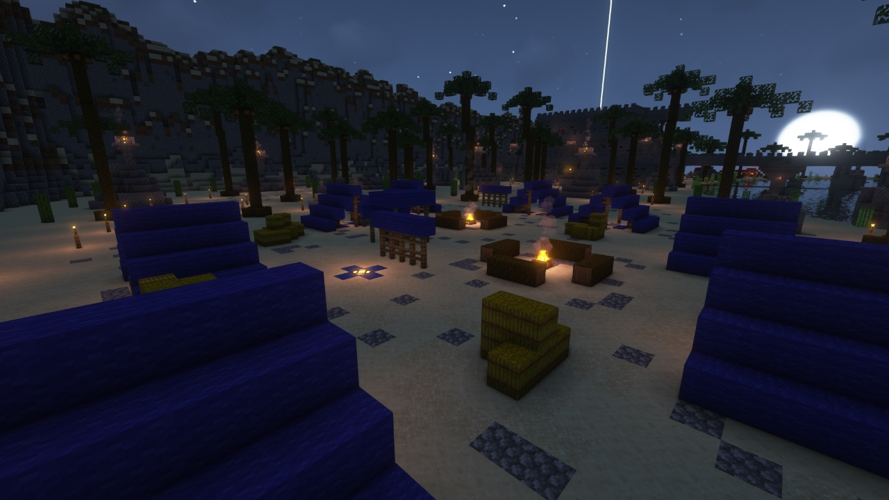
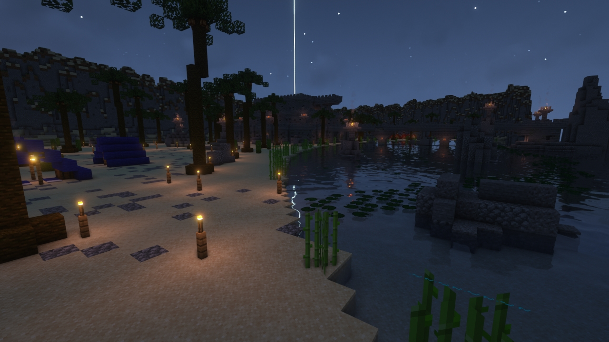
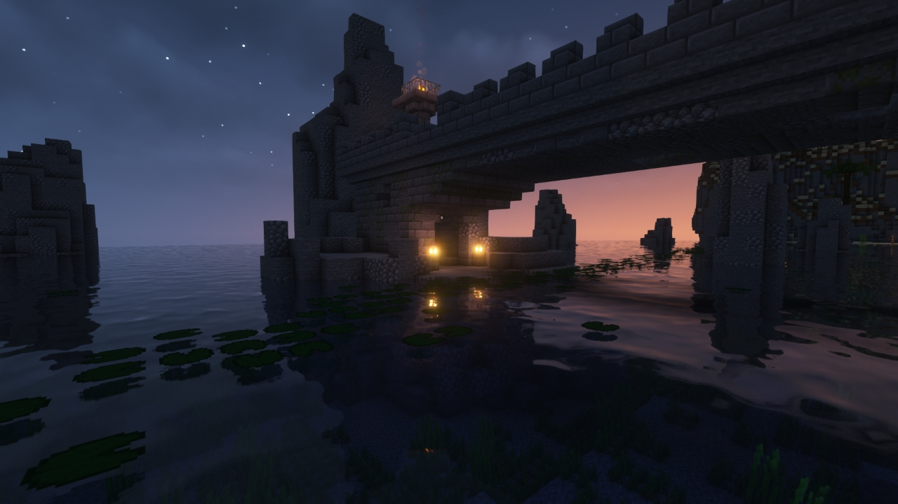

# Coast (KOTH)

---

#### 

# Overview

---

- **Introduced:** v1.7.0
- **Description:** A relic ruins that was built on a beach. Reformated version of the map [Coast](CoastCLASSIC).
- **Gamemode:** King of the Hill
- **Map Type:** Non-Build (NB)
- **Size:** Large
- **Contributors:** LinkFD & TheLordStan

 

# Image Gallery

# Achievements

---

| Achievement              | Description                         | Reward     |
| ------------------------ | ----------------------------------- | ---------- |
| We’re all just coasting. | Win a game on the map Coast (KOTH). | 20 Credits |

# Map Data

---

| Property    | Value                                        | Description                                    |
| ----------- | -------------------------------------------- | ---------------------------------------------- |
| buildRadius | `{{ maps.map_coast_koth.data.buildRadius }}` | {{ mapPropertyDescriptions.buildRadius.koth }} |
| buildHeight | `{{ maps.map_coast_koth.data.buildHeight }}` | {{ mapPropertyDescriptions.buildHeight.koth }} |
