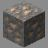
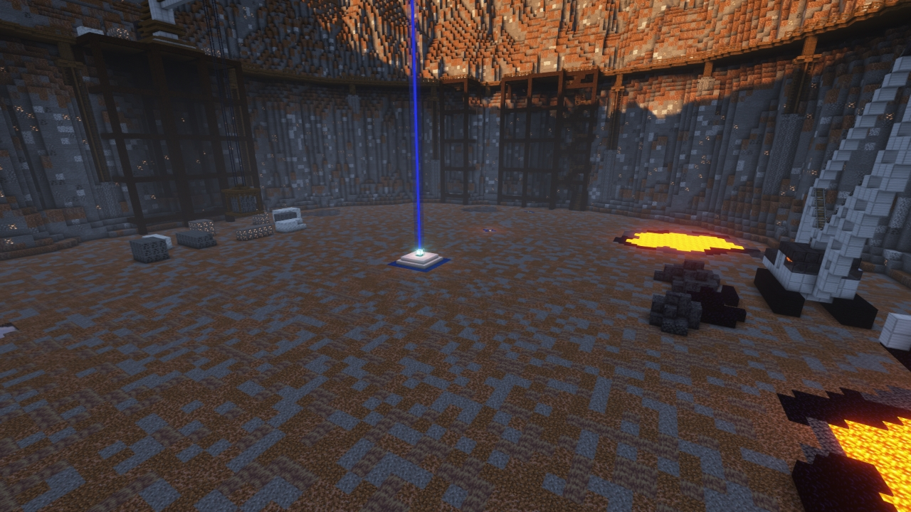
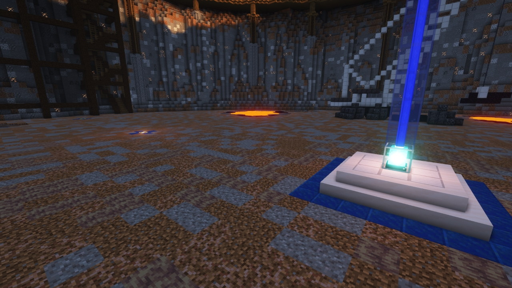
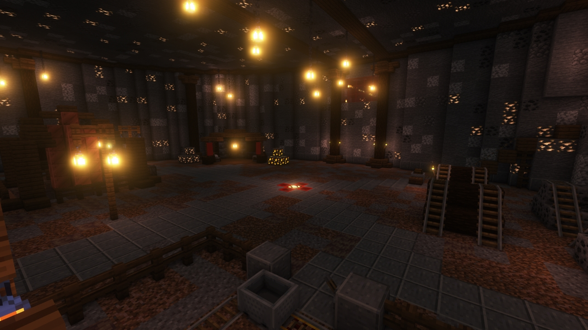

# Colliery

---

#### 

# Overview

---

- **Introduced:** v1.7.0
- **Description:** An extensive coal mine with a quarry and mineshaft.
- **Gamemode:** Attack and Defend
- **Map Type:** Build (B)
- **Size:** Large
- **Contributors:** LinkFD & TheLordStan

 

# Image Gallery

# Achievements

---

| Achievement           | Description                     | Reward     |
| --------------------- | ------------------------------- | ---------- |
| Successful Excavation | Win a game on the map Colliery. | 20 Credits |

# Map Data

---

| Property    | Value                                      | Description                                       |
| ----------- | ------------------------------------------ | ------------------------------------------------- |
| buildRadius | `{{ maps.map_colliery.data.buildRadius }}` | {{ mapPropertyDescriptions.buildRadius.classic }} |
| buildHeight | `{{ maps.map_colliery.data.buildHeight }}` | {{ mapPropertyDescriptions.buildHeight.classic }} |
