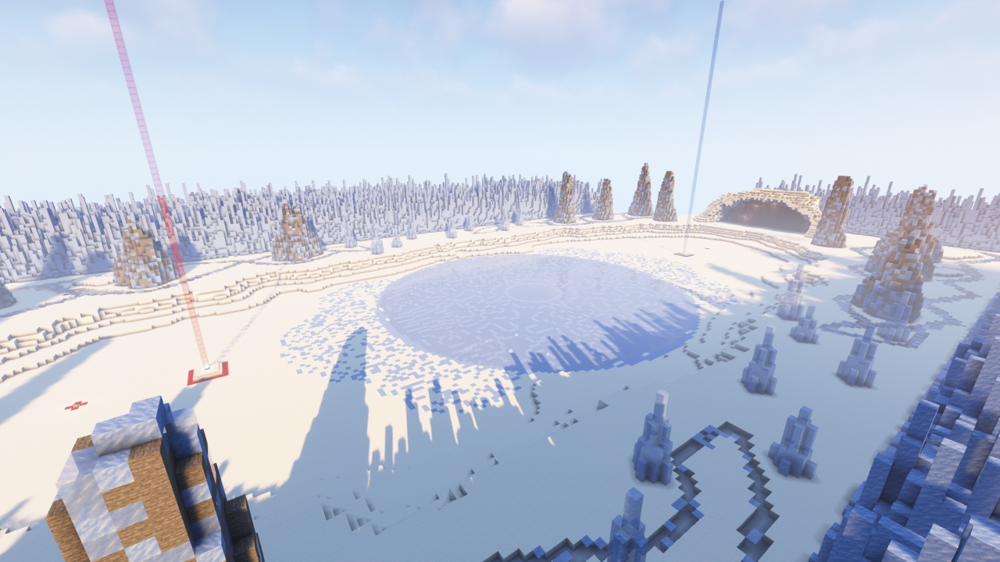
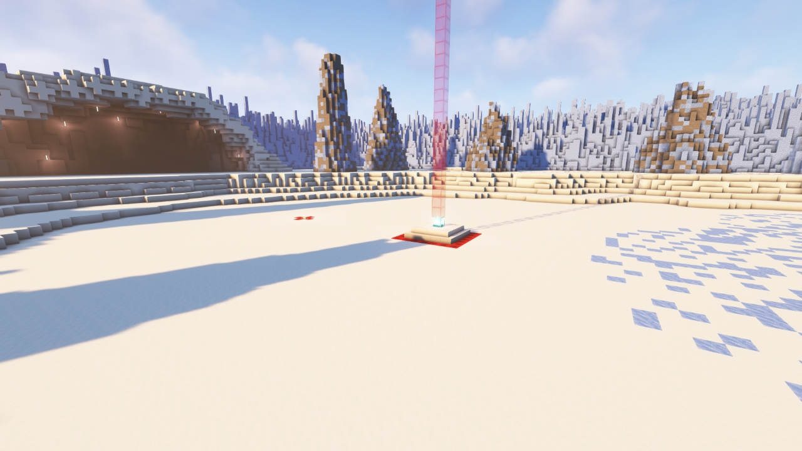
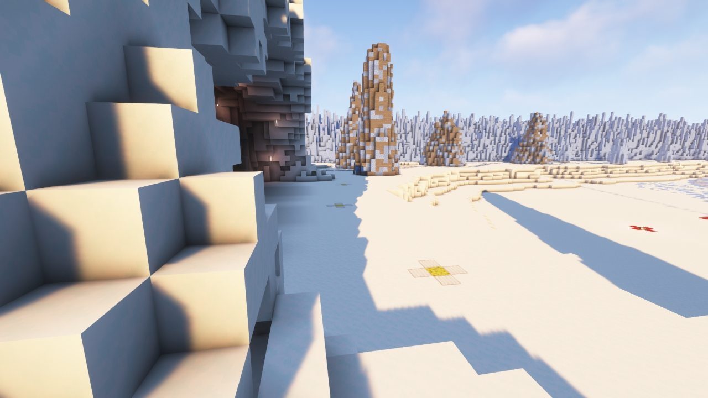
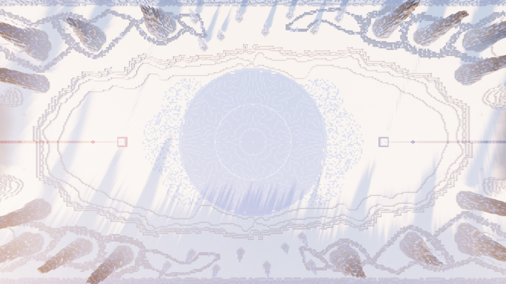
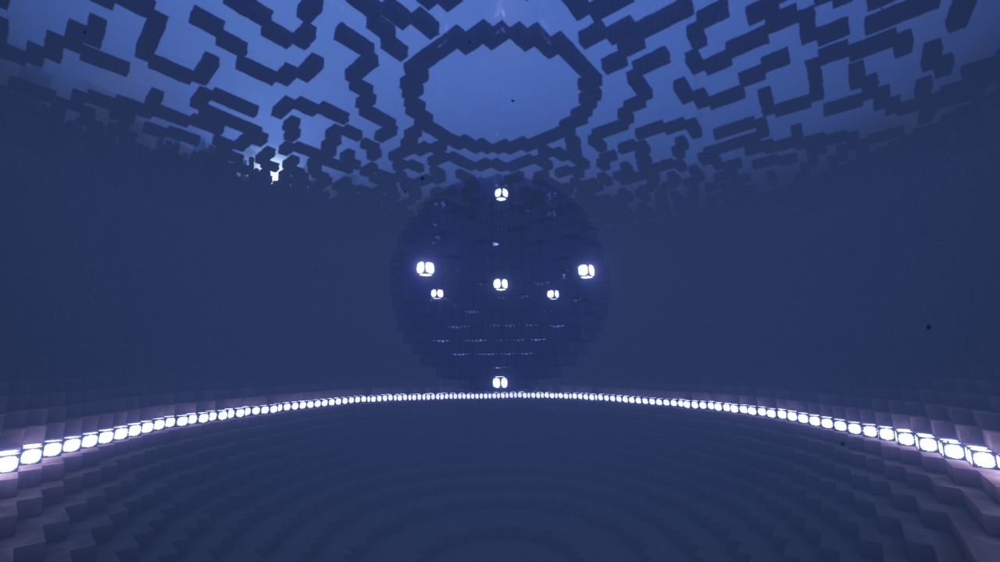

# Frostnova

---

#### 

# Overview

---

- **Introduced:** v1.7.0
- **Description:** A frozen tundra with ice spikes coming out on the side.
- **Gamemode:** Classic
- **Map Type:** Build and Break (BAB)
- **Size:** Large
- **Contributors:** xzyle

 

# Image Gallery

# Achievements

---

| Achievement             | Description                      | Reward     |
| ----------------------- | -------------------------------- | ---------- |
| It's too cold for this! | Win a game on the map Frostnova. | 20 Credits |

# Map Data

---

| Property    | Value                                       | Description                                       |
| ----------- | ------------------------------------------- | ------------------------------------------------- |
| buildRadius | `{{ maps.map_frostnova.data.buildRadius }}` | {{ mapPropertyDescriptions.buildRadius.classic }} |
| buildHeight | `{{ maps.map_frostnova.data.buildHeight }}` | {{ mapPropertyDescriptions.buildHeight.classic }} |
