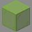
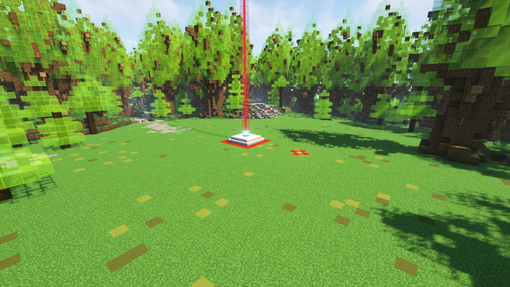

# Glass Forest

---

#### 

# Overview

---

- **Introduced:** v1.7.0
- **Description:** A forest with leaves made of magical glass.
- **Gamemode:** Classic
- **Map Type:** Build (B)
- **Size:** Large
- **Contributors:** Lucky_lew

 

v

# Achievements

---

| Achievement    | Description                         | Reward     |
| -------------- | ----------------------------------- | ---------- |
| Precious trees | Win a game on the map Glass Forest. | 20 Credits |

# Map Data

---

| Property    | Value                                         | Description                                       |
| ----------- | --------------------------------------------- | ------------------------------------------------- |
| buildRadius | `{{ maps.map_glassforest.data.buildRadius }}` | {{ mapPropertyDescriptions.buildRadius.classic }} |
| buildHeight | `{{ maps.map_glassforest.data.buildHeight }}` | {{ mapPropertyDescriptions.buildHeight.classic }} |
