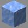

# Icefields (NB)

---

#### 

# Overview

---

- **Introduced:** v1.7.0
- **Description:** A hilly icy forest. With a prebuilt base on the map [Icefields](icefields).
- **Gamemode:** Classic
- **Map Type:** Non-Build and Break (NBAB)
- **Size:** Large
- **Contributors:** Lucky_Lew & R3dThunderr

 

# Image Gallery

# Achievements

---

| Achievement  | Description                           | Reward     |
| ------------ | ------------------------------------- | ---------- |
| Ice Breaker! | Win a game on the map Icefields (NB). | 20 Credits |

# Map Data

---

| Property    | Value                                    | Description                                       |
| ----------- | ---------------------------------------- | ------------------------------------------------- |
| buildRadius | `{{ maps.map_ice_nb.data.buildRadius }}` | {{ mapPropertyDescriptions.buildRadius.classic }} |
| buildHeight | `{{ maps.map_ice_nb.data.buildHeight }}` | {{ mapPropertyDescriptions.buildHeight.classic }} |
