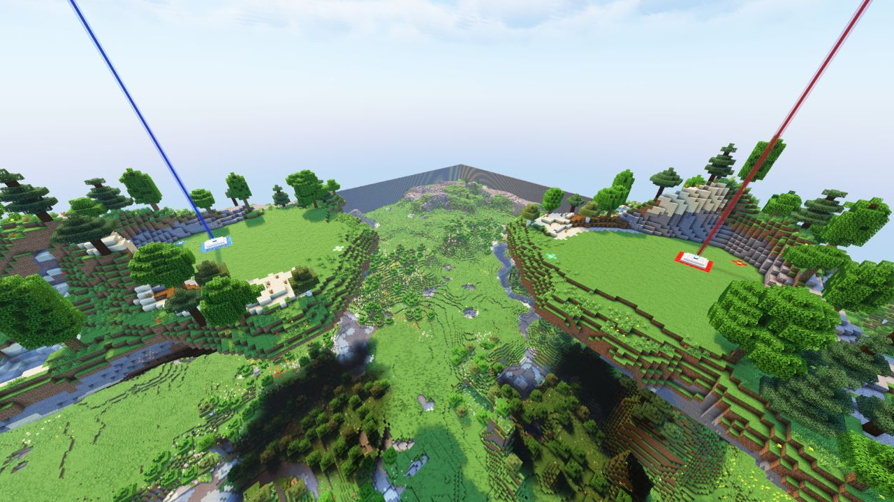
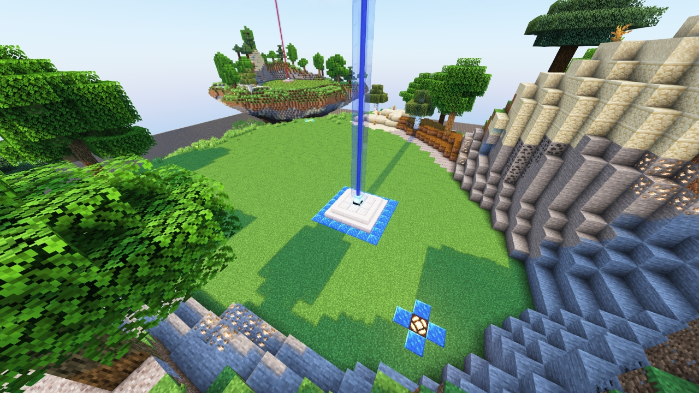

<!-- replace islands with the actual map name -->
<!-- change gamemode type for the Map data description  -->

# Islands

---

#### 

# Overview

---

- **Introduced:** v2.2.0
- **Description:** Sky islands floating above the world, connected by a launcher that randomly sends players between them.
- **Gamemode:** Classic
- **Map Type:** Build (B)
- **Size:** Small
- **Contributors:** St3venAU

 

# Image Gallery

# Achievements

---

| Achievement | Description                    | Reward     |
| ----------- | ------------------------------ | ---------- |
| ----------- | Win a game on the map Islands. | 20 Credits |

# Map Data

---

| Property    | Value                                     | Description                                       |
| ----------- | ----------------------------------------- | ------------------------------------------------- |
| buildRadius | `{{ maps.map_islands.data.buildRadius }}` | {{ mapPropertyDescriptions.buildRadius.classic }} |
| buildHeight | `{{ maps.map_islands.data.buildHeight }}` | {{ mapPropertyDescriptions.buildHeight.classic }} |
