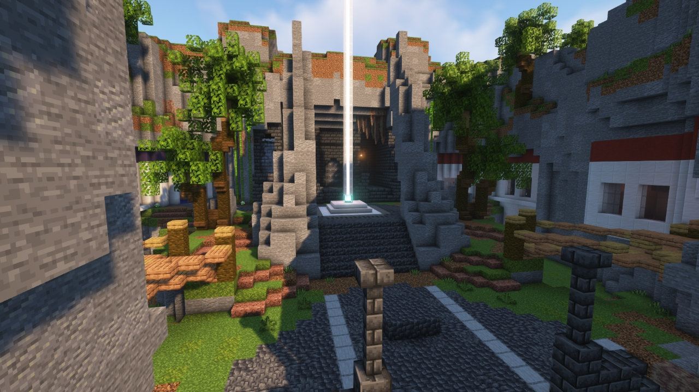
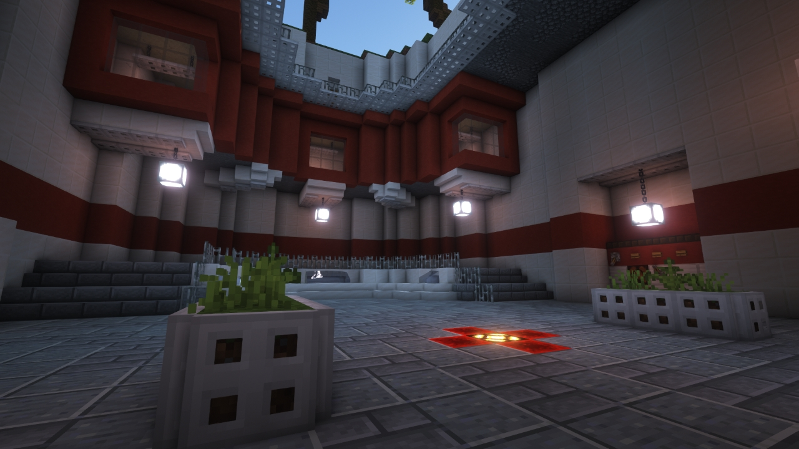
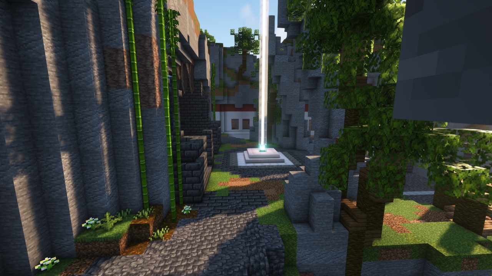

# Lazarus

---

#### 

# Overview

---

- **Introduced:** v1.8.0
- **Description:** A aztec temple in which a mythical spring is beneath it. This map is a recreation of the Team Fortress 2 map.
- **Gamemode:** King of the Hill
- **Map Type:** Non-Build (NB)
- **Size:** Medium
- **Contributors:** alfredodan

 

# Image Gallery

# Achievements

---

| Achievement                         | Description                    | Reward     |
| ----------------------------------- | ------------------------------ | ---------- |
| The Fight for the Fountain of Youth | Win a game on the map Lazarus. | 20 Credits |

# Map Data

---

| Property    | Value                                     | Description                                    |
| ----------- | ----------------------------------------- | ---------------------------------------------- |
| buildRadius | `{{ maps.map_lazarus.data.buildRadius }}` | {{ mapPropertyDescriptions.buildRadius.koth }} |
| buildHeight | `{{ maps.map_lazarus.data.buildHeight }}` | {{ mapPropertyDescriptions.buildHeight.koth }} |
