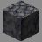
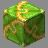
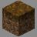
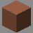
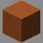
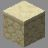
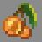
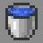
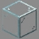
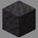

# Maps
> Index for all playable maps in Fortress Wars

***

> ## [Ashlands](Ashlands)
> - **Gamemode**: King of the Hill
> - **Type**: Non-Build
> - **Introduced**: v1.8.0
> - **Contributors**: alfredodan & LinkFD
> # 

> ## [Biohazard](Biohazard)
> - **Gamemode**: Classic
> - **Type**: Non-Build
> - **Introduced**: v1.7.0
> - **Contributors**: Naparizel
> # 

> ## [Bootcamp](Bootcamp)
> - **Gamemode**: Classic
> - **Type**: Non-Build
> - **Introduced**: v1.7.0
> - **Contributors**: xzyle
> # 

> ## [Candyland](Candyland)
> - **Gamemode**: Attack and Defend
> - **Type**: Build
> - **Introduced**: v1.7.0
> - **Contributors**: LinkFD & TheLordStan
> # 

> ## [Caverns](Caverns)
> - **Gamemode**: Classic
> - **Type**: Build
> - **Introduced**: v1.7.0
> - **Contributors**: UNKNOWN
> # 

> ## [Clay](Clay)
> - **Gamemode**: Classic
> - **Type**: Build and Break
> - **Introduced**: v1.7.0
> - **Contributors**: flameproofsocks
> # 

> ## [Clay (NB)](ClayNB)
> - **Gamemode**: Classic
> - **Type**: Build and Break
> - **Introduced**: v1.7.0
> - **Contributors**: flameproofsocks & LinkFD
> # 

> ## [Coast](CoastClassic)
> - **Gamemode**: Classic
> - **Type**: Build
> - **Introduced**: v1.7.0
> - **Contributors**: LinkFD & TheLordStan
> # 

> ## [Coast (KOTH)](CoastKOTH)
> - **Gamemode**: Classic
> - **Type**: Non-Build
> - **Introduced**: v1.7.0
> - **Contributors**: LinkFD & TheLordStan
> # 

> ## [Colliery](Colliery)
> - **Gamemode**: Attack and Defend
> - **Type**: Build
> - **Introduced**: v1.7.0
> - **Contributors**: LinkFD & TheLordStan
> # 

> ## [Frostnova](Frostnova)
> - **Gamemode**: Classic
> - **Type**: Build and Break
> - **Introduced**: v1.7.0
> - **Contributors**: xzyle
> # 

> ## [GlassForest](GlassForest)
> - **Gamemode**: Classic
> - **Type**: Build
> - **Introduced**: v1.7.0
> - **Contributors**: Lucky_Lew
> # 

> ## [GreatWall](GreatWall)
> - **Gamemode**: Classic
> - **Type**: Build
> - **Introduced**: v1.7.0
> - **Contributors**: Lucky_Lew
> # 

> ## [Hotel Monseñor](HotelMonsenor)
> - **Gamemode**: King of the Hill
> - **Type**: Non-Build
> - **Introduced**: v1.7.0
> - **Contributors**: alfredodan
> # 

> ## [Icefields](Icefields)
> - **Gamemode**: Classic
> - **Type**: Build and Break
> - **Introduced**: v1.7.0
> - **Contributors**: Lucky_Lew
> # 

> ## [Icefields (AD)](IcefieldsAD)
> - **Gamemode**: Classic
> - **Type**: Build and Break
> - **Introduced**: v1.7.0
> - **Contributors**: LuckyLew & alfredodan
> # 

> ## [Icefields (NB)](IcefieldsNB)
> - **Gamemode**: Classic
> - **Type**: Non-Build and Break
> - **Introduced**: v1.7.0
> - **Contributors**: LuckyLew & R3dThunderr
> # 

> ## [Lazarus](Lazarus)
> - **Gamemode**: King of the Hill
> - **Type**: Non-Build
> - **Introduced**: v1.8.0
> - **Contributors**: alfredodan
> # 

> ## [Leafy Canyon](LeafyCanyon)
> - **Gamemode**: King of the Hill
> - **Type**: Non-Build
> - **Introduced**: v1.7.0
> - **Contributors**: LinkFD & TheLordStan
> # 

> ## [Mountain](Mountain)
> - **Gamemode**: Classic
> - **Type**: Build
> - **Introduced**: v1.7.0
> - **Contributors**: Cloud123
> # 

> ## [Oasis City](Oasiscity)
> - **Gamemode**: King of the Hill
> - **Type**: Non-Build
> - **Introduced**: v1.7.0
> - **Contributors**: LinkFD & TheLordStan
> # 

> ## [Overgrown](Overgrown)
> - **Gamemode**: Classic
> - **Type**: Build
> - **Introduced**: v1.7.0
> - **Contributors**: LinkFD, TheLordStan & liamtheliam29
> # 

> ## [Ravine](Ravine)
> - **Gamemode**: Classic
> - **Type**: Build
> - **Introduced**: v1.7.0
> - **Contributors**: Lucky_Lew
> # 

> ## [River](River)
> - **Gamemode**: Classic
> - **Type**: Build
> - **Introduced**: v1.7.0
> - **Contributors**: Lucky_Lew
> # 

> ## [Ships](Ships)
> - **Gamemode**: Classic
> - **Type**: Non-Build
> - **Introduced**: v1.7.0
> - **Contributors**: Lucky_Lew
> # 

> ## [Skylands](skylands)
> - **Gamemode**: Classic
> - **Type**: Build
> - **Introduced**: v1.7.0
> - **Contributors**: Lucky_Lew
> # 

> ## [Somber Swamps](SomberSwamps)
> - **Gamemode**: King of the Hill
> - **Type**: Non-Build
> - **Introduced**: v2.0.0
> - **Contributors**: alfredodan
> # 

> ## [Two Castles](TwoCastles)
> - **Gamemode**: Classic
> - **Type**: Non-Build
> - **Introduced**: v1.7.0
> - **Contributors**: inbystander000
> # 

> ## [Underworld](Underworld)
> - **Gamemode**: Classic
> - **Type**: Build
> - **Introduced**: v1.7.0
> - **Contributors**: Lucky_Lew
> # 

> ## [Urban](Urban)
> - **Gamemode**: Classic
> - **Type**: Build
> - **Introduced**: v1.7.0
> - **Contributors**: Demodwarfz & LittleChaos98
> # 

> ## [Valley](Valley)
> - **Gamemode**: Classic
> - **Type**: Build and Break
> - **Introduced**: v1.7.0
> - **Contributors**: Lucky_Lew
> # 

> ## [Valley (NB)](ValleyNB)
> - **Gamemode**: Classic
> - **Type**: Non-Build and Break
> - **Introduced**: v1.7.0
> - **Contributors**: Lucky_Lew & R3dthunderr
> # 

> ## [Void](Void)
> - **Gamemode**: Classic
> - **Type**: Non-Build
> - **Introduced**: v1.7.0
> - **Contributors**: St3vanAU
> # 

> ## [Void (KOTH)](VoidKOTH)
> - **Gamemode**: Non-Build
> - **Type**: King of the Hill
> - **Introduced**: v1.7.0
> - **Contributors**: LinkFD
> # 
