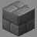

# Maps

> Index for all playable maps in Fortress Wars

---

> ## [Ashlands](Ashlands)
>
> - **Gamemode**: King of the Hill
> - **Type**: Non-Build
> - **Introduced**: v1.8.0
> - **Contributors**: alfredodan & LinkFD
>
> #### 

> ## [Biohazard](Biohazard)
>
> - **Gamemode**: Classic
> - **Type**: Non-Build
> - **Introduced**: v1.7.0
> - **Contributors**: Naparizel
>
> #### 

> ## [Bootcamp](Bootcamp)
>
> - **Gamemode**: Classic
> - **Type**: Non-Build
> - **Introduced**: v1.7.0
> - **Contributors**: xzyle
>
> #### 

> ## [Bootcamp (AD)](Bootcamp_AD)
>
> - **Gamemode**: Attack and Defend
> - **Type**: Non-Build
> - **Introduced**: v2.2.0
> - **Contributors**: xzyle, alfredodan & FewerReaper1
>
> #### 

> ## [Candyland](Candyland)
>
> - **Gamemode**: Attack and Defend
> - **Type**: Build
> - **Introduced**: v1.7.0
> - **Contributors**: LinkFD & TheLordStan
>
> #### 

> ## [Caverns](Caverns)
>
> - **Gamemode**: Classic
> - **Type**: Build
> - **Introduced**: v1.7.0
> - **Contributors**: UNKNOWN
>
> #### 

> ## [Clay](Clay)
>
> - **Gamemode**: Classic
> - **Type**: Build and Break
> - **Introduced**: v1.7.0
> - **Contributors**: flameproofsocks
>
> #### 

> ## [Clay (NB)](Clay_NB)
>
> - **Gamemode**: Classic
> - **Type**: Build and Break
> - **Introduced**: v1.7.0
> - **Contributors**: flameproofsocks & LinkFD
>
> #### 

> ## [Coast](Coast)
>
> - **Gamemode**: Classic
> - **Type**: Build
> - **Introduced**: v1.7.0
> - **Contributors**: LinkFD & TheLordStan
>
> #### 

> ## [Coast (KOTH)](Coast_KOTH)
>
> - **Gamemode**: Classic
> - **Type**: Non-Build
> - **Introduced**: v1.7.0
> - **Contributors**: LinkFD & TheLordStan
>
> #### 

> ## [Colliery](Colliery)
>
> - **Gamemode**: Attack and Defend
> - **Type**: Build
> - **Introduced**: v1.7.0
> - **Contributors**: LinkFD & TheLordStan
>
> #### 

> ## [Frostnova](Frostnova)
>
> - **Gamemode**: Classic
> - **Type**: Build and Break
> - **Introduced**: v1.7.0
> - **Contributors**: xzyle
>
> #### 

> ## [Glass Forest](Glass_Forest)
>
> - **Gamemode**: Classic
> - **Type**: Build
> - **Introduced**: v1.7.0
> - **Contributors**: Lucky_Lew
>
> #### 

> ## [Great Wall](Great_Wall)
>
> - **Gamemode**: Classic
> - **Type**: Build
> - **Introduced**: v1.7.0
> - **Contributors**: Lucky_Lew
>
> #### 

> ## [Hotel Monseñor](Hotel_Monsenor)
>
> - **Gamemode**: King of the Hill
> - **Type**: Non-Build
> - **Introduced**: v1.7.0
> - **Contributors**: alfredodan
>
> #### 

> ## [Icefields](Icefields)
>
> - **Gamemode**: Classic
> - **Type**: Build and Break
> - **Introduced**: v1.7.0
> - **Contributors**: Lucky_Lew
>
> #### 

> ## [Icefields (AD)](Icefields_AD)
>
> - **Gamemode**: Classic
> - **Type**: Build and Break
> - **Introduced**: v1.7.0
> - **Contributors**: LuckyLew & alfredodan
>
> #### 

> ## [Icefields (NB)](Icefields_NB)
>
> - **Gamemode**: Classic
> - **Type**: Non-Build and Break
> - **Introduced**: v1.7.0
> - **Contributors**: LuckyLew & R3dThunderr
>
> #### 

> ## [Islands](Islands)
>
> - **Gamemode**: Classic
> - **Type**: Build
> - **Introduced**: v2.2.0
> - **Contributors**: St3venAU
>
> #### 

> ## [Lazarus](Lazarus)
>
> - **Gamemode**: King of the Hill
> - **Type**: Non-Build
> - **Introduced**: v1.8.0
> - **Contributors**: alfredodan
>
> #### 

> ## [Leafy Canyon](Leafy_Canyon)
>
> - **Gamemode**: King of the Hill
> - **Type**: Non-Build
> - **Introduced**: v1.7.0
> - **Contributors**: LinkFD & TheLordStan
>
> #### 

> ## [Mountain](Mountain)
>
> - **Gamemode**: Classic
> - **Type**: Build
> - **Introduced**: v1.7.0
> - **Contributors**: Cloud123
>
> #### 

> ## [Oasis City](Oasis_City)
>
> - **Gamemode**: King of the Hill
> - **Type**: Non-Build
> - **Introduced**: v1.7.0
> - **Contributors**: LinkFD & TheLordStan
>
> #### 

> ## [Overgrown](Overgrown)
>
> - **Gamemode**: Classic
> - **Type**: Build
> - **Introduced**: v1.7.0
> - **Contributors**: LinkFD, TheLordStan & liamtheliam29
>
> #### 

> ## [Ravine](Ravine)
>
> - **Gamemode**: Classic
> - **Type**: Build
> - **Introduced**: v1.7.0
> - **Contributors**: Lucky_Lew
>
> #### 

> ## [River](River)
>
> - **Gamemode**: Classic
> - **Type**: Build
> - **Introduced**: v1.7.0
> - **Contributors**: Lucky_Lew
>
> #### 

> ## [Ships](Ships)
>
> - **Gamemode**: Classic
> - **Type**: Non-Build
> - **Introduced**: v1.7.0
> - **Contributors**: Lucky_Lew
>
> #### 

> ## [Skylands](Skylands)
>
> - **Gamemode**: Classic
> - **Type**: Build
> - **Introduced**: v1.7.0
> - **Contributors**: Lucky_Lew
>
> #### 

> ## [Somber Swamps](Somber_Swamps)
>
> - **Gamemode**: King of the Hill
> - **Type**: Non-Build
> - **Introduced**: v2.0.0
> - **Contributors**: alfredodan
>
> #### 

> ## [Spawn Ruins](Spawn_Ruins)
>
> - **Gamemode**: King of the Hill
> - **Type**: Non-Build
> - **Introduced**: v2.2.0
> - **Contributors**: Lucky_Lew, ElectricSparx & alfredodan
>
> #### 

> ## [Two Castles](Two_Castles)
>
> - **Gamemode**: Classic
> - **Type**: Non-Build
> - **Introduced**: v1.7.0
> - **Contributors**: inbystander000
>
> #### 

> ## [Underworld](Underworld)
>
> - **Gamemode**: Classic
> - **Type**: Build
> - **Introduced**: v1.7.0
> - **Contributors**: Lucky_Lew
>
> #### 

> ## [Urban](Urban)
>
> - **Gamemode**: Classic
> - **Type**: Build
> - **Introduced**: v1.7.0
> - **Contributors**: Demodwarfz & LittleChaos98
>
> #### 

> ## [Valley](Valley)
>
> - **Gamemode**: Classic
> - **Type**: Build and Break
> - **Introduced**: v1.7.0
> - **Contributors**: Lucky_Lew
>
> #### 

> ## [Valley (NB)](Valley_NB)
>
> - **Gamemode**: Classic
> - **Type**: Non-Build and Break
> - **Introduced**: v1.7.0
> - **Contributors**: Lucky_Lew & R3dthunderr
>
> #### 

> ## [Void](Void)
>
> - **Gamemode**: Classic
> - **Type**: Non-Build
> - **Introduced**: v1.7.0
> - **Contributors**: St3vanAU
>
> #### 

> ## [Void (KOTH)](Void_KOTH)
>
> - **Gamemode**: Non-Build
> - **Type**: King of the Hill
> - **Introduced**: v1.7.0
> - **Contributors**: LinkFD
>
> #### 
