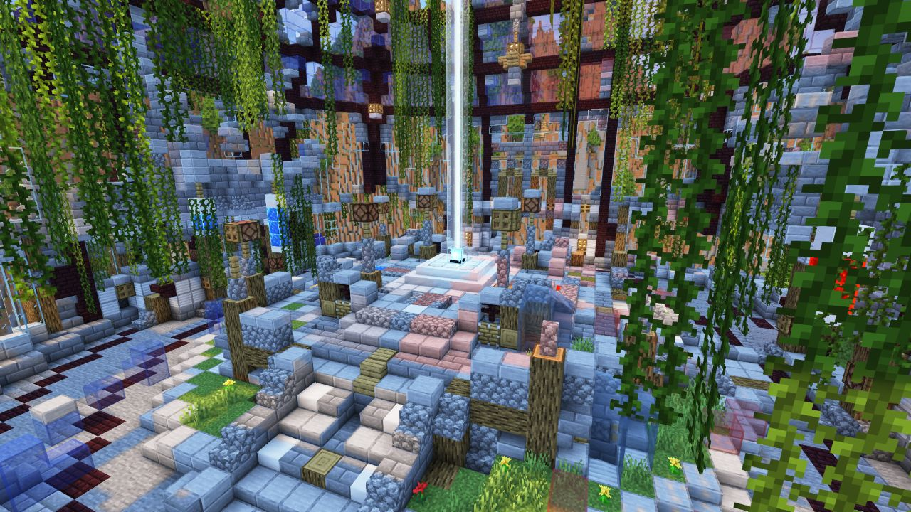

<!-- replace spawn ruins with the actual map name -->
<!-- change gamemode type for the Map data description  -->

# Spawn Ruins

---

#### 

# Overview

---

- **Introduced:** v2.2.0
- **Description:** A crumbling ancient ruins where players battle for dominance amid crumbling stone and overgrown remnants of a forgotten age.
- **Gamemode:** King of the Hill
- **Map Type:** Non-Build (NB)
- **Size:** Medium
- **Contributors:** Lucky_Lew, ElectricSparx & alfredodan

 

# Map Galley

# Achievements

---

| Achievement  | Description                        | Reward     |
| ------------ | ---------------------------------- | ---------- |
| Relic of War | Win a game on the map Spawn Ruins. | 20 Credits |

# Map Data

---

| Property    | Value                                         | Description                                       |
| ----------- | --------------------------------------------- | ------------------------------------------------- |
| buildRadius | `{{ maps.map_spawn_ruins.data.buildRadius }}` | {{ mapPropertyDescriptions.buildRadius.classic }} |
| buildHeight | `{{ maps.map_spawn_ruins.data.buildHeight }}` | {{ mapPropertyDescriptions.buildHeight.classic }} |
