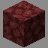
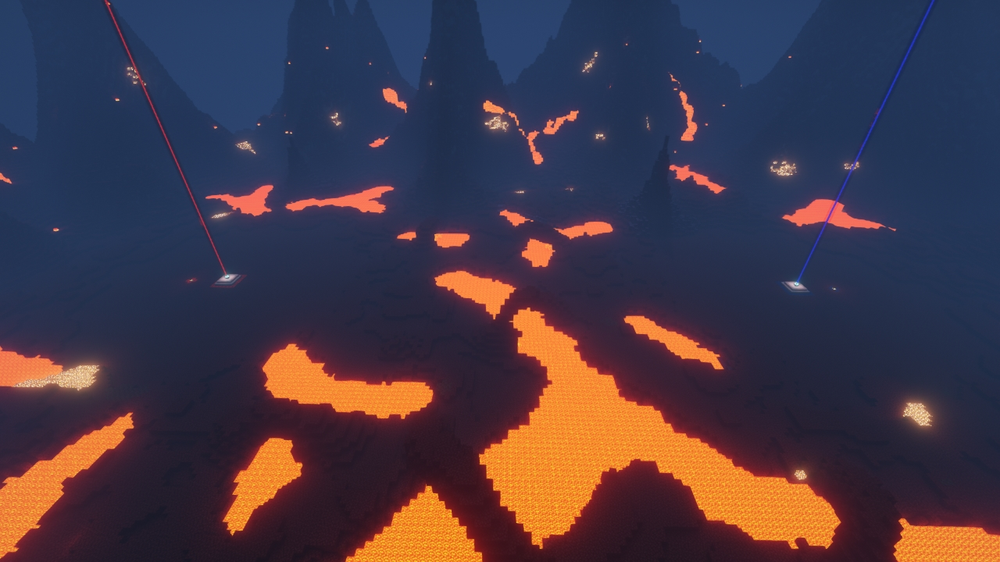
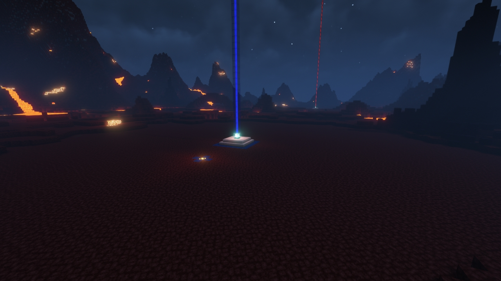
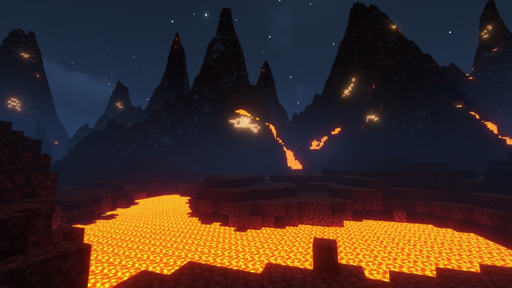

# Underworld

---

#### 

# Overview

---

- **Introduced:** v1.7.0
- **Description:** A firey hellish land where one goes to face eternal punishment.
- **Gamemode:** Classic
- **Map Type:** Build (B)
- **Size:** Large
- **Contributors:** Lucky_Lew

 

# Image Gallery

# Achievements

---

| Achievement          | Description                       | Reward     |
| -------------------- | --------------------------------- | ---------- |
| Satan didn't eat me! | Win a game on the map Underworld. | 20 Credits |

# Map Data

---

| Property    | Value                                        | Description                                       |
| ----------- | -------------------------------------------- | ------------------------------------------------- |
| buildRadius | `{{ maps.map_underworld.data.buildRadius }}` | {{ mapPropertyDescriptions.buildRadius.classic }} |
| buildHeight | `{{ maps.map_underworld.data.buildHeight }}` | {{ mapPropertyDescriptions.buildHeight.classic }} |
