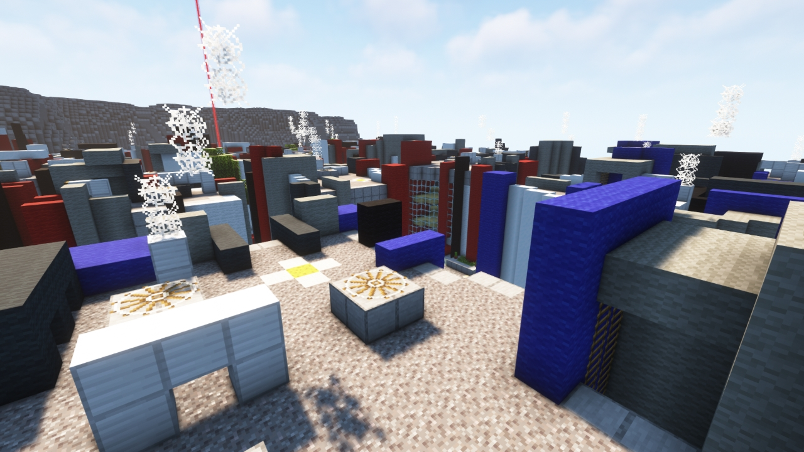

# Urban

---

#### 

# Overview

---

- **Introduced:** v1.7.0
- **Description:** A city that has become a battlefield.
- **Gamemode:** Classic
- **Map Type:** Build (B)
- **Size:** Medium
- **Contributors:** Demodwarfz & LittleChaos98

 

# Image Gallery

# Achievements

---

| Achievement                       | Description                  | Reward     |
| --------------------------------- | ---------------------------- | ---------- | --- |
| Not a place for rural activities! | Win a game on the map Urban. | 20 Credits | s   |

# Map Data

---

| Property    | Value                                   | Description                                       |
| ----------- | --------------------------------------- | ------------------------------------------------- |
| buildRadius | `{{ maps.map_urban.data.buildRadius }}` | {{ mapPropertyDescriptions.buildRadius.classic }} |
| buildHeight | `{{ maps.map_urban.data.buildHeight }}` | {{ mapPropertyDescriptions.buildHeight.classic }} |
