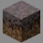
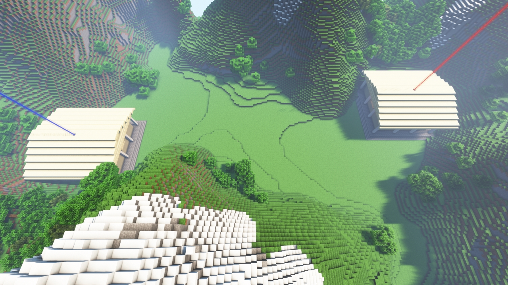
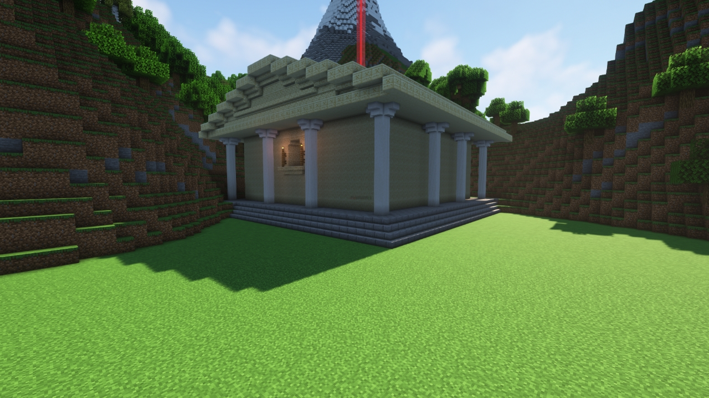
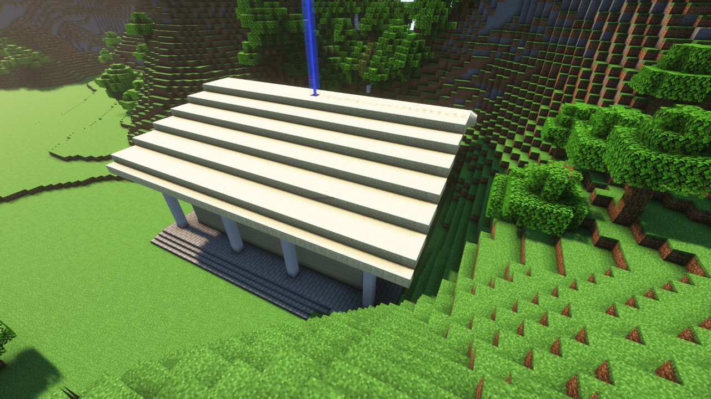

# Valley (NB)

---

#### 

# Overview

---

- **Introduced:** v1.7.0
- **Description:** A mountain range surrounding a flat plains with a prebuilt base.
- **Gamemode:** Classic
- **Map Type:** Non-Build and Break (BAB)
- **Size:** Medium
- **Contributors:** Lucky_Lew & R3dthunderr

 

# Image Gallery

# Achievements

---

| Achievement          | Description                        | Reward     |
| -------------------- | ---------------------------------- | ---------- |
| Valley? What Valley? | Win a game on the map Valley (NB). | 20 Credits |

# Map Data

---

| Property    | Value                                       | Description                                       |
| ----------- | ------------------------------------------- | ------------------------------------------------- |
| buildRadius | `{{ maps.map_valley_nb.data.buildRadius }}` | {{ mapPropertyDescriptions.buildRadius.classic }} |
| buildHeight | `{{ maps.map_valley_nb.data.buildHeight }}` | {{ mapPropertyDescriptions.buildHeight.classic }} |
