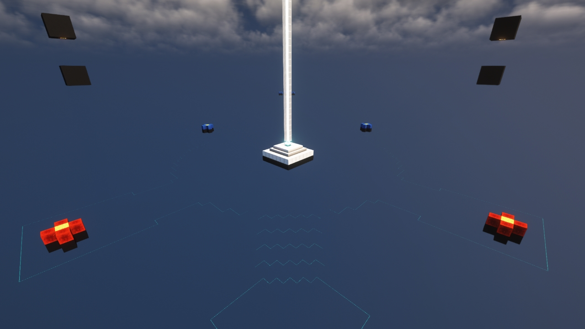
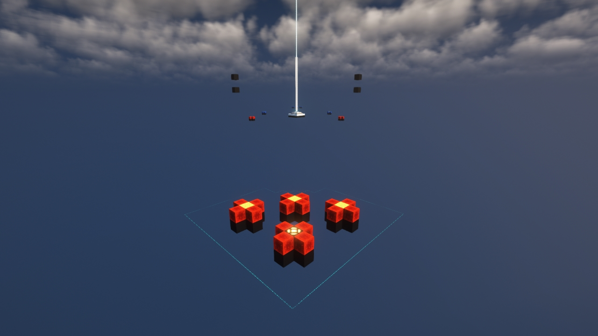

# Void (KOTH)

---

#### 

# Overview

---

- **Introduced:** v1.7.0
- **Description:** Nothing... there is next to nothing... Reformated version of the map [Void](Void).
- **Gamemode:** King of the Hill
- **Map Type:** Non-Build (NB)
- **Size:** Small
- **Contributors:** LinkFD

 

# Image Gallery

# Achievements

---

| Achievement          | Description                        | Reward     |
| -------------------- | ---------------------------------- | ---------- |
| It's worse than void | Win a game on the map Void (KOTH). | 20 Credits |

# Map Data

---

| Property    | Value                                       | Description                                    |
| ----------- | ------------------------------------------- | ---------------------------------------------- |
| buildRadius | `{{ maps.map_void_koth.data.buildRadius }}` | {{ mapPropertyDescriptions.buildRadius.koth }} |
| buildHeight | `{{ maps.map_void_koth.data.buildHeight }}` | {{ mapPropertyDescriptions.buildHeight.koth }} |
