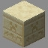

<!-- replace _map_ with the actual map name -->
<!-- change gamemode type for the Map data description  -->
# Oasis City

***

#### 

# Overview
***
- **Introduced:** v1.7.0
- **Description:** A sandy sanctuary in the desert.
- **Gamemode:** King of the Hill
- **Map Type:** Non-Build (NB)
- **Size:** Large
- **Contributors:** LinkFD & TheLordStan

   

# Map Galley

# Achievements
***

| Achievement | Description | Reward |
| ----- | ----- | ------ |
| A mirage miracle! | Win a game on the map Oasis City. | 20 Credits |

# Map Data
***

| Property | Value | Description |
| ----------- | ----------- | ------ |
| buildRadius |`{{ maps.map_oasiscity.data.buildRadius }}`| {{ mapPropertyDescriptions.buildRadius.koth }} |
| buildHeight |`{{ maps.map_oasiscity.data.buildHeight }}`| {{ mapPropertyDescriptions.buildHeight.koth }} |