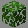

<!-- replace overgrown with the actual map name -->
<!-- change gamemode type for the Map data description  -->
# Overgrown

***

#### 

# Overview
***
- **Introduced:** v1.7.0
- **Description:** A open valley surrounded by a crowded jungle.
- **Gamemode:** Attack and Defend
- **Map Type:** Build
- **Size:** Medium
- **Contributors:** LinkFD, TheLordStan & liamtheliam29

   

# Map Galley

# Achievements
***

| Achievement | Description | Reward |
| ----- | ----- | ------ |
| Spiders in my head, spiders in my mind! | Win a game on the map Overgrown. | 20 Credits |

# Map Data
***

| Property | Value | Description |
| ----------- | ----------- | ------ |
| buildRadius |`{{ maps.overgrown.data.buildRadius }}`| {{ mapPropertyDescriptions.buildRadius.classic }} |
| buildHeight |`{{ maps.overgrown.data.buildHeight }}`| {{ mapPropertyDescriptions.buildHeight.classic }} |