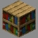

<!-- replace _map_ with the actual map name -->
<!-- change gamemode type for the Map data description  -->
# Urban

***

#### 

# Overview
***
- **Introduced:** v1.7.0
- **Description:** A fort built in a metropolis
- **Gamemode:** Classic
- **Map Type:** Build (B)
- **Size:** Medium
- **Contributors:** Demodwarfz & LittleChaos98

   

# Map Galley

# Achievements
***

| Achievement | Description | Reward |
| ----- | ----- | ------ |
| Not a place for rural activities! | Win a game on the map Urban. | 20 Credits |

# Map Data
***

| Property | Value | Description |
| ----------- | ----------- | ------ |
| buildRadius |`{{ maps.map_urban.data.buildRadius }}`| {{ mapPropertyDescriptions.buildRadius.classic }} |
| buildHeight |`{{ maps.map_urban.data.buildHeight }}`| {{ mapPropertyDescriptions.buildHeight.classic }} |