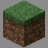

# Valley

***

#### 

# Overview
***
- **Introduced:** v1.7.0
- **Description:** A flat plain with mountainous range surrounding it.
- **Gamemode:** Classic
- **Map Type:** Build and Break (BAB)
- **Size:** Medium
- **Contributors:** Lucky_Lew

   

# Image Gallery

# Achievements
***

| Achievement | Description | Reward |
| ----- | ----- | ------ |
| Into the valley we go! | Win a game on the map Valley. | 20 Credits |

# Map Data
***

| Property | Value | Description |
| ----------- | ----------- | ------ |
| buildRadius |`{{ maps.map_valley.data.buildRadius }}`| {{ mapPropertyDescriptions.buildRadius.classic }} |
| buildHeight |`{{ maps.map_valley.data.buildHeight }}`| {{ mapPropertyDescriptions.buildHeight.classic }} |