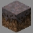

# Valley (NB)

***

#### 

# Overview
***
- **Introduced:** v1.7.0
- **Description:** A flat plain with mountainous range surrounding it. Has a prebuilt base from the map [Valley](Valley).
- **Gamemode:** Classic
- **Map Type:** Non-Build and Break (BAB)
- **Size:** Medium
- **Contributors:** Lucky_Lew & R3dthunderr

   

# Image Gallery

# Achievements
***

| Achievement | Description | Reward |
| ----- | ----- | ------ |
| Valley? What Valley? | Win a game on the map Valley (NB). | 20 Credits |

# Map Data
***

| Property | Value | Description |
| ----------- | ----------- | ------ |
| buildRadius |`{{ maps.map_valley_NB.data.buildRadius }}`| {{ mapPropertyDescriptions.buildRadius.classic }} |
| buildHeight |`{{ maps.map_valley_NB.data.buildHeight }}`| {{ mapPropertyDescriptions.buildHeight.classic }} |w